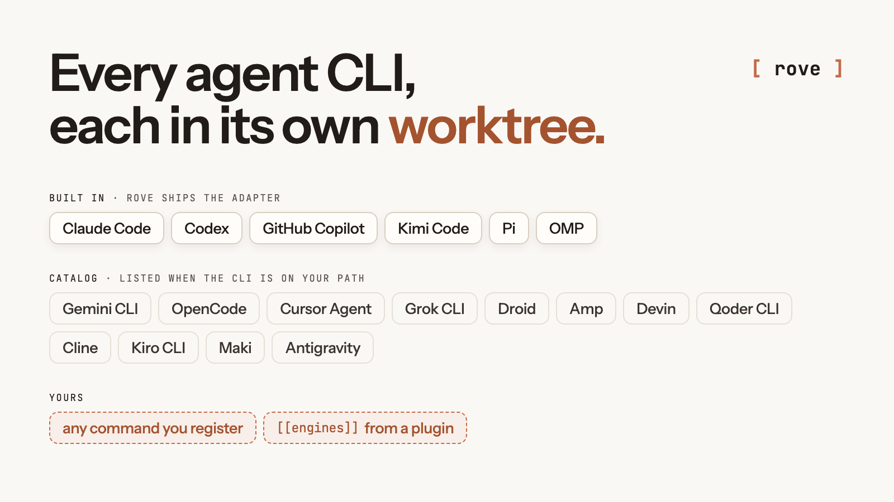
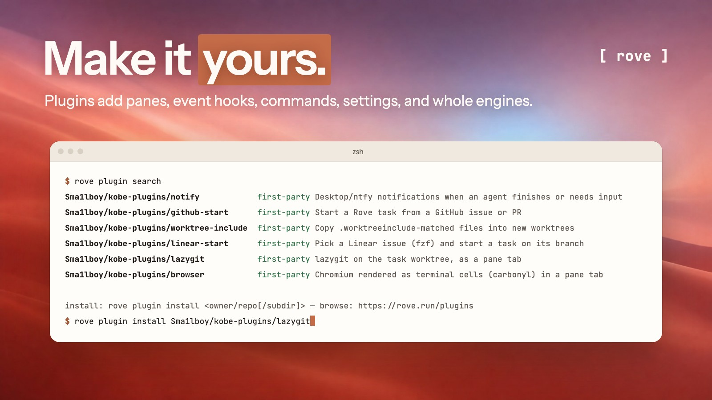

# Rove: the agent multiplexer for your terminal

<p align="center">
  
</p>

Rove is a terminal-native workspace for running multiple coding tasks in parallel with [Claude Code](https://claude.com/claude-code), [Codex](https://github.com/openai/codex), [Copilot](https://github.com/github/copilot-cli), Kimi, Gemini CLI, OpenCode, Cursor Agent, [and more](./docs/ENGINES.md), or any CLI you register.

Rove isolates parallel work in git worktrees and branches, while agent and shell sessions keep running when you disconnect.

<p align="center">
  <a href="https://www.npmjs.com/package/@sma1lboy/rove"></a>
  <a href="https://github.com/Sma1lboy/rove/actions/workflows/ci.yml"></a>
  <a href="./LICENSE"></a>
</p>

<p align="center">
  <a href="https://docs.rove.run"><strong>Documentation</strong></a> ·
  <a href="https://docs.rove.run/rove/quick-start">Quick start</a> ·
  <a href="https://docs.rove.run/rove/concepts">Concepts</a> ·
  <a href="https://docs.rove.run/rove/cli">CLI</a> ·
  <a href="https://docs.rove.run/rove/api">Agent API</a> ·
  <a href="https://rove.run">Website</a>
</p>

<p align="center">
  
</p>

The sidebar tracks tasks and their sessions. The workspace embeds the active agent or shell. The files pane shows what changed in the worktree. Switch tasks to read output, inspect a diff, run tests, or send the next instruction.

## Quick start

Install Rove, then launch it in a repository. Rove runs on [Bun](https://bun.sh) ≥ 1.3.11, and the install script sets Bun up if you don't have it.

```bash
curl -fsSL https://rove.run/install.sh | sh
cd your-repo
rove
```

Press `n` to create your first task. You need git and at least one supported agent CLI on `PATH`; other install methods are under [Install](#install).

To let a coding agent drive Rove itself, install the skill:

```bash
rove skill install
```

## What you get

<p align="center">
  
</p>

- **Parallel tasks, isolated in git.** Each task owns a worktree and branch, so a refactor, a bug fix, and a review move at the same time without agents overwriting each other's files.
- **Every agent CLI, side by side.** Each task picks its engine: Claude Code, Codex, Copilot, Kimi, Pi, OMP, Gemini CLI, OpenCode, Cursor Agent, [and more](./docs/ENGINES.md), or a CLI you register. Rove runs the real CLI, with its own auth, permissions, and models.
- **Sessions that outlive the terminal.** Quit the TUI or drop SSH, then reattach later. The agents keep working on the host.
- **Terminal-native.** No desktop app. Run Rove where the code lives: laptop, devbox, VPS, or a narrow mobile SSH session.
- **Scriptable.** Scripts and coding agents create, inspect, message, and land tasks through `rove api`.

## How it works

```text
Managed task
├── git worktree
├── git branch
└── terminal tabs
    ├── Claude Code
    ├── Codex
    └── shell
```

Tabs inside one task share its files, so work that needs isolation gets its own managed task; project-main tasks and `rove .` directory tasks deliberately reuse an existing directory. Sessions run on the host rather than in your terminal window, so they keep going when the TUI detaches and come back when you run `rove` again. The loop: start several tasks, switch between their live sessions, review each worktree's diff and checks, send follow-up instructions, then merge the branches that worked out. [Concepts](./docs/CONCEPTS.md) and [Sessions](./docs/SESSIONS.md) cover the full lifecycle.

## Install

The install script above sets up the Bun runtime Rove needs, then Rove itself. Or use the package manager you already have:

```bash
npm install -g @sma1lboy/rove   # offers to install Bun on first launch
bun install -g @sma1lboy/rove   # if you already run Bun
npx @sma1lboy/rove              # try it without installing
```

Rove runs on macOS, Linux, and Windows; Windows also requires Node.js and Git for Windows/Git Bash. The CLI runs on [Bun](https://bun.sh) ≥ 1.3.11, which every install route brings along. If your Bun lives somewhere unusual, point Rove at it with `ROVE_BUN=/path/to/bun`.

`rove` is the canonical command. The package also installs `kobe` as a compatibility alias. On first launch, supported legacy state is copied into `~/.rove`; existing files and worktrees stay where they are.

## Scripting and Agent API

`rove api` exposes the same task model to shell scripts and coding agents. A run creates a task, checks its output, sends follow-ups, and lands the branch:

```bash
rove api add --repo "$PWD" --prompt "Fix the flaky auth test."
rove api list
rove api read-output --task-id <id>
rove api send --task-id <id> --prompt "Run the integration suite too."
rove api land --task-id <id>
```

The companion skill teaches a coding agent to drive that loop for you:

```bash
rove skill install
```

A task created from inside another Rove session remembers which task and tab dispatched it, so workers report results back without an external coordinator. The API also covers task inspection, notifications, prompts, panes, issue tracking, routines, and worktree-safe lifecycle operations.

Every verb, flag, and exit code is in the [Agent API reference](https://docs.rove.run/rove/api).

## Plugins

<p align="center">
  
</p>

A plugin is a directory with a `rove-plugin.toml` manifest and commands in any language. It can add panes, react to events such as a finished agent turn, register commands and settings, and contribute whole engines. Browse and install from the terminal:

```bash
rove plugin search
rove plugin install owner/repo
```

The same catalog is on [rove.run/plugins](https://rove.run/plugins) and under Settings → Marketplace. Any public GitHub repo tagged `rove-plugin` shows up there; [plugin authoring](./docs/PLUGIN-AUTHORING.md) covers the manifest, the event catalog, and the optional TypeScript SDK.

## More features

- **Review.** Diff views, plus inline notes that go back as one agent prompt.
- **Recovery.** Rate-limit resume, cross-engine handoff, several agents inside one task.
- **Remote ergonomics.** Narrow and mobile layouts, a durable Inbox, notifications, attachments.
- **Unattended work.** Scheduled routines, with optional prechecks that skip idle runs.
- **Planning context.** Local Kanban, GitHub issue intake, reusable repository field notes.
- **Customization.** Themes, and [plugins](#plugins) with custom panes, events, commands, and engines.

Details live in the [TUI guide](./docs/TUI.md), [Routines](./docs/ROUTINES.md), [configuration](./docs/CONFIGURATION.md), and [plugin authoring](./docs/PLUGIN-AUTHORING.md).

## Troubleshooting

```bash
rove doctor
```

[Troubleshooting](./docs/TROUBLESHOOTING.md) has the diagnostics and recovery steps.

## Development

```bash
bun install
bun run dev:sandbox
bun run test
```

Start with [CONTRIBUTING.md](./CONTRIBUTING.md) and [Architecture](./docs/ARCHITECTURE.md). Shipped behavior is in the [changelog](./packages/kobe/CHANGELOG.md).

## License

[MIT](./LICENSE) © Jackson Chen
