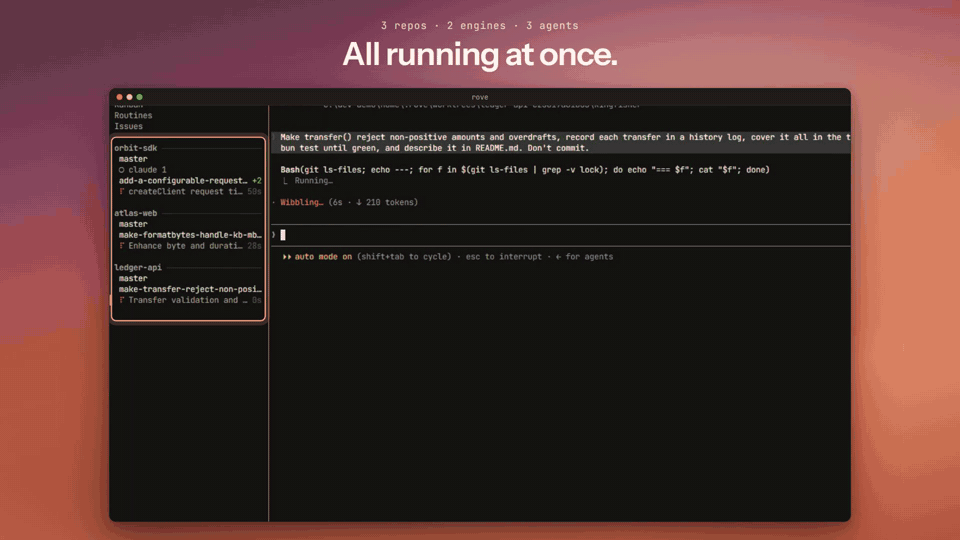

# Rove: the agent multiplexer for your terminal

<p align="center">
  
</p>

Rove is a terminal-native workspace for running multiple coding tasks in parallel with [Claude Code](https://claude.com/claude-code), [Codex](https://github.com/openai/codex), [Copilot](https://github.com/github/copilot-cli), Kimi, or any CLI you register.

Rove isolates parallel work in git worktrees and branches, while agent and shell sessions keep running when you disconnect.

<p align="center">
  <a href="https://www.npmjs.com/package/@sma1lboy/rove"></a>
  <a href="https://github.com/Sma1lboy/rove/actions/workflows/ci.yml"></a>
  <a href="./LICENSE"></a>
</p>

<p align="center">
  <a href="https://docs.rove.sma1lboy.me"><strong>Documentation</strong></a> ·
  <a href="https://docs.rove.sma1lboy.me/docs/quick-start">Quick start</a> ·
  <a href="https://docs.rove.sma1lboy.me/docs/concepts">Concepts</a> ·
  <a href="https://docs.rove.sma1lboy.me/docs/cli">CLI</a> ·
  <a href="https://docs.rove.sma1lboy.me/docs/api">Agent API</a> ·
  <a href="https://rove.sma1lboy.me">Website</a>
</p>

<p align="center">
  <br />
  <a href="docs/assets/demo.mp4">Watch the full-quality MP4</a>
</p>

The sidebar tracks tasks and their sessions. The workspace embeds the active agent or shell. The files pane shows what changed in the worktree. Switch tasks to read output, inspect a diff, run tests, or send the next instruction.

## Quick start

One line on a machine with nothing installed. It sets up the Bun runtime Rove needs, then Rove itself:

```bash
curl -fsSL https://rove.sma1lboy.me/install.sh | sh
```

Or use the package manager you already have:

```bash
npm install -g @sma1lboy/rove   # offers to install Bun on first launch
bun install -g @sma1lboy/rove   # if you already run Bun
npx @sma1lboy/rove              # try it without installing
```

To let a coding agent drive Rove itself, install the skill:

```bash
rove skill install
```

Then launch it in a repository:

```bash
cd your-repo
rove
```

Rove needs git and at least one supported agent CLI on `PATH`. It runs on macOS, Linux, and Windows; Windows also requires Node.js and Git for Windows/Git Bash. The CLI itself runs on [Bun](https://bun.sh) ≥ 1.3.11, which every install route above brings along. If your Bun lives somewhere unusual, point Rove at it with `ROVE_BUN=/path/to/bun`.

Press `n`, choose a repository, base branch, and agent, then enter a prompt. `F1` shows the live keybinding reference. `ctrl+q` returns to the sidebar, and quits from there without stopping sessions.

`rove` is the canonical command. The package also installs `kobe` as a compatibility alias. On first launch, supported legacy state is copied into `~/.rove`; existing files and worktrees stay where they are.

## Why Rove

- **Parallel tasks.** Keep a refactor, a bug fix, a test investigation, and a review moving at the same time.
- **Git isolation.** Each managed task owns a worktree and branch, so agents on different tasks never overwrite each other's files.
- **Persistent sessions.** Quit the TUI or drop SSH, then reattach without stopping the work.
- **Your existing agents.** Rove runs the real Claude Code, Codex, Copilot, Kimi, or custom CLI, with its own auth, permissions, models, and access to the local machine.
- **Terminal-native.** Run Rove where the code lives: laptop, devbox, VPS, or a narrow mobile SSH session.
- **Scriptable.** Scripts and coding agents create, inspect, message, and land tasks through `rove api`.

## How it works

```text
Managed task
├── git worktree
├── git branch
└── terminal tabs
    ├── Claude Code
    ├── Codex
    └── shell
```

Tabs inside one task share its files, so work that needs isolation gets its own managed task. Project-main tasks and `rove .` directory tasks deliberately reuse an existing directory. Sessions keep running in the background when the TUI detaches, and Rove restores them when you return.

The loop: start several tasks, switch between their live sessions, review each worktree's diff and checks, send follow-up instructions, then merge the branches that worked out. [Concepts](./docs/CONCEPTS.md) and [Sessions](./docs/SESSIONS.md) cover the full lifecycle.

## Scripting and Agent API

`rove api` exposes the same task model to shell scripts and coding agents. A run creates a task, checks its output, sends follow-ups, and lands the branch:

```bash
rove api add --repo "$PWD" --prompt "Fix the flaky auth test."
rove api list
rove api read-output --task-id <id>
rove api send --task-id <id> --prompt "Run the integration suite too."
rove api land --task-id <id>
```

The companion skill teaches a coding agent to drive that loop for you:

```bash
rove skill install
```

A task created from inside another Rove session remembers which task and tab dispatched it, so workers report results back without an external coordinator. The API also covers task inspection, notifications, prompts, panes, issue tracking, routines, and worktree-safe lifecycle operations.

Every verb, flag, and exit code is in the [Agent API reference](https://docs.rove.sma1lboy.me/docs/api).

## Built for the terminal

Rove runs the interactive agent CLIs you already have, keeps their sessions alive on the host, and lets you manage parallel coding tasks from the terminal, including over SSH.

- **Terminal TUI.** No desktop app.
- **SSH-native.** The same workflow on remote machines.
- **Persistent sessions.** Disconnect and come back without losing running agents.
- **Existing agent CLIs.** Claude Code, Codex, Copilot, Kimi, or your own.
- **Git-native isolation.** Parallel tasks live in separate worktrees and branches.
- **Programmable.** Orchestrate tasks through `rove api`.

## More features

- **Review.** Diff views, plus inline notes that go back as one agent prompt.
- **Recovery.** Rate-limit resume, cross-engine handoff, several agents inside one task.
- **Remote ergonomics.** Narrow and mobile layouts, a durable Inbox, notifications, attachments.
- **Unattended work.** Scheduled routines, with optional prechecks that skip idle runs.
- **Planning context.** Local Kanban, GitHub issue intake, reusable repository field notes.
- **Customization.** Themes, and plugins with custom panes, events, and commands.

Details live in the [TUI guide](./docs/TUI.md), [Routines](./docs/ROUTINES.md), [configuration](./docs/CONFIGURATION.md), and [plugin authoring](./docs/PLUGIN-AUTHORING.md).

## Troubleshooting

```bash
rove doctor
```

[Troubleshooting](./docs/TROUBLESHOOTING.md) has the diagnostics and recovery steps.

## Development

```bash
bun install
bun run dev:sandbox
bun run test
```

Start with [CONTRIBUTING.md](./CONTRIBUTING.md) and [Architecture](./docs/ARCHITECTURE.md). Shipped behavior is in the [changelog](./packages/kobe/CHANGELOG.md).

## License

[MIT](./LICENSE) © Jackson Chen
