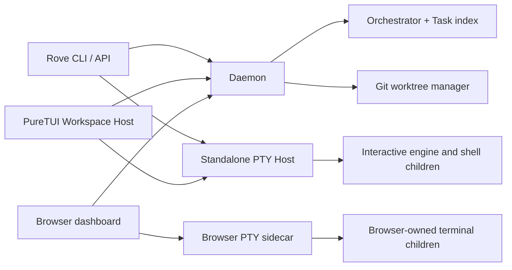

# Architecture

## 1. System shape



The Daemon owns control-plane state. The standalone PTY Host independently owns
TUI/API interactive processes. The browser dashboard uses its own Node PTY
sidecar instead. This separation is load-bearing: a TUI exit or daemon restart
must not end standalone-host sessions.

The isolation unit for a managed Task is:

```text
Managed task = git worktree + branch + terminal tabs
```

The persisted `Task` type also supports `kind: "main"` for a saved repository's
existing checkout and `kind: "dir"` for a user-owned directory. Those variants
reuse their directory and do not own a Rove-created worktree or branch.

## 2. Package map

- `packages/kobe/` — CLI and PureTUI, published canonically as `@sma1lboy/rove` and in lockstep as the `@sma1lboy/kobe` compatibility alias.
  - `src/cli/` — command routing, help, API handlers, daemon and PTY-host
    process entrypoints.
  - `src/engine/` — engine registry, command/capability/history adapters,
    protocols, turn detection, and shared session launch composition.
  - `src/orchestrator/` — Task index and Worktree lifecycle.
  - `src/client/` — framework-free remote Orchestrator client and channel
    stores.
  - `src/tui/` — framework-free keymap, state, terminal, file, sidebar, and
    workspace cores.
  - `src/tui-react/` — the only UI implementation: React 19 over opentui.
- `packages/kobe-daemon/` — Unix-socket daemon protocol/server, browser
  transport, standalone PTY Host implementation, and the plugin core
  (`src/plugins/`: manifest, registry, event derivation, daemon-side host —
  see [docs/design/plugins.md](./design/plugins.md)).
- `packages/kobe-web/` — browser dashboard SPA and browser-side PTY transport.
  **Frozen (2026-07-25):** no new features. It survives because its `/harness`
  route is the only sanctioned visual ground truth for OpenTUI work, not
  because the SPA is a product surface. Every extra GUI consumer is another
  lifetime the daemon has to refcount, which is where the orphan/OOM
  incidents came from. Fix bugs and keep `/harness` working; take new
  surface work to the TUI. The `kobe-desktop` Electron shell was removed the
  same day for the same reason.
- `packages/branding/` — Remotion assets and checked-in replay rendering.
- `packages/kobe-docs/` — public docs site (Fumadocs on Next.js, static
  export). Content is synced from `docs/` by `scripts/sync-docs.mjs`
  (frontmatter injection + link rewriting); edit the source in `docs/`,
  never the generated copies.
- Official plugins live in the separate
  [Sma1lboy/kobe-plugins](https://github.com/Sma1lboy/kobe-plugins) repo
  (`rove plugin install Sma1lboy/kobe-plugins/<name>`). New plugins use
  `rove-plugin.toml` and `@sma1lboy/rove-plugin-sdk`; legacy Kobe spellings
  remain accepted.

## 3. Launch and lifetime

Plain `rove` starts `src/tui/index.tsx`, which dynamically loads the React
Workspace Host. Startup has one behavior; there is no launch-mode parser or
environment switch.

The Workspace Host connects as a daemon GUI client and attaches to hosted PTY
sessions. On exit it detaches local consumers. It does not kill children.

`rove web` connects the frozen browser SPA to the Daemon for shared control
plane data and starts `packages/kobe-web/pty-server.mjs` for browser-owned
terminal children. Browser reconnects can reattach while that sidecar remains
alive, but browser PTYs are not standalone-host sessions and stop with the
`rove web` sidecar.

The Daemon is refcounted by attached GUI clients and browser streams. A daemon
idle exit leaves the PTY Host untouched. The PTY Host idle-exits only when it
owns zero live sessions.

The standalone host periodically freezes bounded terminal rings plus launch
metadata. After a host restart or reboot, it restores dead session records;
the first attachment replays the last snapshot and respawns the recorded
command. This recovery is distinct from a still-live child surviving a TUI or
daemon restart. Explicit close/archive/reset operations remove their frozen
records.

Tmux is not a session backend. The CLI retains one quarantined compatibility
seam solely for upgrades from pre-v0.8: `rove doctor` reports processes still
owned by the retired `tmux -L kobe` server, and `rove reset` terminates those
pane process groups before stopping that server.

## 4. Hosted session addressing

Each standalone-host Terminal Tab uses `<taskId>::<tabId>`. The initial engine tab is
deterministically `<taskId>::tab-1`; API liveness, delivery, and teardown use
the same address.

`src/engine/session-launch.ts` is the canonical launch builder. It owns shell
quoting, repository init scripts, engine argv/protocol, resume context, and
first-prompt priority. Both the Workspace Host and headless API automation call
it.

`rove api send` and prompted `add` (single or `--count` parallel):

1. ensure the Worktree;
2. ensure the PTY Host;
3. reuse an alive canonical engine session, or open `tab-1` once;
4. deliver the prompt and detach the short-lived client;
5. after a confirmed, verified cross-task `send`, best-effort coalesce a
   bounded sender → recipient communication edge in daemon-owned Task
   metadata. This records direction/count/recency, never message content;
   failure cannot make an already-delivered prompt retryable.

The PTY Host's key-level `pty.open` idempotence prevents concurrent callers
from creating duplicate children.

## 5. Ownership boundaries

- Engine adapters own identity, launch commands, capabilities, models,
  history, completion markers, and telemetry normalization.
- The Orchestrator owns Task metadata and git Worktree mutations, not engine
  children. That includes durable spawn provenance and bounded peer
  communication edges consumed by Agent Topology.
- The Daemon is the Task-index writer and channel publisher, not the terminal
  process owner.
- The PTY Host owns child lifetime and buffered terminal bytes, not Task
  metadata.
- The browser PTY sidecar owns only browser-created terminal children; it does
  not attach to or replace standalone-host sessions.
- React components render and wire events; reusable policy/state belongs in
  framework-free `src/tui/**` modules.

## 6. State

- Task index: `<ROVE_HOME>/.rove/tasks.json` (legacy `.kobe/tasks.json` is copied additively when the new daemon starts, after the old writer stops)
- UI/settings state: platform config home, normally
  `~/.config/rove/state.json` (legacy `.config/kobe/state.json` is copied without overwrite)
- Daemon socket/pid/log: derived from `ROVE_HOME_DIR` (`KOBE_HOME_DIR` fallback) and intentionally retain legacy `.kobe` runtime names
- PTY Host socket/pid/log plus bounded `pty-sessions/` recovery snapshots and
  `pty-exits.json` abnormal-exit tails: derived independently from the same home
- Browser PTYs: process state in the `rove web` Node sidecar; browser tab
  metadata is not authoritative product state
- Engine conversation history: engine-owned locations such as
  `~/.claude/projects/**`
- Plugins: registry `<KOBE_HOME>/.kobe/plugins.json` (CLI-written,
  daemon-watched); per-plugin checkout/config/state/log under
  `<KOBE_HOME>/.kobe/plugins/<id>/`. These paths intentionally remain in the
  compatibility namespace; new commands receive both `ROVE_PLUGIN_*` and
  `KOBE_PLUGIN_*` variables pointing at the same data.

Never treat browser storage as authoritative for local product state.

## 7. Reference projects

`refs/` is gitignored and read-only study material. Consult the relevant
project before changing a boundary it demonstrates:

- `agent-deck` — multi-session/task ergonomics
- `opcode`, `codexui` — coding-agent UI patterns
- `codex` — Codex CLI protocols and history
- `claude-code` — interactive engine behavior
- `ccstatusline` — terminal status presentation
- `warp` — terminal interaction and layout patterns

Reference code informs decisions but is never edited or copied wholesale.

Clone them before development:

```bash
mkdir -p refs && cd refs
ln -s /Users/jacksonc/i/agent-deck agent-deck   # if you have it locally
git clone --depth 1 https://github.com/winfunc/opcode.git
git clone --depth 1 https://github.com/tanbiralam/claude-code.git
git clone --depth 1 https://github.com/sirmalloc/ccstatusline.git
git clone --depth 1 https://github.com/openai/codex.git
git clone --depth 1 https://github.com/friuns2/codexui.git
git clone --depth 1 https://github.com/warpdotdev/warp.git
# conductor is image-only — see docs/DESIGN.md §1
```
