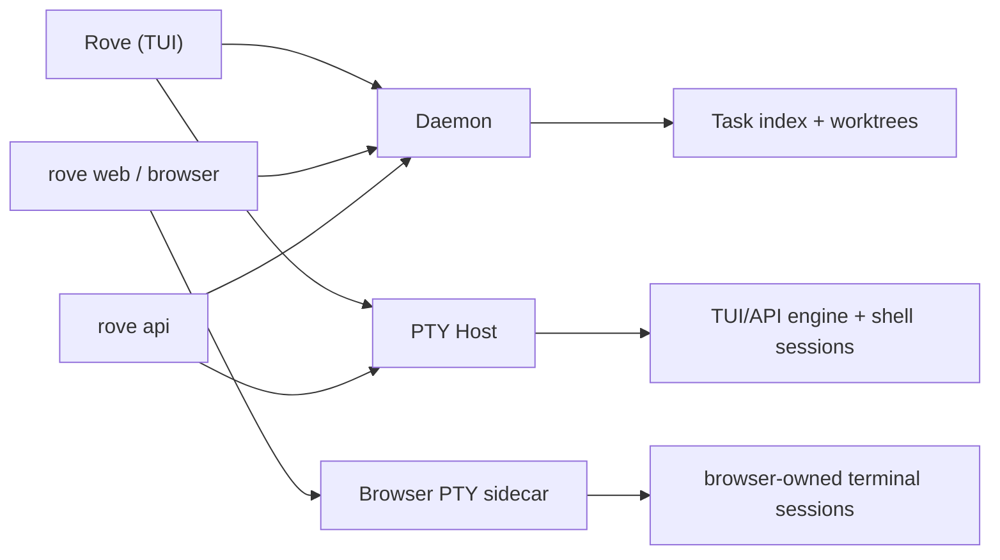

# Concepts

Six nouns explain Rove: **Task**, **Worktree**, **Terminal Tab**, **Engine**,
**Daemon**, and **PTY host**. Learn those and the rest reads itself.

## Task

A Task is one workspace record you're tracking. Rove has three Task kinds:

| Kind | Directory | Git isolation |
|---|---|---|
| Project main | A saved repository's existing checkout | Uses the checkout as-is; no Rove-created branch or worktree |
| Managed task | A Rove-created worktree | Own branch and worktree |
| Directory task | An existing directory opened with `rove .` | Uses the directory as-is; it need not be a git repository |

For a managed task, the product unit is:

```text
Managed task = git worktree + branch + terminal tabs
```

A Task is a **workspace, not a conversation**. Its Terminal Tabs all run in
the same directory. Only managed tasks get Rove-created branch/worktree
isolation; project-main and directory tasks deliberately reuse directories you
already own.

**Scratch shells** are directory Tasks with an unsettled home: the "scratch
shell" choice at the tail of the `ctrl+e` new-conversation dialog opens one
as a bare shell in `$HOME`. It
lives in the sidebar's Scratch section above every project, and follows a
zero-ceremony lifecycle — the shell exiting removes the row (no archive, no
confirm; nothing on disk is touched). A scratch row earns a permanent place
two ways: rename it (naming is the keep gesture), or start a coding harness
inside a git repository — Rove detects the live harness plus the shell's
settled directory and quietly migrates the row into that repository's project
group. If the settled directory already belongs to a Task — the project's
main checkout, a directory Task's directory, or inside a managed Task's
worktree — the shell (running session and all) folds into that Task as a new
terminal tab instead of becoming a duplicate row.

Each Task has a `status` you set yourself — `backlog`, `in_progress`,
`in_review`, `done`, `canceled`, `error` — and a separate `archived` flag.

**Archiving a managed or directory Task is safe.** It stops the Task's live
sessions and removes the row from the sidebar (archived Tasks remain listed by
`rove api list` and on the web board). Its directory and engine-owned
conversation history stay. Archive, `done`, and `canceled` never delete files.
Project-main Tasks cannot be archived.

**Delete is explicit and kind-aware.** A project-main Task cannot go through
Task deletion; pressing `d` on its row instead forgets the saved project and
synthetic main row while keeping the repository, branches, worktrees, and
managed Tasks. Deleting a directory Task removes only its Rove record, never
the directory.
Deleting a managed Task removes its worktree after the dirty-worktree safety
check. **The task branch stays** — git is the durable record of the work;
pass `--delete-branch` on `rove api delete` to drop it too. The separate
[Worktrees page](WORKTREES.md) is an audit/cleanup tool: removing a directory
there keeps its Task record and branch so the worktree can be materialized
again later.

## Worktree and branch

Every managed Task gets its own git worktree at
`~/.rove/worktrees/<repo-key>/<task-slug>/`, checked out to the task's
branch. That's what makes running many tasks at once safe: N tasks means N
working trees that can't overwrite each other or your main checkout. Edits
cross over only when you merge.

Project-main and directory Tasks are the exceptions: they point at an existing
checkout or directory. Use a managed Task when you want isolation.

The worktree outlives everything else. Killing a session, quitting the TUI,
dropping SSH, restarting the daemon — none of them touch it.

> **One thing to watch:** Terminal Tabs inside the same managed Task share one worktree,
> and Rove does not coordinate their writes. Two tabs editing the same file
> at once will conflict. If you need real isolation, open a new task.

## Terminal Tabs and engine sessions

A Task owns N Terminal Tabs. An engine tab runs an engine inside an interactive
shell and can resume an engine-owned conversation. Other tabs can be shells,
fixed commands/editors, or read-only file/diff content; those are not engine
conversations. Splits add more shell leaves inside a tab.

Tabs let you ask a side question or open a shell without changing directories.
Close a tab when you're done; the Task's directory stays. Exiting the engine
CLI itself returns an engine tab to its shell prompt—the hosted session ends
only when that wrapping shell exits or Rove explicitly closes it.

Each engine tab may pin its own engine; otherwise it inherits the Task's engine,
so tabs in one Task can use different vendors. A Task-level reasoning-effort
choice is forwarded when that engine supports it. The embedded engine CLI owns
its own model and permission controls.

Conversation history belongs to the engine, not to Rove (Claude Code, for
example, keeps JSONL transcripts under `~/.claude/projects/**`). Hosted
terminal output has separate persistence rules; see [Sessions](SESSIONS.md).

## Engines

An engine is the execution backend a task runs on. Rove embeds the **real
interactive CLI** — `claude`, `codex`, `copilot`, `kimi`, or one you register
yourself — inside a hosted terminal session. No API wrappers, no re-rendered
output: what you see is the actual engine running next to your dependencies
and credentials.

Details: [Engines](ENGINES.md).

## Daemon and PTY host

rove splits into three processes, and that split is why your sessions
survive you:



- **Daemon** — owns your task list, worktrees, and the issue store. Starts on
  its own, then stops after the last attached GUI disconnects unless an
  enabled routine — or any live tab session in the PTY host — holds it alive
  (it must stay up to collect engine activity, or the status dots go stale).
- **PTY host** — owns the running engine and shell processes. Survives both
  the TUI *and* a daemon restart.
- **Browser PTY sidecar** — a separate Node process started by `rove web` for
  browser-owned terminals. It is not the standalone PTY host and does not own
  the TUI's hosted sessions.
- **The TUI** — just a viewport. Quitting it kills nothing.

Full lifetime rules, and exactly what survives a reboot:
[Sessions](SESSIONS.md).

## The issue store

rove has no external issue tracker. Your backlog lives in a daemon-owned
store at `~/.rove/issues.json`, shared between a repo and all its worktrees.

It's deliberately simple — no type taxonomy, just a status
(`open → doing → done`, plus `hold` for things parked on purpose):

- **You:** the Issues page in `rove web`, or the Kanban in the TUI.
- **Agents and scripts:** `rove api issue-list`, `issue-create`,
  `issue-set-status`, `issue-update`.

Issues track *what to do*; the changelog records *what shipped*.

## Where things live on disk

| What | Where |
|---|---|
| Task index | `~/.rove/tasks.json` |
| Worktrees | `~/.rove/worktrees/<repo-key>/<task-slug>/` |
| Issue store | `~/.rove/issues.json` |
| Daemon socket / log | `~/.rove/daemon.sock`, `~/.rove/daemon.log` |
| Settings | `~/.config/rove/state.json` (open with `rove config`) |
| Conversation history | engine-owned, e.g. `~/.claude/projects/**` |

Setting `ROVE_HOME_DIR` moves Rove's home-rooted product data and compatibility
runtime; `KOBE_HOME_DIR` remains a fallback. It does not relocate platform
settings or engine-owned conversation stores. That's how the dev sandbox
avoids touching your real `~/.rove` task data or runtime.

## Three ways people use it

**Many attempts at one prompt.** Press `n` in the TUI, or script it:

```bash
rove api add --repo "$PWD" \
  --agents claude:2,codex:2 \
  --prompt "Try independent approaches to simplify the auth flow."
```

Each attempt is its own Task with its own worktree. Workers message their
outcome back to the spawning agent's engine tab (`rove api send`); compare
with `rove api collect`, merge with `rove api land`.

**Over SSH, on the machine your code lives on.** The daemon and PTY host run
on that machine, so dropping SSH does not end hosted sessions. SSH back in and
run `rove` to reattach. Clipboard and terminal notifications depend on the
attached terminal connection; attention that happens while disconnected stays
available in Rove's Inbox when you return.

**The browser dashboard as a maintenance surface.** `rove web` serves the
frozen browser SPA (default `http://localhost:45174`). It shares daemon-owned
Task and issue data with the TUI, but browser terminal tabs belong to the
browser PTY sidecar and are not the TUI's hosted Terminal Tabs. New product
surface work belongs in the TUI; `/harness` remains the visual test path.

## Glossary

- **Task** — a tracked workspace record: project main, managed worktree, or
  existing directory.
- **Worktree** — a git working tree on disk. Rove creates one for each managed
  Task; project-main and directory Tasks reuse existing directories.
- **Terminal Tab** — an engine, shell, command/editor, or read-only content
  surface inside a Task. N per Task.
- **Engine** — the coding-agent CLI a task runs on.
- **Daemon** — the background process holding your task list and issues.
- **PTY host** — the standalone process holding TUI/API live sessions; survives
  daemon restarts.
- **`rove api`** — the headless surface for scripts and agents.
- **Fan out / fan in** — run N attempts of one prompt, then merge the winner.
