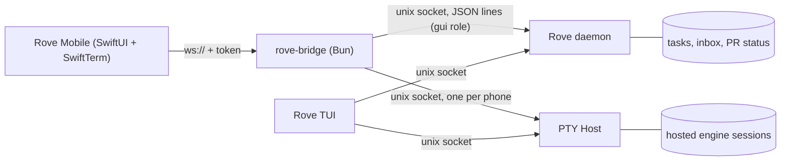

# iOS client

Rove Mobile is an iPhone app that drives the Rove on your Mac: see every task and what it is waiting on, watch an engine's terminal, type into it, read the diff, start, land and delete tasks. The Mac stays the only place state lives; the phone holds no copy of your tasks, files or sessions.

The phone cannot reach the daemon's unix socket, so a small Mac-side process, `rove-bridge`, carries a fixed list of operations over one WebSocket. It is off unless you start it.

## Start the bridge

From a checkout of the Rove repo:

```bash
bun install
bun run --filter rove-bridge start                      # your real Rove home
bun run --filter rove-bridge dev                        # the dev:sandbox home instead
bun run --filter rove-bridge dev -- --name ios          # a named sandbox home
```

It prints a pairing URL (and a QR code) such as `ws://127.0.0.1:7878/?token=…`, then keeps running. It connects to the same daemon and PTY Host your TUI uses, starting them if they are down.

| Flag | Effect |
| --- | --- |
| `--host <addr>` | Interface to listen on. Repeatable. Default `127.0.0.1` only. |
| `--port <n>` | TCP port, default `7878`. |
| `--rotate-token` | Mint a new token. Every paired phone must pair again. |
| `--no-qr` | Print the URL without the QR code. |

Loopback is only reachable from the Mac itself (and the iOS Simulator). For a real phone, pick one:

- **Tailscale (recommended).** Install Tailscale on the Mac and the phone, then `--host 100.x.y.z` with the Mac's Tailscale address (`tailscale ip -4`). Traffic is WireGuard-encrypted end to end and works away from home.
- **Same Wi-Fi.** `--host 192.168.1.20` with the Mac's LAN address. Traffic is plain `ws://`: anyone on that network can read it.
- **`--host 0.0.0.0`** listens everywhere and prints one pairing URL per address. Use it only on networks you trust.

## Pair the phone

1. Build and run the app (below), open **Settings**.
2. Scan the QR code, or paste the URL. A `rove://pair?url=<percent-encoded URL>` link opens the app straight into pairing.
3. The app stores the URL in the iOS Keychain and connects. It reconnects by itself when the Mac or the bridge comes back.

The token lives in `<ROVE_HOME>/.rove/bridge/token` (mode 0600) and survives bridge restarts, so a paired phone stays paired. `--rotate-token` is the revoke button.

## What the app does

- **Tasks.** Every task across repos with its title, branch, engine and group — `waiting-on-you`, `landing`, `ready-for-review`, `working`, `idle`, `unknown` — sorted so what needs you is on top. The groups are computed by the same code as `rove api context`. A badge counts unread attention-inbox items. Pull to refresh; changes also arrive live.
- **Terminal.** Each Terminal Tab of a task attaches to the hosted session in the PTY Host — the same session the TUI shows, so both see the output and both can type. A key row adds Esc, Tab, Shift-Tab, a sticky Ctrl, arrows, Enter and Ctrl-C; a composer sends a line plus Enter. **Fit** resizes the shared session to the phone's screen (the TUI sees the new size until it next resizes); **Watch** leaves the size alone and scales the font instead.
- **New engine tab.** Pick an engine and a first message; this is `rove api send --tab new`.
- **Diff.** Files changed on the branch versus its base (same base rule as the TUI's changes pane) and uncommitted files, each with its unified diff.
- **New task, land, delete.** New task takes a repo, an engine and an optional first prompt. Land and delete ask twice; delete keeps the branch, as `rove api delete` does.
- **Notifications.** While the app is running, a task that moves into `waiting-on-you`, or from `working` to `ready-for-review`/`idle`, posts a local notification.

Engine names in the app come from Rove's engine registry through the bridge.

## Architecture



- The bridge subscribes to the daemon as a `gui` client, the way an open TUI does, so the daemon does not idle-stop while a phone is the only UI.
- Task rows come from `task.list`, the activity registry, the attention inbox and PTY Host liveness, folded by `buildContext` from `rove api context`. Mutations go through the `rove api` verbs themselves (`add`, `delete`, `land`, `send --tab new`, `tab-close`), so they keep every guard those verbs have.
- Each phone connection opens its own PTY Host socket. Closing the WebSocket detaches every session that phone watched; it never ends a session.
- The daemon is unchanged. No HTTP or SSE was added to it.

## Security model

- **Off by default.** Nothing listens until you run the bridge.
- **Loopback by default.** Any other interface is an explicit `--host`.
- **One bearer token.** 32 random bytes. It is checked with a constant-time compare at the WebSocket upgrade; a missing or wrong token gets HTTP 401 and no socket. Every later frame rides that authenticated socket.
- **Closed op list.** The phone can call the 18 operations below and nothing else. There is no generic daemon passthrough; anything else is refused with `UNKNOWN_OP`.
- **Terminal input is scoped.** `term.input` only reaches a session this connection attached, and attach refuses a tab with no hosted session instead of spawning one.
- **Diff paths stay in the worktree.** Absolute paths and `..` are refused.
- **What the token grants.** Whoever holds it can do what the app can: read task output, type into engine sessions (which run with your user's permissions), create, land and delete tasks. Treat the pairing URL like a password; rotate it if it leaks.
- **No transport encryption of its own.** Use Tailscale or a trusted network. Plain `ws://` on shared Wi-Fi exposes the token and terminal contents.

## Protocol

JSON text frames over one WebSocket. Request `{"id": 1, "op": "tasks.list", "args": {}}`; reply `{"id": 1, "ok": true, "result": {…}}` or `{"id": 1, "ok": false, "error": {"code", "message"}}`; push `{"event": "tasks" | "term.data" | "term.exit", "data": {…}}`. The types live in `packages/rove-bridge/src/protocol.ts`.

| Op | Args | Result |
| --- | --- | --- |
| `hello` | — | `{protocol, roveVersion, host}` |
| `tasks.subscribe` | — | `{tasks, attention}`, then `tasks` pushes on change |
| `tasks.list` | — | `{tasks, attention}` (fresh read) |
| `engines.list` | — | `{engines: [{id, name, command, protocol, builtin}]}` |
| `repos.list` | — | `{repos}` (saved projects plus repos with tasks) |
| `task.create` | `repo`, `engine?`, `prompt?`, `title?` | `{taskId}` |
| `task.delete` | `taskId`, `force?` | `{status}` |
| `task.land` | `taskId`, `strategy?` (`merge`/`squash`) | `{landedOn, commit}` |
| `task.tabs` | `taskId` | `{tabs: [{id, kind, title, engineName, alive, engineAlive}]}` |
| `tab.new` | `taskId`, `prompt`, `engine?` | `{tabId}` |
| `tab.close` | `taskId`, `tabId` | `{}` |
| `term.attach` | `taskId`, `tabId`, `cols?`+`rows?` | `{stream, alive, replay}` (base64 bytes) |
| `term.input` | `stream`, `data` | `{}` |
| `term.resize` | `stream`, `cols`, `rows` | `{}` |
| `term.detach` | `stream` | `{}` |
| `diff.files` | `taskId` | `{base, files: [{path, status, added, deleted, scope}]}` |
| `diff.file` | `taskId`, `path`, `scope` | `{kind, text?, message?}` |
| `attention.dismiss` | `taskId`, `tabId?` | `{}` |

## Build the app

The app is in `packages/rove-ios` (SwiftUI, iOS 17+, SwiftTerm). The Xcode project is generated, not committed:

```bash
cd packages/rove-ios
xcodegen generate
xcodebuild -scheme RoveMobile -destination 'platform=iOS Simulator,name=iPhone 17 Pro' build test
```

Running on a physical iPhone needs your own signing team in Xcode; the repo ships no signing configuration.

## Not done yet

- Push notifications (APNs). Notifications fire only while the app is running.
- TestFlight / App Store distribution.
- A chat view of the conversation; the app shows the raw terminal.
- Transport encryption inside the bridge (TLS or end-to-end), and a relay for reaching a Mac without Tailscale.
- Per-device tokens with a device list and per-device revoke; today one token is shared and rotation revokes all.
- Restoring the TUI's terminal size when a phone leaves Fit mode.
