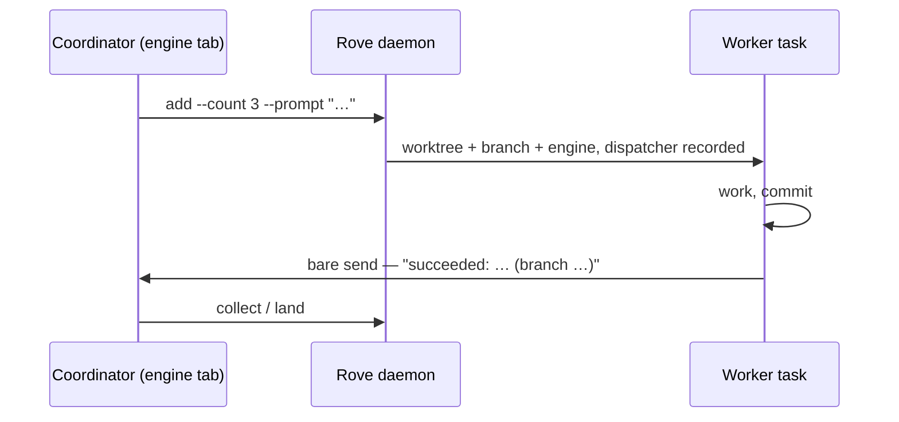

# Orchestrating many agents

[Concepts](CONCEPTS.md) names the pieces and the [API reference](API.md)
lists the verbs. This page is the missing middle: how you actually run
several agents at once — when to isolate, how wide to fan out, how results
come back, and what goes wrong.

Everything here works from a plain shell. It also works from *inside* an
engine session Rove manages: an agent with `rove` on its PATH can spawn and
supervise its own workers with the same commands, and Rove records who
spawned whom so replies route home automatically.

## Task, tab, or split?

The most common orchestration mistake is picking the wrong isolation level.
The three units nest — **Task ⊃ Terminal Tab ⊃ Split** — and isolation drops
at each level down:

```text
new Task → own worktree + own branch   (parallel work can't collide)
new Tab  → own conversation, SAME files (a helper in the same checkout)
new Split → same screen, one tab divided (a monitor beside the work)
```

| You want | Use | Because |
|---|---|---|
| Independent attempts, comparable results | New tasks (`add`) | Each gets its own worktree and branch; nothing can overwrite anything |
| A second opinion on the *same* working tree | New tab (`send --tab new`) | Separate conversation, shared files — deliberate, and deliberate collisions too |
| A different engine on the same files | New tab with `--command` | The tab pins its own engine; the task's default is untouched |
| Logs, tests, `btop` next to the work | Split (`pane-open`) | A split is layout, not delegation — it isolates nothing |

The rule that decides every ambiguous case: **a new tab shares the worktree
and branch; only a new task gets its own.** Two tabs editing the same file
will conflict — that's a feature when you asked for a helper, a bug when you
wanted parallel attempts. When in doubt, take a new task: it is the only
choice whose isolation cannot corrupt work in progress.

## Fan out

`add` creates one task; `--count` makes it a parallel round — N sibling
tasks of the same prompt, each in its own worktree and branch, sharing a
`groupId` and `#i/N` titles:

```bash
rove api add --repo "$PWD" --count 3 \
  --prompt "Simplify the auth flow. Commit when tests pass."

# Mixed fleet: engine ids from `rove api engine-list`, with per-engine counts.
rove api add --repo "$PWD" --agents claude:2,codex:1 \
  --prompt "Simplify the auth flow. Commit when tests pass."
```

Ground rules that make rounds worth running:

- **3–4 attempts is the sweet spot.** The hard cap is 10, but comparing ten
  diffs costs more than it buys. Fan out wide only when attempts are cheap to
  judge (a failing test either passes or it doesn't).
- **The prompt is the whole brief.** Workers don't share your conversation;
  each one starts cold in a fresh worktree. Scope, constraints, and the
  definition of done all go in `--prompt` — including "commit your work",
  or you'll get green tests and an empty branch.
- **One level of fan-out.** Workers should not spawn their own rounds;
  a tree of agents spending tokens on the same problem is how budgets die.
- **Don't fan out for a fix you'd accept from anyone.** One task is fine.
  Parallel rounds pay off when approaches genuinely differ.

## The report-back loop

Rove's completion contract is a *message*, not stored state. When a task is
created from inside another Rove session, the creator's task + tab are
recorded as the new task's **dispatcher**. When the worker finishes, one
bare `send` — no `--task-id` — routes its outcome back to that exact tab:

```bash
rove api send --prompt "succeeded: auth flow simplified (branch fix/auth-simplify)"
```



What makes this loop work:

- **Coordinators don't poll.** Each outcome arrives in the coordinator's own
  chat as a `[ROVE PEER]`-prefixed message carrying the sender's task id and
  a ready-made reply command. Keep working, or end the turn; the messages
  come to you. Every `send` costs the receiver a full engine turn, so a
  polling loop burns both sides' budgets for nothing.
- **Workers report the branch name.** The coordinator needs it to `land`.
- **"Succeeded" means committed.** The only thing `land` can merge is
  commits on the worker's branch. Green tests in a dirty working tree are
  not a deliverable — `land` will refuse an empty branch (`EMPTY_BRANCH`).
- **A report is a claim, not a verification.** Read the winner's actual diff
  before merging it (`collect` shows ahead counts and diffstats; `git log`
  in the worktree shows the truth).

Peer messages aren't limited to the dispatcher. Any session can message any
task's engine tab — `send --task-id <id> --tab tab-N` — and because peers
share a filesystem, a prompt can carry file paths: a screenshot, a log, a
diff. The receiver opens them with its own tools. That is the whole
coordination surface; there is no separate message bus to learn.

## Fan in

Compare, pick, close the round:

```bash
# One snapshot of the whole round: branch, running state, tabs,
# uncommitted changes, ahead count + diffstat vs base per task.
rove api collect --task-ids <a>,<b>,<c> --pretty

# Merge the winner's branch into the base repo's CURRENT branch —
# check the base checkout is on the branch you mean, first.
rove api land --task-id <winner>

# Losers: delete removes the worktree but keeps the branch (git is the durable record).
rove api delete --task-id <loser1>
rove api delete --task-id <loser2>
```

`land` refuses a dirty base checkout, and on merge conflict aborts cleanly
and returns the conflicted files for manual resolution. `delete` removes a
loser's worktree but keeps its branch (git is the durable record); `land`
removes the winner's worktree in the same call by default. Finish rounds —
a sidebar full of stale attempts is where the next round's confusion comes from.

## Failure modes

**Silence is a checkpoint, never a verdict.** A quiet worker may be mid-turn,
or stuck on a permission prompt. Don't mark it failed, don't auto-retry —
peek and nudge:

```bash
rove api get-task --task-id <id>          # .running, per-tab alive
rove api read-output --task-id <id>       # its actual session output
rove api send --task-id <id> --prompt "Status? Reply succeeded/failed + branch."
```

**A test failure in a fresh worktree may be fake.** A managed task's worktree
is a brand-new checkout: no `node_modules`, no build artifacts. Missing
dependencies masquerade as product bugs ("Could not resolve: react-dom/client"
reads like a regression). Repos with an install step should commit
`.rove/init.sh`, which runs once per worktree before the engine starts — see
[Configuration](CONFIGURATION.md#per-repo-init). Before believing a failure a
worker reports, confirm the install ran, and compare against the same command
on the base branch.

**"Succeeded" without commits.** The classic empty-merge: a worker ran
everything, passed everything, committed nothing. `land` fails with
`EMPTY_BRANCH` — send the worker back to commit rather than merging by hand.

**`send` refuses instead of guessing.** A task whose live tabs include no
engine gets `NO_ENGINE_TAB` (address one with `--tab tab-N` from `get-task`'s
`.tabs[]`, or spawn one with `--tab new`); an engine that exited back to its
shell gets `ENGINE_NOT_RUNNING`. Errors carry a `hint` and often
`nextCommandArgs` — argv you can run verbatim to recover.

**Everything else:** `rove api inspect` is the one-read diagnostic — daemon
activity, live PTY sessions, death records with output tails, and the tab
snapshots the sidebar renders from.

## End to end

A complete round, from a plain shell, in a repo with a committed
`.rove/init.sh`:

```bash
# 1. Fan out three attempts.
rove api add --repo "$PWD" --count 3 \
  --prompt "The flaky test in test/sync.test.ts fails ~1 in 5 runs.
Find the root cause and fix it. Run the suite 20x to confirm.
Commit with a descriptive message when green."
# → { "tasks": [ { "taskId": "…", "branch": "…" }, … ] }

# 2. Do something else. From inside a Rove session, outcomes arrive as
#    messages. From a plain shell, check in when you're ready:
rove api collect --repo "$PWD" --pretty

# 3. Verify the most promising attempt — its worktree is a real checkout:
rove api get-task --task-id <winner>       # .task.worktreePath, .task.branch
git -C <worktreePath> log --oneline main..HEAD
git -C <worktreePath> diff main...HEAD

# 4. Land it, delete the losers' worktrees (branches stay).
rove api land --task-id <winner>
rove api delete --task-id <loser1>
rove api delete --task-id <loser2>
```

The same round run *by an agent* differs only in step 2: the workers'
`succeeded:`/`failed:` messages land in its chat unprompted, because its own
task + tab were recorded as each worker's dispatcher at `add` time.

## See also

- [API reference](API.md) — every verb and flag; `rove api schema` when the
  page and the binary disagree.
- [Concepts](CONCEPTS.md) — Task, Worktree, Terminal Tab, Engine, Daemon.
- [Sessions](SESSIONS.md) — what survives detach, daemon restarts, reboots.
- [Routines](ROUTINES.md) — the scheduled cousin: cron-fired prompts that
  each create a fresh task.
