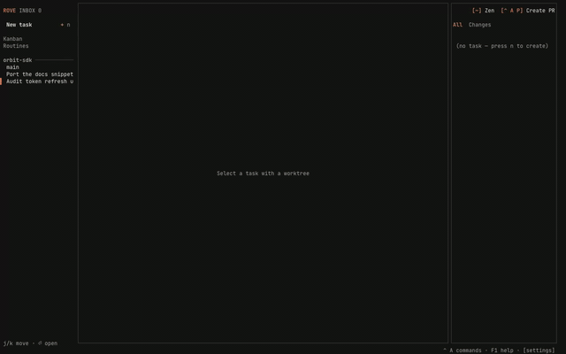
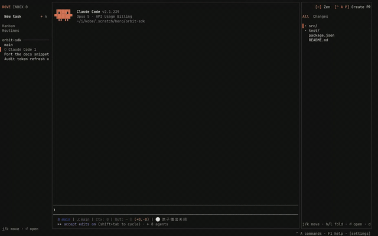
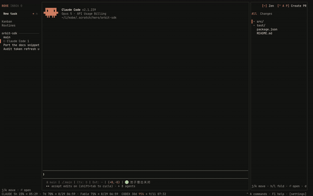
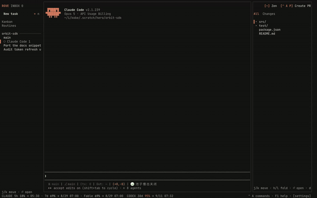
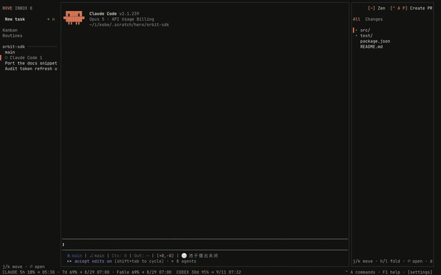

# Writing Rove plugins

The developer-facing reference: everything a plugin can declare, every event
Rove fires, every environment variable it injects, and every way to call
back in. Design rationale lives in [design/plugins.md](./design/plugins.md)
and [design/plugin-events.md](./design/plugin-events.md); this page is the
contract.

A plugin is **a directory with a `rove-plugin.toml` manifest** plus any argv
commands your machine can run: Bash, Node, Bun, Python, Rust, a prebuilt
binary. No SDK is required: the whole `rove` CLI and the daemon socket are the
plugin API, with an optional TypeScript SDK described below. Rove owns the host
surface (install, validation, event dispatch, env injection, panes, settings
UI, run logs); you own the implementation.

## Quickstart

```bash
mkdir my-plugin && cd my-plugin
cat > rove-plugin.toml <<'EOF'
id = "you.hello"
name = "Hello"
version = "0.1.0"
min_rove_version = "0.8.24"

[[events]]
on = "agent.turn-complete"
command = ["sh", "-c", "echo \"$ROVE_PLUGIN_TASK_TITLE finished a turn\" >> \"$ROVE_PLUGIN_STATE_DIR/log\""]
EOF

rove plugin link .            # register your working directory (dev loop)
rove plugin log you.hello     # inspect hook runs (exit codes, output, timing)
```

`link` is a one-time registration. After it, a running daemon picks up edits to
your `rove-plugin.toml` within about half a second — add an `[[events]]` hook,
fire the event, and `rove plugin log` shows the run. Re-run `link` only when
you move the plugin, or when its id or version changes.

## Optional SDK (TypeScript)

The contract above is the API: any language, no SDK required. For
TypeScript/JavaScript authors, **`@sma1lboy/rove-plugin-sdk`** wraps that
same contract with types and autocomplete (zero deps, Node ≥ 18 or Bun):

```ts
import { pluginContext, pluginEvent, notify, Pane, RoveSocket } from "@sma1lboy/rove-plugin-sdk"

const ctx = pluginContext()   // typed ROVE_PLUGIN_* env
const ev = pluginEvent()      // typed event envelope (null outside [[events]])
```

- `pluginContext()` / `pluginEvent()`: the env contract, typed.
- `readSettings()` / `setting()`: your `[[settings]]` values from config `.env`.
- `rove()` / `roveJson()` + `notify` / `dispatch` / `listTasks` / `openPane`:
  `$ROVE_BIN_PATH` callbacks.
- `RoveSocket`: daemon socket client: `request(name, payload)` + live
  channel `subscribe` (always `role: "pane"`).
- `Pane`: a tiny pane kit for `[[panes]]` pages: alt screen, raw-mode
  keys, resize, absolute-addressed `draw(lines)`.
- `PLUGIN_EVENT_NAMES` / `DAEMON_CHANNELS`: the catalogs as typed unions.
  These are the SINGLE source: the daemon itself imports them from the
  SDK's `./contract` module, so host and SDK can't drift by construction.

Package README has full examples: `packages/kobe-plugin-sdk/README.md`.
Module-by-module SDK reference: [PLUGIN-SDK.md](./PLUGIN-SDK.md).

## SDK examples

Five runnable examples live under `packages/kobe-plugin-sdk/examples/`, one
per surface. Each clip below is the real TUI — recorded through the same
browser-PTY path the README assets use, against a throwaway home with the
example already linked (`packages/kobe-harness/e2e/hero-plugin-demos.ts`), so what
you see is where your plugin actually shows up.


*`[[panes]]` — the pane is offered in the `ctrl+e` picker under its declared
title, splits in beside the engine, and redraws when a task is created from
outside the TUI: it is subscribed to `task.snapshot`, not polling.*


*`[[engines]]` — a manifest-only plugin puts `fake-coder` in the engine list
next to the built-ins, with the identity and screen-state rules it declared.*


*`[[settings]]` + `[[actions]]` — Settings → Plugins renders the settings the
manifest declares; editing one writes the config `.env` your plugin reads on
its next run.*


*`[[events]]` — an `issue.changed` fired from outside the TUI reaches the hook,
and the plugin's run summary records the exit status and timing.*


*`[[events]]` + `notify()` — the hook calls back INTO the host, and its own
copy appears as a toast in every attached UI.*

Re-record with:

```bash
cd packages/kobe-harness
bun e2e/hero-fixture.ts --fresh   # throwaway home + a real repo
bun e2e/hero-plugins.ts           # link all five examples (BEFORE the TUI boots)
bun e2e/hero-serve.ts             # warm capture stack (keep running)
bun e2e/hero-plugin-demos.ts      # all five, or name one
```

Linking has to happen before the harness starts: the TUI reads the plugin
registry once at boot, so a plugin linked mid-session contributes nothing a
running TUI can see. The takes create real records and do not clean up after
themselves, so re-shoot from a fresh fixture rather than a used one.

Publish: push a public GitHub repo (one plugin per subdirectory is fine),
add the topic **`rove-plugin`** → it appears in the marketplace
([rove.run/plugins](https://rove.run/plugins) and
`rove plugin search`) automatically. Users install with
`rove plugin install owner/repo[/subdir]` and stay fresh with
`rove plugin outdated` / `rove plugin update --all` (an update is a clean
reinstall of the managed checkout; config/state survive).

## Manifest reference

```toml
id = "you.example"               # letters/digits/dot/colon/underscore/hyphen
name = "Example"
version = "0.1.0"
min_rove_version = "0.8.24"      # install refuses older Rove versions
description = "…"                # optional
platforms = ["macos", "linux", "windows"] # optional; item-level override

[[build]]                        # runs at GitHub install (after preview confirm), cwd = checkout
command = ["npm", "install"]     # self-provision deps INTO the plugin dir; `link` skips build

[[startup]]                      # once per daemon start; the socket may not accept connections yet — retry your connect. One-shot, not a daemon
command = ["node", "restore.js"]
timeout_ms = 30000               # optional, 100…600000; the host SIGKILLs the
                                 # hook's process group at the deadline.
                                 # Default 30s for [[startup]]/[[events]], 3s
                                 # for [[shutdown]] (it delays daemon stop)

[[shutdown]]                     # at daemon stop; bounded (~3s), the host kills a hook that lingers
command = ["node", "flush.js"]

[[actions]]                      # on-demand: rove plugin action invoke you.example.greet [args…]
id = "greet"                     # local id, no dots; extra CLI args append to argv
title = "Say hello"
command = ["sh", "greet.sh"]

[[events]]                       # async observer fired by the daemon (catalog below)
on = "agent.turn-complete"
command = ["sh", "notify.sh"]

[[panes]]                        # a terminal surface in the task workspace
id = "board"
title = "Board"
placement = "split"              # split (default: joins the focused chattab's
                                 # split group beside the engine) | tab (own tab)
command = ["node", "$ROVE_PLUGIN_ROOT/board.js"]   # cwd = the TASK WORKTREE

[[settings]]                     # rendered as an editor in Settings → Plugins
key = "YOU_EXAMPLE_MODE"         # stored as KEY=value in your config .env;
                                 # must be a plain env var name, and may not
                                 # be one that steers how a process runs
                                 # (PATH, LD_PRELOAD, NODE_OPTIONS, …)
label = "Mode"
type = "enum"                    # string | number | boolean | enum | secret
options = ["fast", "fancy"]
default = "fast"                 # what the Settings editor pre-fills, NOT a
                                 # stored value: nothing reaches the config
                                 # .env until the user saves, so read it as
                                 # `setting(dir, key, "fast")`. TOML `true` /
                                 # `false` / numbers are accepted and become
                                 # "1" / no default / their decimal spelling

[[settings]]                     # `secret` masks the value everywhere it is
key = "YOU_EXAMPLE_TOKEN"        # shown, for keys the user pastes in
label = "API token"
type = "secret"

[[file_handlers]]                # claim Files-pane opens by filename pattern
pattern = "\\.(png|jpg)$"        # JS regex, case-insensitive, vs the file name
action = "greet"                 # your action, invoked with the absolute path

[[engines]]                      # contribute a coding-CLI engine
id = "aider"                     # VendorId; may not shadow a built-in (claude/codex/copilot/kimi) or shipped engine (gemini/opencode/cursor/grok/droid/amp)
name = "Aider"                   # display name in the selector and Settings
command = ["aider"]              # launch argv; argv[0] is the binary
# process_names = ["aider-core"] # extra ps basenames (post-launch renames)
# first_message_delivery = "paste"  # argv (default) | paste — see below

[engines.identity]               # optional product identity for UI labels
short_name = "Aider"             # falls back to `name`

[[engines.rules]]                # screen-state rules, first match wins;
state = "blocked"                # declare blocked before working
all = ["(y)es/(n)o"]             # every string must appear (case-insensitive)

[[engines.rules]]
state = "working"                # working | blocked | idle
any = ["ctrl-c to interrupt"]    # at least one must appear
# line_regex = ["^\\s*⠋"]        # or: one screen line matches a regex
# bottom_lines = 12              # trailing non-empty lines examined (default 12)
```

`command` is argv, never a shell, for events, startup, shutdown and
actions: no expansion, no pipes, no globs. **Panes are the exception** — a
pane runs through the user's interactive login shell (`sh -ilc`, the same
launch path as an engine tab), expands `$ROVE_PLUGIN_ROOT`, and therefore
inherits the rc-file environment: your `command[0]` must resolve on the PATH
the user's `.zshrc`/`.bashrc` builds, not the daemon's, and anything those
files print (version-manager chatter, MOTDs, banners) reaches the terminal
before your first draw. The pane kit's `start()` handles that for you — it
enters the alternate screen and clears it, so rc output stays on the primary
screen; a pane that does not use the kit should clear the screen itself
before its first frame. Unknown event names are warnings (forward compat);
invalid types/patterns are install-time errors.

`first_message_delivery` says how the CLI takes a session's first message.
The default `"argv"` appends the prompt as a positional argument. Declare
`"paste"` when argv[1] means something else — a subcommand, or a project
directory — or the launch dies on the prompt text instead of running it
(`opencode "Run ls -la"` exits with `Failed to change directory to …`).
With `"paste"` the message is typed into the running pane instead.

The accepted platform tokens are exactly `macos`, `linux`, and `windows`.
A top-level list applies to the whole plugin; `platforms` on an individual
build, startup, shutdown, action, event, or pane replaces that list for that item. With
no declaration, Rove assumes the command is portable and allows it everywhere.

A plugin whose top-level `platforms` excludes the current machine stays in
the registry but never runs; Settings → Plugins marks that row `not supported
on this platform` rather than showing it as healthy.

## Event catalog

Declare `[[events]]` hooks; each fire runs your command with the envelope in
`ROVE_PLUGIN_EVENT_JSON`. Events are **asynchronous observers**. Your exit
code and output never block or change what happened. Support: C = Claude
Code, X = Codex, K = Kimi Code.

This table is the one-line index. **Per-event trigger semantics, exact
`detail` fields, and envelope samples live in
[PLUGIN-EVENTS.md](./PLUGIN-EVENTS.md)**.

| Event | Fires when | Detail highlights |
|---|---|---|
| `task.created` / `task.deleted` | task appears/disappears in the index | task context |
| `task.changed` | any watched task field changed (title/branch/status/pin/vendor/…), fired off the snapshot diff, so EVERY mutation path counts | `fields`, `from`, `to` |
| `task.landed` | a task's branch merged back into its base repo | `strategy`, `landedOn`, `commit` |
| `task.pr-changed` | the task's PR status changed (open/merged/closed, checks) | `from`, `to` (TaskPRStatus) |
| `worktree.created` | a task's worktree materialized: lazy ensure, adopt, or scratch-adopt | task context |
| `issue.changed` | a daemon-tracker issue mutated (create/edit/status) | `repo`, `op` |
| `note.filed` | a session filed a field note (`rove api note`) | `repo`, `author`, `text`, `routed`, `persisted` |
| `message.delivered` | text was dispatched into a task's live session (`dispatch`/note relay) | `source`, `tabId`, `length` |
| `attention.handled` | the human resolved an inbox episode | `how: dismissed\|read`, `tabId` |
| `automation.dispatched` / `automation.skipped` / `automation.failed` | one scheduled-automation run finished with that outcome | `automationId`, `name`, `repo`, `status`, `trigger`, `scheduledFor`, `error` |
| `quota.exhausted` / `quota.resumed` | rate-limit auto-resume armed / delivered its continue prompt | `vendor`, `resumeAt` / `delivered` |
| `session.exited` | a hosted PTY child died abnormally (the crash signal; the engine's own `session.end` hook never fires on a crash) | `tabId`, `pid`, `code`, `signal`, `exitedAt`, `tail` |
| `plugin.enabled` / `plugin.disabled` | YOUR plugin was enabled/disabled in the registry (delivered only to the affected plugin). Registry membership only — a manifest that stops parsing does not fire teardown | `pluginId` |
| `task.opened` / `project.opened` | the user selects/enters a task / project row | |
| `file.will-open` / `file.opened` / `file.closed` | Files-pane open, before/after; editor tab closed | `path`, `via: plugin\|editor\|external` |
| `tab.opened` / `tab.closed` | a workspace tab appeared/went away (restores don't fire) | `tabId`, `kind`, `title`, `vendor`, `purpose` |
| `agent.running` / `agent.idle` / `agent.turn-complete` / `agent.permission-needed` / `agent.rate-limited` / `agent.error` | activity-STATE transitions, deduped per task+tab | `tabId` when the source state identifies a tab |
| `session.start` / `session.end` | engine session lifecycle (C, K; X start only) | |
| `turn.prompt` / `turn.complete` / `turn.failed` / `turn.interrupted` | one event per turn edge (C, X, K; failed: C, K) | `failure` class on failed; `turn` (id/model/usage/startedAt/endedAt) on complete when the transcript yielded one |
| `tool.pre` / `tool.post` / `tool.failed` | every tool call (C, X, K; failed: C, K); **installed into engine config only while some enabled plugin subscribes** | `tool.name`, `tool.id` |
| `attention.permission` / `attention.question` | the engine blocked on a human (permission: C, K; question: C) | `waiting` |
| `context.pre-compact` / `context.post-compact` | context compaction (C, X) | `compact.trigger: manual\|auto` |
| `subagent.start` / `subagent.stop` | nested agent lifecycle (C, K) | `subagent.type/id` |

Envelope (`ROVE_PLUGIN_EVENT_JSON`):

```jsonc
{
  "event": "tool.post",
  "taskId": "…",                 // when the event mapped to a task
  "task": { "id", "title", "repo", "branch", "worktreePath", "vendor", "status" },
  "vendor": "claude",            // agent-layer events
  "tabId": "…", "sessionId": "…",// when known
  "detail": { /* per-event, see table */ },
  "at": 1690000000000
}
```

**The principle: any observable product moment is a candidate event.** The
catalog grows as subsystems expose their edges. Threshold policies stay OUT:
"worktree dirtier than N" is a plugin's own judgment. Subscribe to the
`worktree.changes` channel over the raw socket and decide yourself. If your
plugin needs a moment that isn't fired yet, ask via `rove feedback` or a
GitHub issue; the plumbing (`ui.reportEvent` → plugin sink) makes additions
cheap.

## Environment contract

Every plugin command gets, on top of the user's environment:

| Variable | Meaning |
|---|---|
| `ROVE_BIN_PATH` | exec this to call back into Rove — the absolute path of the running install when that is a runnable file (an npm install, a compiled binary), otherwise the bare `rove`/`kobe` name resolved on `PATH`, which is what a dev checkout run through `bun` falls back to. In that fallback your callbacks run **a different build than the daemon that launched you**, so a verb or flag the daemon has can still fail as a usage error: compare `$ROVE_BIN_PATH --version` against the daemon's own `roveVersion` (see [Which host am I talking to](#which-host-am-i-talking-to)) before blaming your own arguments |
| `ROVE_SOCKET_PATH` | daemon unix socket, for raw JSON requests |
| `ROVE_HOME_DIR` | set when Rove runs against a non-default home (keep passing it through) |
| `ROVE_PLUGIN_ID`, `ROVE_PLUGIN_ROOT` | who you are, where your files are |
| `ROVE_PLUGIN_CONFIG_DIR` | user-editable config (`.env` etc.); survives reinstall |
| `ROVE_PLUGIN_STATE_DIR` | your durable state; survives reinstall |
| events | `ROVE_PLUGIN_EVENT`, `ROVE_PLUGIN_EVENT_JSON`, `ROVE_PLUGIN_TASK_ID`, `ROVE_PLUGIN_TASK_TITLE` |
| startup | `ROVE_PLUGIN_EVENT=startup` |
| shutdown | `ROVE_PLUGIN_EVENT=shutdown` |
| actions | `ROVE_PLUGIN_ACTION_ID`, `ROVE_PLUGIN_INVOKE_CWD` (where the user invoked, usually "the repo I mean") |
| panes | `ROVE_PLUGIN_ENTRYPOINT_ID`, `ROVE_PLUGIN_TASK_ID`; cwd is the task worktree. Panes get no `_TASK_TITLE` — read it with `"$ROVE_BIN_PATH" api get-task --task-id "$ROVE_PLUGIN_TASK_ID"` |

Every `ROVE_*` variable above is also injected under its established `KOBE_*`
alias. Existing plugins need no edits; when both are supplied, SDK readers
prefer `ROVE_*`. Likewise, `kobe-plugin.toml`, `min_kobe_version`, and
`@sma1lboy/kobe-plugin-sdk` remain supported compatibility spellings.

Never write durable state under `ROVE_PLUGIN_ROOT`. GitHub installs are
managed checkouts replaced on reinstall. Settings you declare in
`[[settings]]` arrive as plain vars in your config `.env`; source it
(`. "$ROVE_PLUGIN_CONFIG_DIR/.env"`) or read it yourself.

Because that file is sourced, a settings `key` must be a plain env var name
(`^[A-Za-z_][A-Za-z0-9_]*$`), and a small set of names is refused outright:
those that change how a process runs rather than what it reads — `PATH`,
`HOME`, `SHELL`, the `LD_*`/`DYLD_*` loader vars, `NODE_OPTIONS` and its
per-language siblings, `BASH_ENV`, `GIT_SSH_COMMAND`, `EDITOR`/`PAGER`.
A rejected key fails the whole manifest at parse time, so fix it before
publishing. Asking for an API key is fine and expected — use `type =
"secret"` so the value is masked in Settings. Your config `.env`, state
directory, and `log.jsonl` are all owner-only (0600/0700).

## Calling back into Rove

**CLI (recommended, portable):** exec `$ROVE_BIN_PATH` with any command.
The high-value verbs live under `rove api`: machine-readable list via
`rove api schema`, human list via `rove api help`. Highlights:

```bash
"$ROVE_BIN_PATH" api add --repo <dir> --title T --prompt "…"   # create task + start engine
"$ROVE_BIN_PATH" api dispatch --task-id ID --prompt "…"        # text into a live session
"$ROVE_BIN_PATH" api list                                      # all tasks (JSON)
"$ROVE_BIN_PATH" api notify --title "done"                     # toast in every attached UI
"$ROVE_BIN_PATH" api issue-create --repo <dir> --title "…"     # daemon issue tracker
"$ROVE_BIN_PATH" api prompt --title "URL?"                     # host input dialog → {value}|{cancelled}
"$ROVE_BIN_PATH" api read-output --task-id ID                  # structured session reads
"$ROVE_BIN_PATH" plugin pane open you.example.board            # qualified-id form
"$ROVE_BIN_PATH" plugin pane open --plugin you.example \
  --entrypoint board                                           # equivalent flag form
"$ROVE_BIN_PATH" plugin pane open you.example.board --task ID  # a specific task, not the active one
```

`plugin pane open` prints JSON: `{"ok":true,"clients":N,"pane":…,"taskId":…,"title":…}`.
Branch on `clients`, not the exit code — the open is a broadcast, and `0`
means no attached UI performed the split. Without `--task` the host uses the
active task and fails when there is none, so an event hook should pass its
own `$ROVE_PLUGIN_TASK_ID`.

**Socket (advanced):** newline-delimited JSON frames on `ROVE_SOCKET_PATH`
(`{"type":"request","id":"1","name":"task.list","payload":{}}`); request
names and payloads in `packages/kobe-daemon/src/daemon/protocol.ts`. Prefer
the CLI unless you need push channels.

### Which host am I talking to

The `hello` request answers it, and it is the only thing that can: your SDK
version describes what YOU were built against, not what the running daemon
knows. Send `{"type":"request","id":"1","name":"hello","payload":{}}` (the
SDK wraps it as `RoveSocket.hello()`) and read back:

- `kobeVersion` — the daemon's build version. The SDK also surfaces it as
  `roveVersion`; the wire field keeps its original spelling.
- `capabilities` — the broadcast channels **this** daemon has. A channel name
  it does not know is dropped from a `subscribe` filter silently, so this is
  how you tell "the host is too old for that channel" from "nothing has
  happened yet".
- `protocolVersion` / `minProtocolVersion` — the wire range it accepts.
- `homeDir` — its state root. A different home means you reached a foreign
  daemon (a sandbox one on the production socket path).

## Interaction surfaces

- **ctrl+e picker**: every enabled plugin's panes are listed by title;
  picking one opens it with your declared placement.
- **User keybindings**: users bind chords themselves in
  `~/.rove/settings/keybindings.yaml`:
  `plugins: { ctrl+b: pane:you.example.board, f6: action:you.example.greet }`.
  Ship the suggestion in your README; Rove ships no default plugin chords.
- **Files pane**: `[[file_handlers]]` claims opens by pattern.
- **Engines**: `[[engines]]` contributes a coding CLI to the engine
  selector: identity, launch command, and screen-state rules for
  working / needs-input badges. Beyond screen scraping, a wrapper can
  report PRECISE activity itself: `rove api engine-report --kind
  turn-complete --engine <id>` drives the same badge / attention-inbox /
  plugin-event pipeline the built-in hook adapters use (kinds:
  `session-start|turn-start|turn-complete|turn-failed|turn-interrupted|awaiting-input|session-end`,
  plus the plugin-only `tool-*`/`*-compact`/`subagent-*` family). Account
  detection, history readers, and model catalogs still require a built-in
  adapter in Rove itself; render those surfaces yourself via `[[panes]]`.
- **Host input dialog**: `rove api prompt --title "…"` (SDK: `promptUser()`)
  pops the TUI's standard input dialog and blocks for the answer: `{value}`
  on submit, `{cancelled, reason}` on esc/timeout. Use it instead of
  hand-rolling in-pane prompts.
- **Settings → Plugins**: enable/disable, declared surfaces, last run,
  and your `[[settings]]` editors.
- **CLI**: `rove plugin action invoke`, `rove plugin pane open`, `rove
  plugin log`, `rove plugin config-dir` (prints the plugin's config
  directory).

## Ground rules

- **Hooks must be fast and silent.** Event hooks run on real product
  moments; do your slow work detached. Exit non-zero only for real failures;
  output is capped at 8 KB per run in `log.jsonl`.
- **Every hook has a deadline.** 30s for `[[startup]]` and `[[events]]`, 3s
  for `[[shutdown]]`, or whatever `timeout_ms` you declare. At the deadline
  the host SIGKILLs the hook's whole process group, so a `curl` with no
  `--max-time` on a `tool.post` hook stops one process short of leaking one
  per tool call. A hook still running after ~2s gets a `phase: "running"`
  record in `log.jsonl`, ahead of the record its exit will write.
- **Never block.** Events are observers; there is no veto surface. Blocking
  tweaks (deny a tool call) belong in engine-native hooks the user installs
  directly.
- **Trust model**: plugins run as the user with their environment; installs
  preview every command and build step first, but nothing is sandboxed.
  Keep your repo auditable. That's what gets you installed.
- Reference implementations: the first-party plugins in
  [Sma1lboy/kobe-plugins](https://github.com/Sma1lboy/kobe-plugins)
  (notifications, GitHub/Linear task starters, lazygit pane, Chromium pane,
  the character-cell video player).
