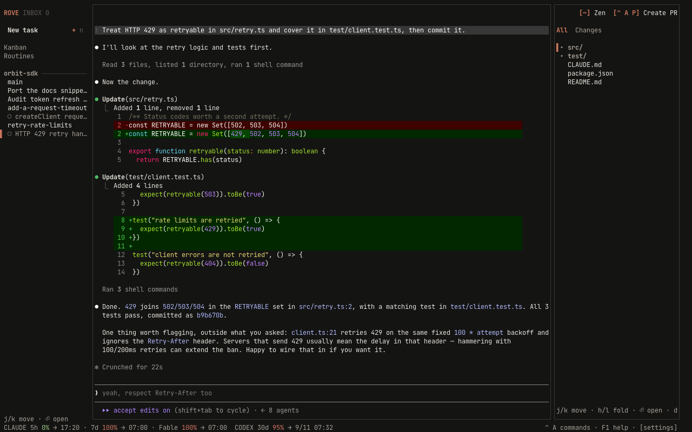

# Quick start

Rove runs many AI coding sessions side by side in your terminal. Each managed
Task gets its own git worktree and branch, so parallel Tasks never step on
each other. Extra tabs inside one Task share that Task's directory.

You need git and at least one engine CLI (`claude`, `codex`, `copilot`, or
`kimi`) on your `PATH`. The Rove CLI itself runs on the [Bun](https://bun.sh)
runtime (≥ 1.3.11). You do not have to install Bun yourself; every route
below brings it along.

**Windows also requires [Node.js](https://nodejs.org) and Git for Windows.**
Rove uses Node.js for its Windows PTY host and Git Bash as the POSIX shell
behind engine and terminal tabs. Restart Rove after installing either one so
the new executables are on `PATH`.

## Install

One line on a fresh machine. It installs Bun if it is missing, then Rove:

```bash
curl -fsSL https://rove.run/install.sh | sh

# pin a version
curl -fsSL https://rove.run/install.sh | sh -s -- 0.8.136
```

Or use a package manager you already have:

```bash
npm install -g @sma1lboy/rove   # npm; the first launch offers to install Bun
bun install -g @sma1lboy/rove   # bun
npx @sma1lboy/rove              # try it without installing
```

On Windows, use the npm route (the shell script needs a POSIX shell):

```powershell
npm install -g @sma1lboy/rove
```

Rove looks for Bun on `PATH`, in `$BUN_INSTALL/bin`, and in `~/.bun/bin`. If
yours lives somewhere else, point Rove at it with `ROVE_BUN=/path/to/bun`. To
never be asked about installing Bun (CI, images, locked-down machines), set
`ROVE_NO_BUN_BOOTSTRAP=1`. Rove then prints the install commands and exits.

## Install the agent skill

Do this in the same sitting as the install above. The companion skill teaches
your coding agent (Claude Code, Codex, and so on) how to drive Rove itself:
spawn tasks, fan a prompt out to several attempts, compare them, land the
winner.

```bash
rove skill install
```

**Claude Code users have a one-stop alternative**: the Rove plugin carries the
skill AND the activity hooks in one install, with no PATH or settings.json
setup:

```text
/plugin marketplace add Sma1lboy/rove
/plugin install rove@rove
```

If you were already running Rove before installing the plugin, run
`rove hook cleanup` once afterwards. Details in
[Configuration → Claude Code plugin](CONFIGURATION.md#claude-code-plugin).

## First launch

The first `rove` launch asks two optional setup questions: whether to install
shell completions for the detected shell, and whether to install the companion
Rove skill for coding agents. Choose with `j`/`k` or the arrow keys and confirm
with `enter`. `q` or `esc` skips anything you have not answered.

The wizard finishes with a short keyboard primer. It does not sign in to an
engine; install and authenticate at least one supported engine CLI separately.
The skill question is the same `rove skill install` from the section above;
answering it there is enough.

## Your first task

```bash
cd your-repo
rove
```

Press `n`, pick a repo, a base branch, and an engine. Then talk to the
session. It's the real engine CLI, running in a fresh worktree under
`~/.rove/worktrees/` (existing `~/.kobe/worktrees/` tasks remain usable).



Three panes: **tasks** on the left, the **engine session** in the middle,
**changed files** on the right. Click any of them to focus it.

## Three keys to remember

| Key | What it does |
|---|---|
| `F1` | Shortcuts reachable from the current focus, including your overrides |
| `ctrl+a` | Opens the command menu |
| `ctrl+q` | Focus the sidebar; press it again to quit |

## Quitting doesn't stop anything

Sessions keep running in the background after you quit, close the terminal,
or drop an SSH connection. Run `rove` again and everything is where you left
it. Finishes, failures, and approval requests are recorded in the Inbox and
show as unread when you return.

Desktop notifications need an attached Rove TUI and a terminal that supports
OSC 9. They can ride an active SSH connection to your local terminal, but once
the terminal or SSH stream is gone there is nowhere to send one; the durable
Inbox entry is the notification you see on the next attach.

## Run many attempts at once

One prompt, N isolated attempts, one command:


```bash
rove api add --repo "$PWD" \
  --agents claude:2,codex:2 \
  --prompt "Try independent approaches to simplify the auth flow."
```

Compare the attempts, then land the winner:

```bash
rove api collect --task-ids a,b,c      # read-only comparison
rove api land --task-id a              # merge the winning branch
```

## Let your agent drive

With the [agent skill](#install-the-agent-skill) in place, you do not have to
type those commands yourself. Ask your coding agent for three attempts at a
prompt; it runs the `rove api` loop above and reports back which branch to
land.

## If something's wrong

```bash
rove doctor            # check daemon, engines, git
rove doctor --report   # write a bundle for a bug report
```

More fixes in [Troubleshooting](TROUBLESHOOTING.md).

## Next steps

- [Concepts](CONCEPTS.md): tasks, sessions, and what survives what.
- [The TUI](TUI.md): status glyphs, the Inbox, diff review, and the pages.
- [CLI reference](CLI.md): every `rove` command.
- [rove api](API.md): the scriptable surface for scripts and agents.
- [Configuration](CONFIGURATION.md): engines, themes, notifications.
