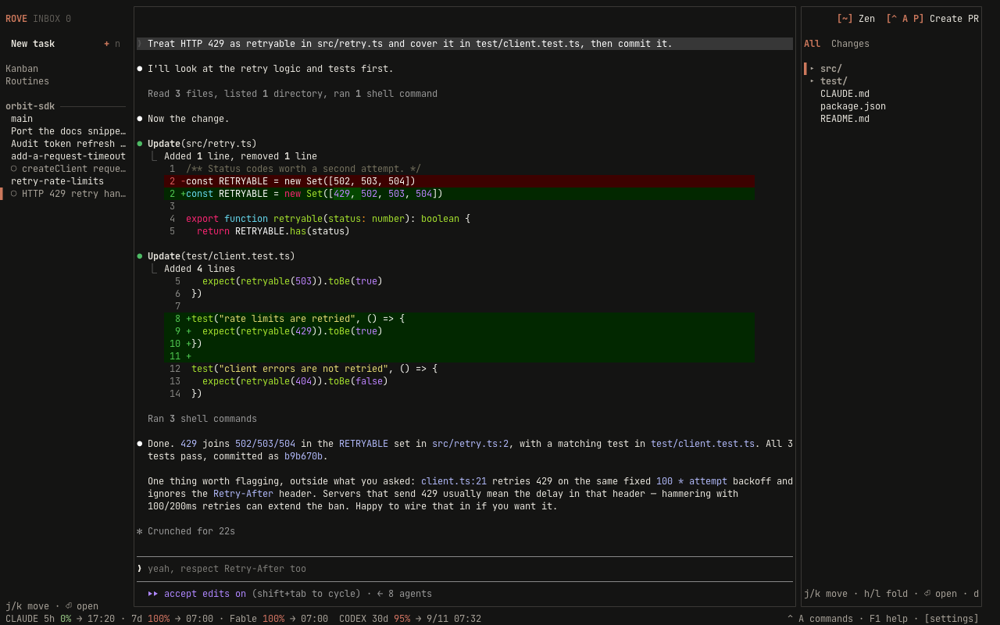

# Quick start

Rove runs many AI coding sessions side by side in your terminal. Each managed
Task gets its own git worktree and branch, so parallel Tasks never step on
each other. Extra tabs inside one Task share that Task's directory.

You need git and at least one engine CLI on your `PATH`. Rove ships built-in
support for `claude`, `codex`, `copilot`, `kimi`, `pi`, `omp` and `bob` (IBM
Bob), and launches `gemini`,
`opencode`, `cursor-agent`, `grok`, `droid`, `amp`, `devin`, `qodercli`, `cline`, `kiro-cli`, `maki`,
and `agy` (Antigravity) too — the full list, and
how to add your own, is in [Engines](ENGINES.md).

The Rove CLI itself runs on the [Bun](https://bun.sh) runtime (≥ 1.3.11). You
do not have to install Bun yourself; every route below brings it along.

**Windows also requires [Node.js](https://nodejs.org) and Git for Windows.**
Rove uses Node.js for its Windows PTY host and Git Bash as the POSIX shell
behind engine and terminal tabs. Restart Rove after installing either one so
the new executables are on `PATH`.

## Install

### macOS / Linux

Run this in a POSIX shell. It installs Bun if it is missing, then Rove:

```bash
curl -fsSL https://rove.run/install.sh | sh

# pin a version
curl -fsSL https://rove.run/install.sh | sh -s -- <version>
```

Or use a package manager you already have:

```bash
npm install -g @sma1lboy/rove   # npm; the first launch offers to install Bun
bun install -g @sma1lboy/rove   # bun
npx @sma1lboy/rove              # try it without installing
```

### Native Windows (PowerShell)

Install Node.js and Git for Windows **including Git Bash**, then restart your
terminal so `node`, `npm` and `git` are on `PATH`. Use the npm route; do not
paste the POSIX `curl … | sh` command into PowerShell:

```powershell
npm install -g @sma1lboy/rove
```

### WSL

Use the **Linux** instructions inside your WSL distribution. Install git and
your engine CLI and sign in **inside WSL** too. Native Windows installations
and their login state are not substitutes for the Linux environment.

### Runtime troubleshooting

Rove looks for Bun on `PATH`, in `$BUN_INSTALL/bin`, in `~/.bun/bin`, and in
a `bun` npm package installed beside Rove. If
yours lives somewhere else, point Rove at it with `ROVE_BUN=/path/to/bun`. To
never be asked about installing Bun (CI, images, locked-down machines), set
`ROVE_NO_BUN_BOOTSTRAP=1`. Rove then prints the install commands and exits.

A Bun older than 1.3.11 is refused rather than used: Rove's terminals need
Bun's PTY API, and on an older Bun every terminal and engine tab opens empty
with no error. `install.sh` upgrades a self-installed Bun for you and tells you
the command for a Bun it does not own; the launcher skips a too-old Bun in
favour of any newer one on the machine.

## Check one engine is ready

You only need **one** engine for this walkthrough; use the same one for both
tasks. Install and sign in to its own CLI first, then run:

```bash
rove doctor
```

Expected: git is found, your engine binary is found, and (where supported)
its login check succeeds. A binary-only check is not proof of authentication;
open that engine directly to confirm it can answer a short prompt. Missing a
CLI or login? Follow Doctor's instruction before creating a task. Rove does
not sign you in or supply a provider subscription. See [Engines](ENGINES.md).

## First launch

Open a small repository you are comfortable experimenting in, with at least
one commit and a clean checkout. Make sure the two `rove-onboarding-*.txt`
filenames below do not already exist. Avoid production credentials for this exercise.

```bash
cd your-repo
rove
```

The welcome dialog asks about optional shell completions and the agent skill,
then shows **Keyboard basics**. Choose with `j`/`k` or the arrow keys and confirm
with `enter`. Choose **No** for the skill to start the exercise now;
you can install it afterwards. Accepted installations are queued for later;
answering **Yes** does not make them available immediately. `esc` declines
both installations, including any earlier **Yes** answers.

The workspace welcome panel and `rove doctor` provide the environment check;
it is not another wizard page. Settings → Engines lists installed CLIs and
what Rove can detect about login and activity hooks.

**Using Codex?** In its engine pane, open `/hooks` and review/approve the Rove
hook command yourself. Rove writes the definition but does not grant this
trust for you. Until events arrive, do not treat a quiet badge as proof that
work has finished. A short prompt below checks both output and activity;
[Engines → Activity badges](ENGINES.md#activity-badges) explains the limits.

<a id="your-first-task" />

## Your first task: A, one visible result

1. Focus the Tasks sidebar (click it, or press `ctrl+q` from the workspace),
   then `n`. In **For Existing**, choose this repo, its current base branch
   and your ready engine. If an **opens** choice appears, keep **a new task
   worktree**, not **the project itself**. Create the task.
2. Expected: a new managed Task with its own branch and a directory under
   `~/.rove/worktrees/`. Rename the task **A — first result** with `r` from
   its sidebar row. Open its engine tab with `enter`.
3. Send this deliberately small prompt in the engine pane:

   ```text
   Create rove-onboarding-a.txt containing exactly "Task A works" and a newline.
   Do not change other files, commit, push, or install dependencies.
   Show the file contents, your current directory, and git branch --show-current.
   ```

4. Answer any engine permission question after reviewing it. Expected: the
   engine reports the file contents and its worktree path/branch. In **Files →
   Changes**, select `rove-onboarding-a.txt` and press `d` to read its diff.
   You should see one added line, `Task A works`. Actual output and the diff
   are the success check, not a spinner stopping.



Three panes: **Tasks**, **Workspace**, **Files**. Click any pane to focus it.
`F1` explains shortcuts for your current focus; the screenshot illustrates the
layout, not the exact output of this exercise.

## Your second task: B, switch and prove isolation

1. Return to the sidebar with `ctrl+q`, press `n`, and create another managed
   task from the **same original base branch** and **same engine**. Name it
   **B — separate files**. Do not use `ctrl+t`: that creates another conversation
   in the *same* Task directory, not an isolated attempt.
2. Send this prompt:

   ```text
   Check whether rove-onboarding-a.txt exists here and report the result.
   Create rove-onboarding-b.txt containing exactly "Task B works" and a newline.
   Do not change other files, commit, push, or install dependencies.
   Show your current directory and git branch --show-current.
   ```

3. Expected: B cannot see A's uncommitted file. B has a different worktree path
   and branch; its Changes pane shows `rove-onboarding-b.txt`.
4. Press `ctrl+q`, use arrow keys to select A's engine tab, then `enter`.
   Expected: A's conversation and `rove-onboarding-a.txt` are still there;
   B's file is absent. Switch back to B the same way. Sidebar `/` searches
   task titles if you have many tasks.

**The isolation boundary is a managed Task.** Extra tabs and splits share its
files. Project-main tasks and `rove .` directory tasks use your existing
checkout; they do not create an isolated branch/worktree. This exercise
specifically creates two managed tasks via `n`.

## Read state, then detach and return

While B answers, switch to A. For engines with activity tracking, B's tab can
show a spinner while working and `●` when a turn finishes unread; opening B
consumes that completion and returns it to `○`. `!` asks for your attention.
`○` can also mean idle or not observed, so check the actual engine output when
tracking is unavailable. States vary by engine; they are not a universal
completion guarantee.

Open the Inbox with `ctrl+a` then `i`, or use `F7` to jump to a pending item.
Expected: a tracked completion or request points to its task/tab. Visiting it
clears the item; an empty Inbox after you already opened both tabs is normal.
See [The TUI](TUI.md#inbox) for attention and recent visits.

Press `ctrl+q` to focus Tasks, then `ctrl+q` again to quit. Run `rove` again.
Expected: A and B and their files remain. Quitting the TUI or dropping SSH
**detaches**; live engines keep working while their host stays awake. This
exercise does not stop processes, delete tasks or merge either branch.

- **Host sleep / laptop lid:** local work does not keep computing while the
  host sleeps; connections may need recovery after wake. Closing a laptop
  used only as an SSH client leaves work on an awake remote host running.
- **Daemon restart:** live PTYs are hosted separately and survive it.
- **Host restart / reboot:** processes end. Attach restores saved screens and
  relaunches commands; conversation resume depends on the engine. Restored
  output is not evidence that the interrupted turn completed. Review it and
  send the next instruction if needed. See [Sessions](SESSIONS.md).

Desktop notifications need an attached TUI and a terminal supporting OSC 9.
While detached, consult the durable Inbox on return instead.

<a id="install-the-agent-skill" />

## Optional: install the agent skill

You have already completed two tasks without this. The optional companion skill teaches
your coding agent (Claude Code, Codex, and so on) how to drive Rove itself:
spawn tasks, fan a prompt out to several attempts, compare them, land the
winner.

```bash
rove skill install
```

This one step needs [Node.js](https://nodejs.org) on your `PATH` — it wraps
`npx skills add`. The `install.sh` route above installs Bun and Rove but not
Node, so install Node first if `npx` is missing. Core Rove on macOS/Linux runs
without Node; native Windows still needs Node for its PTY host.

**Claude Code users have a one-stop alternative**: the Rove plugin carries the
skill AND the activity hooks in one install, with no PATH or settings.json
setup:

```text
/plugin marketplace add Sma1lboy/rove
/plugin install rove@rove
```

If you were already running Rove before installing the plugin, run
`rove hook cleanup` once afterwards. Details in
[Configuration → Claude Code plugin](CONFIGURATION.md#claude-code-plugin).

## Optional: run many attempts at once

After the two-task exercise, you can automate independent attempts. This
example requires both Claude Code and Codex installed and authenticated:


```bash
rove api add --repo "$PWD" \
  --agents claude:2,codex:2 \
  --prompt "Try independent approaches to simplify the auth flow."
```

Compare the attempts, then land the winner:

```bash
rove api collect --task-ids a,b,c      # read-only comparison
rove api land --task-id a              # merge the winning branch
```

## Let your agent drive

With the [agent skill](#optional-install-the-agent-skill) in place, you do not have to
type those commands yourself. Ask your coding agent for three attempts at a
prompt; it runs the `rove api` loop above and reports back which branch to
land.

## If something's wrong

```bash
rove doctor            # check daemon, engines, git
rove doctor --report   # write a bundle for a bug report
```

More fixes in [Troubleshooting](TROUBLESHOOTING.md).

## Design preview (not the walkthrough)

The following launch film is a concept preview, not a recording to follow
step by step. Use the current-interface walkthrough above for your first tasks.

<video controls playsInline preload="metadata" poster="assets/launch-film.jpg" style={{ width: "100%" }}>
  <source src="assets/launch-film.mp4" type="video/mp4" />
  Your browser cannot play this video. [Download the MP4](assets/launch-film.mp4).
</video>

*The launch film, 50 s. Parts of its UI are a design preview that Rove doesn't ship yet: the island layout and its colors, the one-line launch bar, the six-agent grid, the lanes timeline, and the glance pill.*

## Next steps

- [Concepts](CONCEPTS.md): tasks, sessions, and what survives what.
- [The TUI](TUI.md): status glyphs, the Inbox, diff review, and the pages.
- [CLI reference](CLI.md): every `rove` command.
- [rove api](API.md): the scriptable surface for scripts and agents.
- [Configuration](CONFIGURATION.md): engines, themes, notifications.
