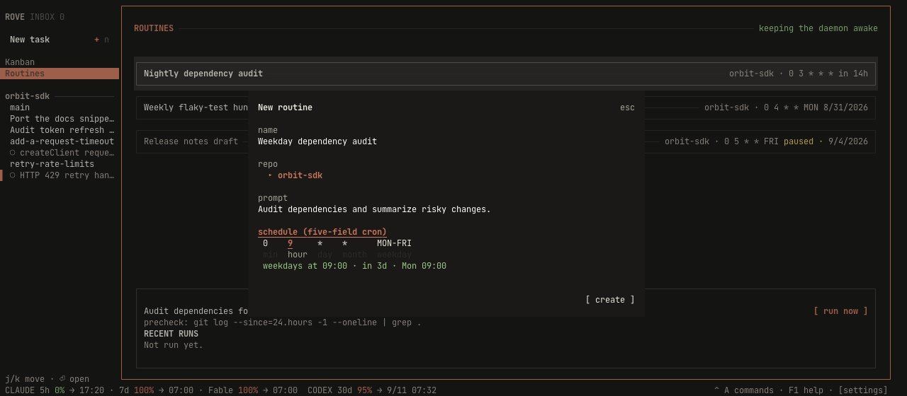
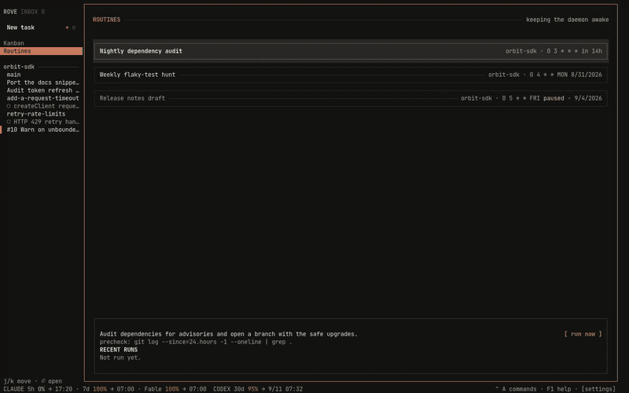

# Routines

Work that runs without you. A **Routine** is a cron rule + a prompt + a repo,
owned by the daemon. Every firing creates a fresh [task](CONCEPTS.md) with its own
worktree, its own branch, and its own engine session, carrying the prompt as that
session's first message.

That last part is the design, not an implementation detail. A run is not a
hidden background job with a log file somewhere; it is an ordinary task in your
sidebar that you can open, read, disagree with, and keep talking to. Scheduled
work you cannot inspect afterwards is not worth scheduling.


## Two minutes to your first routine

The example throughout this page is the one in the screenshot: *every morning at
03:00, audit this repo's dependencies and open a branch with the safe upgrades.*

### From the TUI

1. `ctrl+a` `2` (or click **Routines** in the sidebar rail) opens the page.
2. `n` opens the composer. `tab` / `shift+tab` walk the fields: **name**,
   **repo** (a scrolling picker over your projects), **prompt**, and
   **schedule**, five labelled cells (min / hour / day / month / weekday)
   where `←`/`→` picks a cell and `↑`/`↓` changes it. The composer restates
   the next fire time in your own clock as you type ("weekdays at 12:00 · in
   2d · Mon 12:00"), so a cron expression you got wrong is visible before you
   save it.
3. `s` runs it once, right now. **Do this.** It is how you find out the prompt
   works without waiting a day for the schedule, and it does not shift the next
   scheduled run.
4. `enter` opens the task that run created. From here it is a normal session.



There is no in-page editing: recreate the routine, or use `rove api
routine-update`. A precheck (below) is CLI-only; it is the one field that is
genuinely optional.

The page end to end: walking the schedules, pausing one, then composing a
routine whose next fire time is restated in plain words as the cron cells
change:



<video controls playsInline preload="metadata" poster="assets/routines.png" style={{ width: "100%" }}>
  <source src="assets/routines.mp4" type="video/mp4" />
  Your browser cannot play this video. [Download the full-quality MP4](assets/routines.mp4).
</video>

### From the CLI

The same routine, with the precheck the TUI cannot set:

```bash
rove api routine-create --repo . \
  --name "Nightly dependency audit" \
  --prompt "Audit dependencies for advisories and open a branch with the safe upgrades." \
  --schedule "0 3 * * *" \
  --precheck "git log --since=24.hours --oneline | grep -q ."

rove api routine-list                       # every routine + its next run
rove api routine-run-now --id <id>          # fire it now, skipping the precheck
rove api routine-runs --id <id>             # run history, newest first
```

Full flag list: `rove api schema --group routine`, or [rove api](API.md).

## Reading the page

| Where | What it tells you |
|---|---|
| Header, right | Whether an enabled routine is **keeping the daemon awake** right now |
| Row | Name, repo, five-field schedule, and the next run in relative time (`in 5h`), or `paused` |
| Detail box | The selected routine's prompt, its precheck if any, and **RECENT RUNS** with their outcomes |
| `[ run now ]` | The same thing `s` does; try it without waiting for the schedule |

Keys: `j`/`k` move, `n` creates, `e` pauses or resumes, `s` runs now, `d`
deletes, `r` refreshes, `enter` opens the task from the latest run, `esc` or `q`
closes the page.

Deleting removes the routine and its run history. **Tasks it already created are
untouched.** They are ordinary tasks and outlive the schedule that made them.

## The schedule

Five-field cron, in the **daemon host's local time** (there is no timezone
field):

```text
┌─ minute (0-59)
│ ┌─ hour (0-23)
│ │ ┌─ day of month (1-31)
│ │ │ ┌─ month (1-12)
│ │ │ │ ┌─ day of week (0-6 or SUN-SAT)
0 3 * * *
```

| Expression | Fires |
|---|---|
| `0 3 * * *` | Every day at 03:00 |
| `0 9 * * MON-FRI` | Weekdays at 09:00 |
| `0 4 * * MON` | Mondays at 04:00 |
| `*/30 * * * *` | Every half hour |

Day matching follows the Vixie rule: when **both** day-of-month and weekday are
restricted they are OR'd, so `0 0 1 * MON` means the 1st **or** any Monday, not
"a Monday the 1st".

## The precheck: don't burn a turn on an idle repo

```bash
--precheck "git log --since=24.hours --oneline | grep -q ."
```

The command runs in the repo, through your login shell, **before** the engine
starts. Exit 0 proceeds. Anything else skips the run *without creating a
task*: a non-zero exit, a timeout (120s by default, `--precheck-timeout`), or
a failure to spawn.

This is the cost control. The dominant waste in scheduled agent work is firing
on time when nothing has changed: the engine still boots, still reads the repo,
and still burns a turn to conclude there was nothing to do. A shell command
answers that for free.

It fails closed on purpose. A broken precheck must never quietly degrade into
"run every time", which is exactly the cost it exists to prevent. `run now` /
`routine-run-now` skips the precheck entirely; asking for the run by hand *is*
the answer to "should this run?".

## What each run did

Run outcomes are deliberately distinct rather than a single "didn't run", because
unattended work is only trustworthy if one glance tells you whether a human is
needed:

| Status | Meaning |
|---|---|
| `dispatched` | Task created, engine started with the prompt |
| `skipped_precheck` | The precheck said there was nothing to do. **Healthy** |
| `skipped_missed` | The occurrence was older than the grace window |
| `skipped_unavailable` | The repo or worktree could not be resolved |
| `dispatch_failed` | Task created, but its engine did not start. **Needs you** |

`skipped_precheck` and `dispatch_failed` are opposite signals; they never share
a label.

## Restarts, and runs you missed

The next run is stored as an **absolute timestamp on disk**, never an in-memory
timer. A daemon that restarts, or that was down for a day, rediscovers every
armed schedule on its first sweep, with no re-arm step and no lost schedule.

If the daemon was down when a run was due, the occurrence still runs late as
long as it falls inside the grace window (`--grace`, minutes). Down at 09:00,
back at 09:20 with a 60-minute grace → it runs. Back at 14:00 → `skipped_missed`.

Only the **most recent** missed occurrence is ever considered. Three days
offline produces one run, not three: a stampede at boot is worse than a gap.

## The daemon stays awake for you

Rove's daemon normally stops a few seconds after the last GUI detaches. **An
enabled routine holds it open**, because a schedule that only fires while
someone is watching Rove is not a schedule. The header says so while it is
happening, and `rove daemon status` reports the hold, so a daemon staying up for
a schedule does not read as a leak.

The hold releases when the last routine is deleted or disabled, restoring
ordinary idle shutdown. See [Sessions](SESSIONS.md) for the rest of the daemon's
lifetime rules.

## Limits

Known and deliberate, as of today:

- Every firing creates a new task; a routine cannot reuse an existing one.
- No timezone field; schedules are the daemon host's local time.
- No per-run cost attribution, and no remote/SSH execution target.

## See also

- [rove api](API.md#routine): every `routine-*` verb and flag.
- [The TUI](TUI.md#routines-ctrla-2): the Routines page among the other pages.
- [Concepts](CONCEPTS.md): what a task is, and why a run being one matters.
- [design/automations.md](design/automations.md): internal design note, the
  sweep, the cron implementation, the daemon-lifetime hold.
