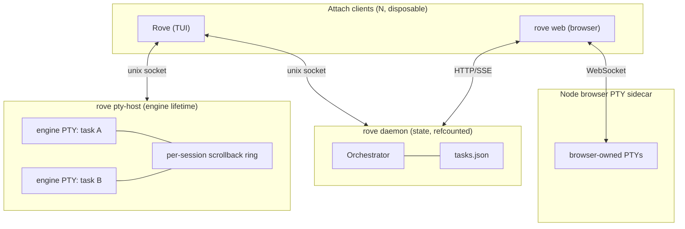

# Sessions: what survives what

Short answer: **quitting Rove only detaches.** A PTY-host restart or machine
reboot ends the child processes, but restores their screens and relaunches
their commands on attach. Closing a tab, archiving a managed/directory Task,
resetting a terminal, or running `rove reset` is an intentional teardown
instead.

## What survives

| If you… | Running process | Scrollback | Tasks + worktrees | Conversation files |
|---|---|---|---|---|
| Quit the TUI | ✓ | ✓ | ✓ | ✓ |
| Drop your SSH connection | ✓ | ✓ | ✓ | ✓ |
| `rove daemon restart` | ✓ | ✓ | ✓ | ✓ |
| Reboot, or the PTY host dies | — command relaunched on attach | ✓ restored | ✓ | ✓ |
| Close a tab | — that tab only | — that tab's ring is dropped | ✓ | ✓ |
| Archive a managed/directory Task | — all of that Task's tabs | — those rings are dropped | ✓ | ✓ |
| Stop `rove web` | browser-owned PTYs end; standalone-host PTYs stay | browser sidecar has no freeze/thaw | ✓ | engine-owned files stay |
| Press F5 | — active terminal is replaced | — old ring is dropped | ✓ | ✓ |
| `rove reset` | — all hosted sessions | — all frozen rings are dropped | worktrees ✓; task index kept unless `--hard` | ✓ |

The first three rows are the whole point: the TUI is a viewport, and the
daemon is replaceable. The reboot row is the freeze/restore contract: nothing
keeps processes alive across a reboot, but the PTY host persists every
session's metadata and bounded scrollback ring to disk. The next host first
thaws a dead **restored** session, then the first attach replays its old screen
and respawns the command in place. Your conversation files survive separately
because the engine owns them.

`rove reset` stops the daemon and PTY host and wipes the frozen-session store.
The normal form keeps the task index, UI state, worktrees, and engine history;
`rove reset --hard` also removes the task and UI indexes, but still does not
delete git worktrees or engine-owned transcripts.

## Why: three processes, three lifetimes

- **The TUI** is an attach client for standalone-host sessions. Closing it
  only detaches.
- **The browser** is a control-plane client of the same Daemon, but its
  terminals belong to the Node sidecar started by `rove web`. Closing a page
  can reconnect to the same sidecar later; stopping the `rove web` process
  stops that sidecar and all browser-owned PTYs. It does not touch standalone
  TUI/API sessions.
- **The daemon** owns your task index, worktree records, and the event bus.
  It starts on first launch and stops after the last attached GUI disconnects,
  unless an enabled routine or a live session in the PTY host holds it alive.
  While an engine or shell tab is still running, the daemon stays up to
  collect its activity events, so the sidebar status dots survive a detach.
  The hold follows actual live standalone-host sessions, not persisted tab
  snapshots. Restarting the daemon is routine: `rove daemon restart`.
- **The standalone PTY host** owns every TUI/API engine and shell process, plus their
  scrollback. It's deliberately a *separate* process from the daemon, so a
  daemon restart never kills a running engine. Like the tmux server, it exits
  on its own only after sitting at zero live sessions. `rove reset` is the
  explicit teardown. While it runs, it freezes every session (metadata +
  scrollback ring) to `<home>/.rove/pty-sessions/`, throttled to one write
  per few seconds while streaming, immediately on exit, and in full at
  shutdown. A host that comes back up (after a crash, a reboot, an idle-exit)
  thaws each record into a dead *restored* session: reattaching replays the
  old screen and respawns the command in place. Closing a tab, archiving a
  task, or `rove reset` deletes the record instead. An intentional end is
  never resurrected.

## Detaching and reattaching

There's no detach command. Quitting **is** detaching. `ctrl+q`, closing the
terminal, an SSH drop: the connection closes and the engine keeps running.

Reattaching is just running `rove` again. A fresh TUI finds the background
sessions and reopens them. A still-live hosted session always wins and is not
restarted. A freeze-restored session is the exception: its old process is
already gone, so the first attach replays the frozen ring and respawns its
recorded command.

You can attach from several clients at once. Terminal output goes to every
client watching that session; your cursor, focus, and unsent draft stay
local to each one.

## What actually ends a session

- **Exiting the engine CLI is not normally a PTY death.** Every engine runs
  inside the tab's login shell. When the CLI exits, Rove prints a settings
  hint for a non-zero code, returns to the shell prompt, and treats the tab as
  a shell. The same PTY and scrollback remain alive.
- **Exiting the shell or a one-off command ends that PTY.** An extra tab closes
  itself; if it was the task's only tab, Rove recycles the slot into a fresh
  engine tab because a task cannot have zero tabs.
- **Closing a tab** explicitly kills that tab's hosted PTY and drops its frozen
  record. The last tab cannot be closed with the close action.
- **Deleting a managed or directory Task** stops all of its hosted sessions and drops their frozen
  records. The task record is removed, but the branch stays; the worktree is
  removed unless the task is a directory Task.
- **F5** confirms, kills, and replaces the active terminal PTY. It is a
  per-terminal recovery action, not the same as the global `rove reset`.

## Tab and split state

Rove saves each Task's tab list and each terminal tab's split tree in UI state.
Closing and reopening the TUI therefore restores tab order, active tab, split
directions, and custom tab or split names. This saved layout is separate from
the PTY host: a still-running hosted process is reattached, while a process
lost to a reboot is relaunched according to the rules above.

Every split created with `ctrl+\` or `ctrl+=` starts a login shell in the
same worktree as its tab. The first leaf keeps the tab's original engine or
command; extra leaves do not start extra agents unless you run one yourself.
Split focus is intentionally local and temporary, so a restored layout starts
from its saved structural leaf rather than trying to reproduce another
client's cursor. Closing or exiting a leaf removes it and collapses any empty
split group.

## Notifications while detached

The daemon records finishes, failures, rate limits, and permission requests
in the durable attention Inbox whether or not the TUI is open. Desktop
notifications are different: the TUI emits an OSC 9 escape into its current
terminal stream. That works through an **active** SSH connection to a
supporting local terminal, but after the TUI, terminal, or SSH stream closes,
no desktop notification can be delivered. Reattach to see the pending Inbox
items and unread state.

## Scrollback

Three related limits are easy to confuse:

- **What a reattach replays.** The PTY host keeps ~512 KiB of recent output
  per session. The live copy is in memory; the complete bounded ring is also
  frozen under `<home>/.rove/pty-sessions/` at most once every five seconds
  while output streams, immediately when the child exits, and in full during
  a clean host shutdown. A crash can therefore lose the newest few seconds,
  but a reboot or host restart restores the last completed snapshot. Closing
  the tab, archiving its task, or `rove reset` deliberately drops the relevant
  frozen record.
- **What diagnostics retain after a death.** `<home>/.rove/pty-exits.json`
  stores the newest 50 records. Each has the exit code or signal, time, and
  the last 40 plain-text lines extracted from up to 16 KiB of raw ring data.
  This is a diagnostic tail, not scrollback. Records come in two layers:
  - `layer: "pty"` — the terminal's own process died. Clean exits are omitted.
  - `layer: "engine"` — the AI process is gone from a terminal that is still
    running, which is what you get when an engine crashes and drops you at
    the fallback shell. Written by the daemon's foreground walk, so it
    appears within about a minute of the death rather than instantly, and
    carries `vendor`, the engine's own pid, `parentAlive: true`, and an exit
    code read from the `Engine exited (code N)` banner when the shell
    printed one. Recorded whether or not the engine exited cleanly — an
    engine that vanishes without explanation is the case worth keeping.
- **How far you can scroll.** `terminal.scrollbackRows` in Settings →
  General → Terminal, default 1000 rows. Applies to terminals started after
  the change.

Reattach has a fast path: if a tab was only hidden, Rove replays just the
bytes written since it was parked, so waking it is bit-identical to never
having left. Attaching from a different-sized terminal resizes the session,
last attach wins, like tmux.

## Resuming a conversation

Process survival and conversation survival are different things. The
conversation is the engine's own file on disk, so it outlives every Rove
process, including a reboot.

- Claude tabs pin their conversation up front, so a tab that already ran
  comes back into the same conversation after a reboot rather than a blank
  one. Engines that can't take a caller-set session id (Codex and the rest)
  relaunch fresh.
- A resumable engine tab found dead on attach gets **one** automatic resume
  attempt. If that dies too, an extra tab closes; the task's only tab recycles
  into a fresh engine tab rather than respawning forever.
- To resume a conversation that is not represented by a tab, use the engine's
  own picker (e.g. claude-code's `/resume`) inside a fresh engine tab.

## rove web as a second client

`rove web` is a second live client of the same daemon: same tasks, same
issues, same event stream. An open browser tab keeps the daemon alive exactly
like an attached TUI does.

One difference: the web dashboard's terminals are **not** views of the TUI's
sessions. They're spawned by a separate sidecar process with their own
lifetime. They survive page reloads and reconnects, and several browser views
of one tab share a single terminal, but they're independent of the sessions
your TUI is attached to. Stopping `rove web` stops the sidecar and its browser
PTYs; they do not use the standalone host's freeze/thaw store.

## Not supported

Stated plainly so this page doesn't overpromise:

- **Surviving a reboot with processes intact.** Tasks, worktrees, scrollback,
  and conversations come back from disk, and sessions relaunch on attach,
  but the processes themselves die with the machine; any in-flight execution
  state inside them is gone.
- **Attaching from another machine.** The sockets are local only. Running the
  TUI over SSH works because both ends are on the same host; there's no
  native remote attach.
- **Event replay on reattach.** Reattaching resyncs from a snapshot, not by
  replaying events you missed.
- **Unsent drafts.** A typed-but-unsent message is local to that client and
  lost if it dies.
