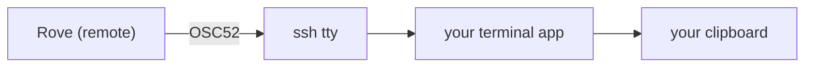

# Troubleshooting

User-facing symptom → cause → fix, for the questions that keep coming back.
One section per symptom; keep entries short and command-exact.

## `rove` exits with "no Bun was found" (or `env: bun: No such file or directory`)

The Rove CLI runs on the [Bun](https://bun.sh) runtime. The published `rove` and
`kobe` bins are node launchers that re-exec through Bun, so an `npm install -g`
or `npx` on a machine without Bun still works; the first launch offers to
install Bun for you. You land on this error when that offer could not be made
(no TTY, `CI=true`, or `ROVE_NO_BUN_BOOTSTRAP=1`) or was declined.

Fix it with any of:

```bash
curl -fsSL https://bun.sh/install | bash        # macOS / Linux / WSL
powershell -c "irm bun.sh/install.ps1 | iex"    # Windows
npm install -g bun                              # any platform
```

Bun is discovered on `PATH`, in `$BUN_INSTALL/bin`, in `~/.bun/bin`, and in a
`bun` npm package installed beside Rove. A Bun anywhere else needs
`ROVE_BUN=/path/to/bun`. Export it from your shell profile so daemon restarts
see it too. The bare `env: bun: No such file or directory` message comes from an install
made before the launcher shipped, whose bin needed Bun on `PATH`. `rove update`
replaces it.

## Windows opens Rove, but engine and terminal tabs never start

Windows needs three separate runtimes:

- **Bun ≥ 1.3.11** runs the Rove CLI and TUI.
- **Node.js** runs the Windows Hosted PTY process. A Bun-only global install
  does not install Node for you.
- **Git for Windows**, including its Git Bash, supplies the POSIX shell used by
  every engine and terminal launch. Rove deliberately does not use the WSL
  `bash.exe`, because it cannot address the Windows worktree correctly.

Start with:

```powershell
rove doctor
where.exe node
where.exe git
```

Install Node.js if Doctor says the Windows PTY host cannot find it. If the
engine launch names `C:\Program Files\Git\bin\bash.exe`, install Git for
Windows or set `SHELL` to the full, existing Windows path of another compatible
Bash. An inherited MSYS value such as `/usr/bin/bash` is not a spawnable
Windows executable path.

Remote-project password auth is not available on Windows; use `--key` or
ssh-agent. Only macOS has the keychain integration used by `--password`.

## The daemon, sidebar, or a terminal session looks wedged

Run the read-only diagnosis first:

```bash
rove doctor
rove api inspect --task-id <task-id> --pretty
```

`inspect` does not start missing services. It joins daemon activity, Hosted
PTY sessions, persisted tab snapshots, and durable abnormal-exit records, so
it is the best first attachment for a badge, label, or engine-crash report.
`rove doctor --report` writes a bundle containing the same diagnosis plus
recent logs and environment details.

The raw logs live under the active Rove home (normally your OS home):

| Path | Contains |
|---|---|
| `~/.rove/daemon.log` | daemon startup, crashes, RPC and web-transport failures, task-deletion audit |
| `~/.rove/pty.log` | Hosted PTY startup and session-host failures |
| `~/.rove/client.log` | TUI/pane connection, disconnect, and reconnect diagnostics |

## Who deleted my task?

Every task deletion is recorded in `~/.rove/daemon.log`, whether it succeeds
or fails:

```
grep task-deletion-audit ~/.rove/daemon.log
```

Each deletion writes a `requested` line when the RPC arrives, then either
`removed` or `failed`. The `requested` line names the task, its branch and
worktree path, the `--force`/`--delete-branch` flags, and who asked:

- `by=<taskId>::<tabId>` — another Rove session ran `rove api delete` from
  inside that tab. This is a verified identity, not the inherited
  `$ROVE_TASK_ID` env, so an unverifiable caller is simply absent rather than
  misattributed.
- `spawnedBy=<taskId>::<tabId>` — the deleted task's own spawner. Useful
  context, but it names who CREATED the task, not who deleted it.
- `client=<n>` — the daemon connection id, which distinguishes concurrent
  callers when neither identity above is present (a TUI keypress, the web UI).

A `salvaged` line appears between `requested` and `removed` when a **forced**
deletion had uncommitted work to destroy. It names the git ref holding a
snapshot of that work and the exact commands to recover it:

```
salvaged task <id> — uncommitted work saved to refs/rove/salvage/<branch>-<stamp> (<sha>).
Recover with: git -C <repo> show refs/rove/salvage/<branch>-<stamp> | ...
```

The same line is written for a forced worktree removal from the worktrees page
or the web UI (`salvaged worktree <path> — …`). No `salvaged` line means there
was nothing uncommitted to save. See
[WORKTREES](./WORKTREES.md#recovering-work-a-force-delete-destroyed).

A `failed` line means the deletion ran only partway: the hosted session was
torn down and the Inbox/activity state cleared, but the worktree directory and
the task entry remain, and the task is left in `deletion.phase === "error"`
(the sidebar row shows it). Delete it again once you have fixed whatever the
reason names — a common one is a worktree directory that is no longer a git
worktree, which `rove doctor` also reports.

(Installs upgraded from pre-0.8.189 builds may still have a `~/.kobe/`
directory; runtime files now live under `~/.rove`, with legacy paths honoured
only while a process started before the move is still alive.)

After an upgrade, a daemon can still be running old in-memory code. Doctor
reports that version mismatch; fix it with `rove daemon restart`. If the PTY
host itself is wedged, `rove reset` stops both runtimes and all live terminal
and engine sessions, but does not touch git worktrees. Read the confirmation
carefully before proceeding.

`rove doctor --fix` walks these remedies for you, one confirmation per fix:
safe ones (a daemon restart, a skill install) run after a per-fix `y/N`, while
anything that would kill live sessions — `rove reset` included — is printed
for you to run yourself, never executed.

## What terminal output does Rove persist after a crash?

Hosted PTY output is not always memory-only. Two bounded recovery stores live
under `~/.rove/` (or the selected Rove home):

- `pty-exits.json` keeps at most the newest 50 death records, with exit
  metadata and up to the last 40 plain-text output lines each. `rove api
  inspect` exposes these as `sessionExits`, newest first. Two layers:
  `layer: "pty"` is the terminal process itself (abnormal exits only), and
  `layer: "engine"` is the AI process gone from a terminal that kept running
  — the case where you return to a shell prompt and want to know what
  happened. An engine record names the engine's pid, its vendor, and the exit
  code from the shell's `Engine exited (code N)` banner; code 143 means it
  was killed with SIGTERM.

  To find out **who** killed it: Rove logs every signal it sends a terminal
  subtree to `daemon.log` as `[pty-signal]`. POSIX gives a dying process no
  way to learn its killer's pid, so attribution works by elimination — no
  `[pty-signal]` line for that session means the signal came from outside
  Rove (the engine's own wrapper, a provider limit, the OS, or your shell).
- `pty-sessions/` freezes each hosted session's launch metadata and bounded
  scrollback ring so a PTY-host crash, restart, or machine reboot can restore
  the old screen and respawn the launch command. An explicit tab close or task
  archive drops that session's frozen record; a reset asks the running host to
  start fresh.

These files can contain text that was visible in the embedded terminal. Treat
the Rove home with the same permissions and backup policy as shell history and
engine transcripts; do not describe terminal output as "never written to
disk."

## Rove says the daemon serves a different home

Rove refuses a daemon whose handshake reports a different state home before
accepting any tasks from it. This normally means a `dev:sandbox` or custom-home
process inherited the production socket override. The error names both homes
and prevents the foreign task list from blanking or replacing the real one.

Check the overrides in the shell that started the unexpected daemon:

```bash
env | grep -E '^(ROVE|KOBE)_(HOME_DIR|DAEMON_SOCKET_PATH)='
rove doctor
```

Stop that daemon from the same environment, then clear the inherited overrides
before starting the intended instance:

```bash
rove daemon stop
unset ROVE_DAEMON_SOCKET_PATH KOBE_DAEMON_SOCKET_PATH
unset ROVE_HOME_DIR KOBE_HOME_DIR
rove daemon restart
```

If you intentionally use a custom home, re-export its `ROVE_HOME_DIR` before
the restart instead of unsetting it. Do not point two homes at one daemon
socket: the server refuses a live takeover, and clients reject the wrong
owner.

## Claude or Codex activity badges do not update

Rove installs its own merge-safe, global activity hooks when the TUI launches:

- Claude Code definitions live in `~/.claude/settings.json`.
- Codex definitions live in `~/.codex/hooks.json`. Codex requires the user to
  trust non-managed hooks once through `/hooks`; Rove writes the definition but
  never bypasses that approval.

Fully relaunch Rove to re-run hook installation, then approve the Rove command
inside Codex's `/hooks` page if needed. Use `rove api inspect --task-id <id>`
to compare hook activity with the PTY/process observation. Codex does not
currently expose clean signals for every state (failure, session end, and
permission waiting), so Rove's polling/PTY fallback remains part of the normal
result.

The hook command itself is intentionally harmless: `rove hook …` always exits
0 and never starts the daemon; sessions outside tracked Rove worktrees quickly
no-op. `rove hook setup` is deprecated and now performs cleanup only. Older
Rove versions installed a Claude `WorktreeCreate` provider hook that could
break `claude --worktree`; current launches remove Rove's old entry while
preserving user hooks and use an observer instead.

## One task's badge never moves, and its title never auto-fills

Every other task updates; one worktree stays silent — no activity badge, no
auto-title, and an interrupted prompt is never offered back. That is the
narrow version of the symptom above: when *every* task goes quiet, the hooks
are the cause; when a single worktree does, its path is.

Rove reads Claude's own transcript directory,
`~/.claude/projects/<encoded-worktree-path>`. Claude folds every
non-alphanumeric character of the path into `-`; before 0.8.198 Rove folded
only `/` and `.`. The two names diverged for any worktree path containing a
character outside `/`, `.`, `-`, and alphanumerics — an underscore, a space,
or anything non-ASCII, whether it came from the repo name, the task slug, or
your home directory. Rove then watched a directory Claude never wrote, and
every signal derived from that transcript went quiet with no error: activity
badge, turn detection, auto-title, and prompt rescue.

Check the version, then confirm the directory exists for the stuck worktree:

```bash
rove --version                                          # 0.8.198+ has the fix
cd <the worktree>
ls -d ~/.claude/projects/"$(pwd | sed 's/[^a-zA-Z0-9]/-/g')"
```

`rove update`, then `rove daemon restart`. No history is lost by the upgrade:
those directories are written by Claude with the correct encoding, so the
corrected name finds the transcripts that were there all along, including for
the sessions that ran while the badge sat still.

## `rove api send` refuses with NO_ENGINE_TAB or ENGINE_NOT_RUNNING

Both errors are deliberate refusals, not delivery failures. Silently spawning
a fresh engine here would make both sender and receiver believe the prompt
was delivered while it actually landed in a duplicate session nobody is
watching — so `send` fails loud instead.

- **`NO_ENGINE_TAB`**: the task has live tabs, but none of them resolves as
  its engine tab (the engine tab died, or the tabs run something else). List
  what is actually alive, then address a tab explicitly:

  ```bash
  rove api pty-list
  rove api send --task-id <id> --tab tab-N --prompt "..."   # deliver to a live tab
  rove api send --task-id <id> --tab new --prompt "..."     # or spawn a fresh engine tab
  ```

- **`ENGINE_NOT_RUNNING`**: the engine tab exists but its engine process has
  exited into a plain shell — pasting there would execute the prompt as shell
  commands. Spawn a fresh engine tab with `--tab new` as above.

A bare `send` (no `--task-id`) targets the dispatcher's tab when run from a
task another Rove session spawned, and otherwise the active task — it never
silently spawns an engine on a guess.

## `rove api set-branch` fails, but the branch was renamed anyway

The call exits non-zero with git's own complaint, stamped with the path of the
**main checkout** rather than the worktree:

```
git branch -m <old> <new> (cwd=/path/to/repo) exited with code 128:
fatal: no branch named '<old>'
```

Meanwhile the worktree is already sitting on `<new>`. The rename worked; only
the task record's idea of the old name was stale — from a retried call whose
first response was lost, a concurrent rename, or an out-of-band
`git branch -m` in the worktree. Branch refs are shared across all worktrees
of a repo, so the main-checkout path in the message is where git was run, not
a branch that is missing from one place and present in another.

0.8.198 resolves the ambiguity: when `git branch -m` fails, the rename probes
the end state, and old-name-gone plus new-name-present is treated as the
requested outcome — the call succeeds and the record converges. A genuine
collision (both names present) or a missing pair still fails.

On an older version, read the end state before you retry, and do **not**
rename by hand — the branch is already correct:

```bash
git -C <worktree> branch --show-current   # already <new>? then it succeeded
rove api get-task --task-id <id>          # what the task record still believes
```

Upgrading and re-running `set-branch` converges the record.

## Two daemons, or engine tabs split across hosts, after an upgrade

Rove 0.8.189 moved runtime files (sockets, pidfiles, logs) from `~/.kobe` to
`~/.rove`. A binary predating the move looks only at the legacy paths; if it
cannot see the new daemon it starts a second one on the same task index, or a
second PTY host that splits your engine tabs. Current versions leave symlinks
at the legacy paths after binding, so mixed-version installs find the same
daemon — you only hit the split if an old global install (`kobe` from npm,
an old Homebrew bin) is still being launched somewhere.

```bash
rove --version        # every entry point should report the same version
rove doctor           # reports version mismatches and duplicate runtimes
rove daemon restart   # rebinds on the canonical ~/.rove paths
```

Then update or remove the stale install so both `rove` and `kobe` resolve to
the same current binary.

## A plugin installs cleanly, but Rove never loads it

`rove plugin list` shows it as enabled, while its panes and actions never
appear in the TUI. The two views disagree because they read different things:
the CLI reads the registry file directly, so it reports what was written; the
daemon is the process that actually loads plugins, and it missed the write.

Before 0.8.198 the daemon watched `plugins.json` with `fs.watch`. On macOS the
FSEvents stream behind `fs.watch` arms asynchronously, so a registry write
landing after the watcher was created but before its stream went live was
dropped permanently, with no error on either side. A `rove plugin install`,
`link`, or `enable` that raced daemon startup was therefore ignored until the
next registry mutation or the next daemon restart.

```bash
rove --version         # 0.8.198+ stat-polls the registry instead
rove daemon restart    # makes the daemon re-read a write it dropped
rove plugin list       # then confirm the TUI agrees
```

0.8.198 takes a synchronous baseline stat before the first registry load and
polls every 200ms, so no write can fall between the watcher and the load.
Enabling a plugin on a current version no longer depends on when you ran it.

## Copy from the embedded terminal doesn't reach my clipboard (especially over SSH)

**How copy works.** Rove's embedded terminal is a full-mouse TUI: it enables
the terminal's mouse reporting (clicks focus panes, tabs are clickable, the
wheel routes to the app). Mouse reporting hands drag-selection to Rove, so
your terminal emulator's native selection no longer participates. Every
mouse-enabled TUI (tmux, `vim` with `mouse=a`) makes the same trade. Rove
implements its own grid selection instead: drag to select (pane-aware, works
inside splits), release to copy. Delivery is dual-channel:

1. a pipe into the platform clipboard command on the machine Rove runs on
   (`pbcopy` / `wl-copy` / `xclip` / `xsel`), and
2. an **OSC52** escape sequence written to the tty.

**The SSH case.** When you SSH into the machine running Rove, channel 1 lands
on the *remote* machine's clipboard, not yours. The only channel that can
reach the clipboard of the machine you are physically at is OSC52: it travels
back through the SSH tty and is executed by your local terminal emulator.



So if copy "works locally but not over SSH", the break is almost always at
the **receiving terminal app** (the one drawing pixels in front of you):

| Terminal (the one you're physically using) | OSC52 clipboard write |
|---|---|
| iTerm2 | **Off by default**: Settings → General → Selection → check *"Applications in terminal may access clipboard"* |
| Ghostty | Allowed (`clipboard-write = allow` is the default) |
| kitty / WezTerm | Allowed or ask, configurable |
| Terminal.app (macOS) | **Unsupported**: no fix; use another terminal or the escape hatch below |

**tmux in the path?** If Rove itself runs inside a remote tmux session, tmux
swallows OSC52 unless told to forward it:

```tmux
set -g set-clipboard on
```

**Escape hatch that always works:** hold **Option** (macOS) / **Shift**
(most Linux terminals) while dragging. That bypasses mouse reporting entirely
and uses your terminal's native local selection + copy, which always lands on
your local clipboard, at the cost of selecting across the whole Rove
window (no pane awareness), exactly like tmux.

**Remote workflows:** the rove web dashboard sidesteps all of this. The
browser owns the clipboard.

## Right-click opens my terminal's menu instead of Rove's

**Why.** The outer terminal's context menu lives in the app layer, ahead of
the TTY: it decides what to do with a right-click before mouse reporting
ever sees it. iTerm2 (and several other emulators) keep right-click for
their own menu by default, so Rove's row menu never gets the event. No TUI
can take that back from inside the terminal. The fix is a terminal
setting, not a Rove one.

**iTerm2** ships an official escape hatch for exactly this
([Pointer preferences](https://iterm2.com/3.3/documentation-preferences-pointer.html)):

- Settings → **Pointer** → check *"Ctrl-click reported to apps, does not
  open menu"*. **Ctrl+left-click** is then reported to Rove as a
  right-click and the row menu opens; plain right-click keeps iTerm2's
  menu, so you lose nothing.
- Alternatively, Settings → Pointer → *Mouse Button Actions* can rebind
  the right-button gesture itself away from iTerm2's menu.

**Terminal.app** has no reporting toggle for this; use the keyboard
fallback below.

**Fallback that works everywhere:** every row-menu entry is also a direct
chord on the row itself (`r` rename, `a` archive, `d` delete, and so on); see
[KEYBINDINGS.md](./KEYBINDINGS.md). The one right-click-only surface today
is the project header's menu.

## Mouse wheel in the embedded terminal

The wheel follows real terminal-emulator semantics, in order:

1. the embedded app enabled mouse tracking (claude's transcript, `vim`,
   `less --mouse`) → the wheel is forwarded; the app scrolls itself;
2. fullscreen app without mouse tracking → 3 arrow keys per tick;
3. plain shell → Rove's local scrollback (same channel as
   `ctrl+pgup` / `ctrl+pgdn`; scroll to the bottom to resume following).

If scrolling "does nothing" inside an app, that app received the events and
chose not to scroll. Check its own mouse setting (e.g. `:set mouse=a`).

## Memory stays high after upgrading from a pre-0.8 build

rove 0.8 replaced the old tmux runtime with the PureTUI + Hosted PTY backend,
but upgrading the package does not stop sessions that a pre-0.8 build already
left running. Those old `tmux -L kobe` sessions keep their `bun` / engine
process groups resident, so memory can look unchanged after the upgrade.

`rove doctor` now reports them:

```
legacy tmux: ⚠ tmux 3.5a — 2 pre-v0.8 session(s) on `kobe`
             20 process(es) across 8 pane(s), 1008.5 MB RSS total
             → run `rove reset` to stop this retired runtime safely
```

**Fix:** `rove reset`. It stops the daemon and Hosted PTY host, then SIGTERMs
each legacy pane process group before killing the retired tmux server (a bare
`tmux kill-server` would leak engines that ignore `SIGHUP`). Worktrees and the
task index are untouched; add `--hard` only if you also want to wipe task/UI
state.
