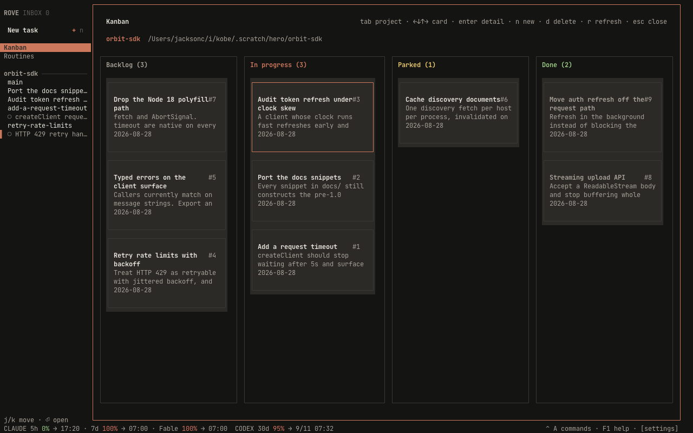
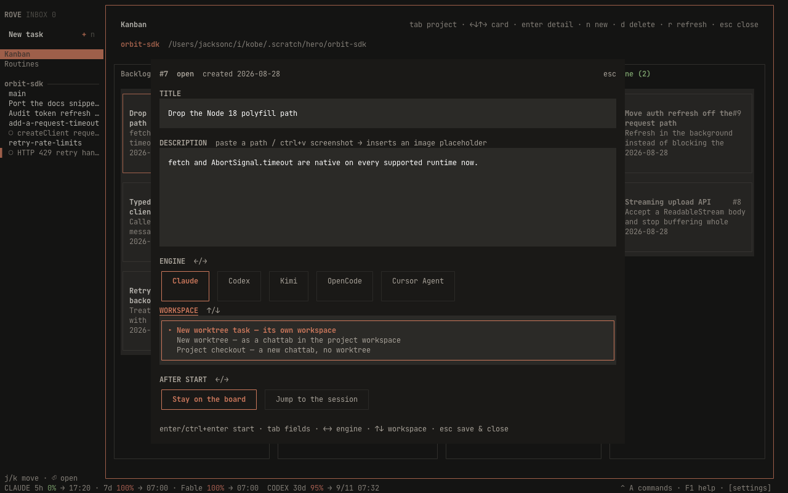
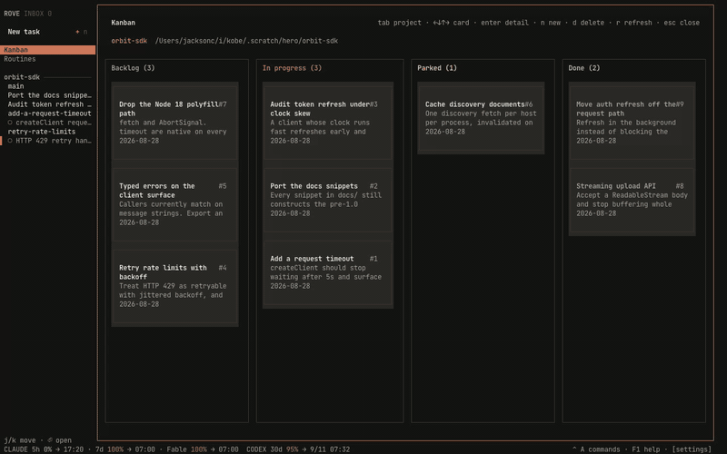
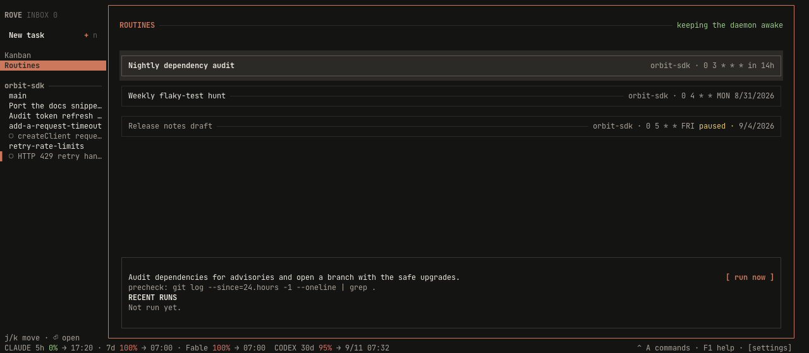

# The TUI

A tour of the complete user-facing interface: the three panes, tasks and
sessions, files and review, Settings and the Inbox, full-window pages, updates,
attachments, and narrow terminals.

This page explains what the features are *for*. The key tables live in
[Keybindings](KEYBINDINGS.md); the mental model behind tasks and sessions
lives in [Concepts](CONCEPTS.md).

## Workspace, focus, and mouse

The normal workspace has three columns:

- **Tasks** is a tree of project → Task/worktree → terminal tab. Every level is
  always expanded. Selecting a tab opens that exact session.
- **Workspace** shows the active engine, shell, plugin, or read-only file tab.
  A Task can have several tabs, and a terminal tab can contain several splits.
- **Files** has **All** and **Changes** views for the selected Task's worktree.

Click a pane or row to focus it. `F4` moves focus forward, `ctrl+a` `h` / `l`
moves left or right, and `ctrl+q` returns from the workspace to Tasks. From the
Tasks pane, right arrow enters the current engine tab. Mouse clicks select rows
and tabs; right-clicking a sidebar row opens the same common actions available
from the keyboard, including **New conversation** and **New shell** for that
Task's worktree. Clicking anywhere else dismisses that menu.

Zen mode (`ctrl+a` `z`) hides Files and lets the workspace use the freed width.
The Tasks rail remains visible. Below 70 columns, the separate
[narrow-terminal layout](#narrow-terminals-phone-ssh) takes over instead.

With no tasks at all (a first launch, or all tasks deleted), the workspace
column shows a welcome panel instead of an empty pane: the keys to create a
task and open help (read from your live keymap, so rebinds show correctly),
which engine CLIs were detected, and — when something is missing (no engine
CLI, no git) — what to install, with `rove doctor` as the full diagnosis.
Creating your first task replaces it with the normal workspace.

## Status glyphs in the sidebar

Task rows carry worktree-level facts:

| Mark | Meaning |
|---|---|
| `▴` | Pinned Task |
| `+N` / `−N` | Changed and deleted files in the worktree |
| `✓` / `✗` / `•` | Pull-request checks passing, failing, or pending |
| jump digit | The `ctrl+2` … `ctrl+0` shortcut currently assigned to this row |

Session state belongs to the engine tab that runs it, so the status glyph sits
on the **tab rows** underneath:

| Glyph | Meaning |
|---|---|
| spinner | Engine is working (also shown while a worktree materializes or deletes) |
| `?` | Needs your input: a permission prompt or a question |
| `●` | Turn finished, and you haven't looked yet |
| `○` | Idle or not yet observed. Includes a finished turn you've already seen |
| `◷` | Rate limited |
| `×` | Error, including a failed worktree deletion |
| `·` | Not an agent tab, or a custom engine without activity tracking |

A tab labelled `⚠ <name>` is a live hosted session that was missing from the
saved tab list. Rove exposes it instead of hiding a running process and adopts
it back into the Task's tab state when possible.

**Seen means consumed.** A `●` clears the moment you actually open that tab,
select the task, with that tab active. Moving the sidebar cursor over the row
doesn't count. Once seen, the badge drops back to `○`; there is no lingering
checkmark. Rove saves the completion timestamp per task and tab, so restarting
or reattaching does not relight a completion you already read. A later
completion has a later timestamp and appears unread as usual.

Each tab row reports its **own** activity, not the task's roll-up. Tab 2 can
spin while tab 1 rests. The tab strip at the top of the workspace uses a
similar vocabulary (`●` running, `✓` done, `!` error, `?` needs input, `○`
idle) over the same saved timestamps: a `✓` you have already read settles
back to `○`, and stays settled after a restart.

## Managing Tasks in the sidebar

Press `/` to fuzzy-search task titles, repositories, branches, and live tab
titles. Parent rows stay visible around a match. Arrow keys move through the
results, `enter` opens one, and `esc` restores the previous selection.

The selected Task answers these actions whether the cursor is on its worktree
row or one of its tab rows:

- `r` changes the Task title. `b` opens a filterable local-branch picker and
  can also rename the current branch by accepting a new name. Project-main
  rows do not rename the repository's checked-out branch.
- `v` cycles through detected and custom engines. The new engine applies when
  the Task's engine session is reopened; it does not replace a running turn.
- `o` opens the Task directory in the configured GUI/workspace editor.
- `shift+p` pins or unpins a managed Task. `shift+m`, followed by `j`/`k`,
  reorders the row under the cursor at its own level: a tab moves within its
  Task, a Task moves within its repo group, and a project-main row moves the
  whole project. Moves stop at the edges (no wrap-around), and the new order
  persists across restarts.
- `a` archives a managed or directory Task after confirmation, stopping its
  hosted sessions but preserving its directory, branch, tab snapshot, and
  engine history. Archived Tasks leave the sidebar entirely; they remain
  listed by `rove api list` and on the web board, and unarchiving from there
  brings the row back.
- `d` is kind-aware: it forgets a project-main row, removes only the Rove
  record for a directory Task, or removes a managed Task and its worktree after
  the dirty-worktree safety check.

The confirmation dialogs state the exact deletion boundary before anything is
changed. See [Concepts → Task](CONCEPTS.md#task) for the three Task kinds and
[Sessions](SESSIONS.md#what-actually-ends-a-session) for session teardown.

## Inbox

`ctrl+a` `i` opens it. The Inbox answers two questions, *what needs me?* and
*where was I?*, with one section for each:

- **ATTENTION.** Pending items, oldest first. An item appears when a turn
  completes, a session asks for input, hits a rate limit, or errors. Most
  items target one task-and-tab; events without a tab identity target the
  whole task instead. A newer event for the same target replaces the older
  one, and starting a new turn clears it.
- **RECENT.** The last handful of tabs you visited, most recent first. These
  aren't pending work, just jump targets; a spinner marks the ones still
  running.

`enter` opens the task and, when the episode names one, its exact tab; a
task-level episode leaves that task's current tab active. It also clears the
item. `d` clears without navigating (ATTENTION rows only; RECENT rows have
nothing to drop). You rarely need `d`: **visiting a target clears its item
anyway**, since visiting any tab resolves a task-level episode, and stale items
whose tab or task is gone get cleaned up in the background.

`F7` jumps straight to the oldest pending item across **all** projects,
without opening the Inbox, and cycles on repeated presses. It works even
while you're typing inside an engine session. With nothing pending it just
says so.

## Diff review

The files pane shows what changed; diff review lets you respond. Press `d`
on a file to open its read-only diff, then:

1. `j` / `k` move the line cursor.
2. `v` anchors a range. Move to the other end with `j`/`k`; `v` again
   cancels. Skip this for a single-line note.
3. `c` writes a note for the current line or range.
4. `s` sends **all** unsent notes, across all files of the task, to the
   engine as one prompt, and submits it.

The prompt the engine receives is just file, line numbers, and your words,
no code excerpt. The engine reads the worktree itself. Notes are stored per
task and survive restarts; the footer counts `notes · unsent` so you always
know what's pending. Sending doesn't switch tabs, so keep reviewing while the
engine works.

Notes anchor to the file path and the line number displayed at the time you
wrote them; they don't re-anchor when the diff changes underneath. These four
keys are fixed and not rebindable.

## Files pane

**All** shows the worktree's tracked and unignored files as a navigable tree.
**Changes** starts with uncommitted changes against `HEAD`. If the working tree
is clean and Rove can resolve a base branch, it automatically switches to the
whole branch-versus-base view so committed agent work does not disappear. Press
`b` to choose the scope manually; the header always names the active scope.

Open a text file with `enter`. Rove uses the configured terminal editor; for a
changed file it requests that editor's diff mode when Vim or Neovim is
available, otherwise it opens Rove's read-only preview. `d` always opens the
read-only diff in a workspace tab, `a` pastes an `@path` mention into the active
engine without submitting it, and `o` sends audio, video, or PDF files to the
system application. Remote files cannot use a local system viewer.

The pane watches local worktrees for changes and also supports `r` for an
explicit refresh. See [Keybindings](KEYBINDINGS.md#sidebar-and-files) for the
complete navigation table.

## Create a pull request with the active agent

Choose **Ask agent to create PR** above Files or press `ctrl+a` `p`. This is an agent
workflow, not a direct GitHub API action: Rove inspects the current branch,
target branch, upstream, and dirty-file count, then submits a prompt to the
active engine. The prompt asks the agent to review the diff, commit remaining
changes, push the branch, and run `gh pr create`.

Watch the engine tab for progress, failures, or questions. The action is
unavailable on the target branch and requires an active engine session. A repo
can replace the prompt with `.rove/pr-instructions.md`; see
[Per-repo init](CONFIGURATION.md#per-repo-init). Because the engine performs the
work, its own skills and approval rules still apply. The default prompt expects
an authenticated `gh` CLI and a pushable `origin` remote.

## Creating a task

Focus the sidebar and press `n`. The New task dialog starts on a mode selector
and an engine selector; `tab` walks every field and the bottom-right Create
button, while `ctrl+e` cycles the detected engines from anywhere in the
dialog. Use `ctrl+[` / `ctrl+]` to move between its three modes, or focus the
mode selector and use the left/right arrows.

- **For Existing** picks a local repository and the ref to branch from. Rove
  creates a new task branch and worktree, then opens it ready for the first
  prompt. The current repository and its checked-out branch are the defaults.
- **For New Repo** clones a Git URL into a chosen parent directory, derives an
  available folder name, then creates a task from the requested base branch.
  The parent directory is remembered for the next clone.
- **Adopt Worktree** imports existing git worktrees that are not already
  tasks. The path-glob field filters by absolute path or basename; `enter`
  toggles the highlighted row and `ctrl+a` selects or clears all filtered
  rows. Adoption does not copy the directory or create a branch. Dirty and
  externally-created worktrees are allowed and labelled.

The chosen repository and engine become defaults for later task creation.
Adopting several worktrees is item-by-item: successful imports remain even if
another row fails, and Rove reports the result count.

## Tabs and terminal splits

`ctrl+t` starts a fresh engine tab immediately; `ctrl+e` opens the full engine,
shell, and plugin picker. Tabs share the Task's worktree but keep separate
processes, scrollback, titles, and engine conversations. `ctrl+[` / `ctrl+]`
switch tabs, `F2` renames one, and `ctrl+w` closes it. A Task always keeps at
least one tab.

Inside a terminal tab, `ctrl+\` splits right and `ctrl+=` splits down. New
leaves run your login shell in the same worktree. `F3` cycles split focus;
`F2` and `ctrl+w` operate on the active split before falling back to the whole
tab. Split layouts and custom names survive a Rove restart, but which split had
focus does not. If a split process exits, its leaf disappears and the remaining
layout collapses naturally.

The optional horizontal tab strip can be always visible, visible only for
multiple tabs, or hidden. The sidebar tree still lists every tab in all three
modes. Persistence and process-lifetime details live in
[Sessions](SESSIONS.md#tab-and-split-state).

## Worktree audit and cleanup

Focus the sidebar and press `x` to open the full-window Worktrees page. It
audits every non-main local worktree for saved projects, including directories
created outside Rove, and shows dirty state, remote-branch state, PR/merge
signals and age. `l` lands a tracked task branch; `d` starts the guarded
worktree-removal flow.

Deleting a worktree is not the same as deleting a task, branch, or engine
history. Dirty deletion requires a second, explicit force confirmation. Read
[Managing worktrees](WORKTREES.md) before using either mutation.

## Settings

Open Settings with `ctrl+a` `,`, or press `s` while the sidebar is focused.
Use `j`/`k` to choose a section, `l` or right arrow to enter its rows, `h` or
left arrow to return to the section list, and `enter` to activate a row.

- **General** controls theme, language, transparency, focus and split styles,
  notifications, keyboard hints, zen startup, editor choice, worktree
  location, terminal scrollback and the optional horizontal tab strip. It
  also shows available engine quota snapshots.
- **Engines** lists every engine Rove can launch: built-ins, the contrib
  catalog, plugin-registered and your own, each with what local detection
  found under it: where its binary is, and for engines with an account
  detector whether you are logged in (login itself still happens in each
  engine's own CLI). On an engine row, `space` switches it on or off (off
  keeps its settings, it just stops being offered when picking an engine for
  a task), `enter` edits the launch command, `r` renames, `x` resets a
  built-in or removes a custom engine, and `d` makes it the default.
- **Plugins** enables or disables registered plugins live and edits settings
  declared by their manifests. Install, update, link and remove plugins from
  the shell.
- **Keybindings** shows the active prefix, loaded YAML overrides and warnings.
  Edit the displayed YAML path; changes reload live.
- **Feedback** submits a GitHub Discussion through an authenticated `gh` CLI.
- **Dev** contains reset, a backend-exit action and experimental switches. Reset
  clears UI and task-index state after confirmation, but leaves worktrees and
  engine history on disk. The current **Restart backend** action exits only this
  TUI window; other attached windows and hosted sessions remain connected. Use
  `rove daemon restart` from a shell when you need to restart the daemon itself.

The current PureTUI always keeps the Tasks rail visible in zen mode. The
legacy `zen.keepTasks` value and its Settings checkbox are retained in state
but do not change this layout.

## Starting sessions: the new-session dialog

`ctrl+e` is the one dialog for starting anything. It lists your detected
engines, a `shell`, and any plugin panes. Two toggles set what happens:

- `tab` flips the **destination**: a new tab in this worktree ⇄ a forked
  child task in a fresh worktree.
- `ctrl+f` flips the **context**: a fresh conversation ⇄ continue this one.

Flip either toggle and the list narrows to engines only; a shell can't
continue a conversation, and a plugin pane isn't a task.

**Continue** uses a native conversation fork only when the selected engine is
the source engine and supports one, currently Claude and Codex. Copilot and
Kimi use a transcript handoff even when continuing to the same engine. A
built-in source can also hand off to a different built-in or custom target.
A custom source has no readable transcript, so Rove refuses to continue it
instead of opening a context-free tab.

**Fork a child task** opens the quick composer (prompt, engine, branch). The
child branches from your task's **current branch**, so committed work carries
over. Uncommitted changes stay behind; commit first if the child needs them.

`ctrl+a` `c` (continue in a new tab) and `ctrl+a` `f` (fork a child task)
open the same dialog with the toggles pre-set.

To resume a conversation that is not already represented by a tab, use the
engine's own picker (e.g. claude-code's `/resume`) inside a fresh engine
tab. Availability and restart behavior vary by engine; see
[Resuming a conversation](SESSIONS.md#resuming-a-conversation).

## Pages: `ctrl+a` `1` / `2` / `3`

Three pages replace the workspace pane while the sidebar stays put. `esc` or
`q` closes a page; selecting a task in the sidebar also returns you to the
workspace. The chords stay live, so you can hop between pages directly.

### Kanban (`ctrl+a` `1`)

The [issue store](CONCEPTS.md#the-issue-store) as a board, one project at a
time (`tab` cycles projects). Four columns:

- **Backlog.** Open or doing, not linked to a task.
- **In progress.** Linked to a task. The link *is* the column: agents move
  cards with `rove api issue-update --task`, and in-progress cards show the
  linked task's live engine activity.
- **Parked.** Status `hold`, linked or not; sits between In progress and
  Done.
- **Done.** Status `done`.

`enter` opens the detail drawer: edit the title and description, then start a
real session from the card: pick an engine, pick where it runs (the story's
own worktree, or the project checkout), and choose to follow it or stay on
the board. Starting links the issue and flips it to `doing`. `n` creates a
story, `d` deletes one (the issue record only; a linked task and its
worktree are never touched). The board refreshes every few seconds, so cards
moved by agents move on screen too.

For a linked story, the drawer also shows an **EVENTS** snapshot with up to the
12 most recent engine lifecycle events Rove still holds for that task. It is a
point-in-time diagnostic view: reopen the drawer to fetch it again. A daemon
restart clears the in-memory event ring, so an empty list does not mean the
linked Task never ran.

The board in motion: walking the cards, opening a story, filing a new one
with `n`, and an agent picking it up (`rove api issue-update --task`) while
the page is open, which moves the card into In progress on its own:

<video controls playsInline preload="metadata" poster="assets/kanban.png" style={{ width: "100%" }}>
  <source src="assets/kanban.mp4" type="video/mp4" />
  Your browser cannot play this video. [Download the full-quality MP4](assets/kanban.mp4).
</video>

### Routines (`ctrl+a` `2`)

Daemon-owned scheduled prompts on five-field cron expressions. Each row shows
the repo, the schedule, and the next run; the detail box below shows the
prompt, the precheck if any, and the last few runs with their outcomes.

`n` creates a routine (name, repo, prompt, schedule), `e` pauses or resumes,
`s` runs one now, `enter` opens the task created by the latest run. There is
no in-page editing. Recreate the routine, or use `rove api routine-update`
(which also sets prechecks; see [rove api](API.md)). An enabled routine keeps
the daemon alive so schedules fire with no TUI attached.

Walked through end to end, with the page pictured and the cron and precheck
rules spelled out: [Routines](ROUTINES.md).

### GitHub Issues (CLI-only)

A read-only view of the repo's GitHub issues, fetched through the `gh` CLI.
Today the only supported entry point is `rove api workitem-*`; use it to
browse issues and start a task from one. The underlying page is wired and
`ctrl+a 3` still opens it, but it is not yet documented as a TUI shortcut
because it has not earned a sidebar rail row.

When the page opens, `a` filters to issues assigned to you, `tab` switches
repos, and `r` refreshes past the cache. `enter` starts a Rove task from the
selected issue: the issue body arrives as the first prompt (fenced, and
explicitly marked as an untrusted report), and the task keeps a
`linkedWorkItem` pointer back to the issue. Nothing is imported into the local
issue store and nothing is written back to GitHub.

## Updates and version warnings

When a newer release is available, the sidebar shows an update affordance and
`u` opens the Update page. It compares the installed and latest versions,
shows release notes for the versions in between, and offers three actions:

- `u` runs the displayed self-update command, leaves the TUI, and reports the
  result in the terminal.
- `r` opens the latest release page in the system browser.
- `q` or `esc` closes the page without changing anything.

For a specific release or a browsable list of the latest 20 releases, use
`rove update <version>` or `rove update list`; see
[CLI reference](CLI.md#install-and-update). Releases that cross a known
breaking version show a warning before installation.

An amber **DAEMON OUT OF DATE** banner means this TUI and the already-running
daemon are different builds. Finish any immediate interaction, run
`rove daemon restart`, and relaunch Rove. Hosted engine sessions live in the
separate PTY host and survive that daemon restart.

## Narrow terminals (phone SSH)

Below **70 columns** the TUI switches to one panel at a time, made for
phone-sized SSH sessions. Nothing changes at 70 columns or wider, and there
is no setting: it follows the terminal width.

- The task list and the workspace alternate: opening a task shows the
  workspace full-width, `ctrl+q` returns to the list. No new chords.
- The first sidebar row is `↩ Recent: <task>`; `enter` drops you back into
  the task you were last working in, and it survives reconnects.
- The files pane is hidden; the pane-cycle keys skip it.
- The tab strip always shows, compressed to the active tab plus a `2/3`
  counter. The usual tab chords still switch.
- The footer keeps one quota chip per engine (`CLAUDE 42%`) and shrinks the
  hints to bare keycaps.
- Dialogs center themselves with tighter padding.

## Attachments: drag and drop, paste

Drop an image (`.png`, `.jpg`, `.jpeg`, `.gif`, `.webp`) or a `.pdf` from
your file manager:

- **Onto an engine session.** The path lands in the engine's input, pasted
  but **not submitted**, so you can keep typing around it. The visible
  session catches the drop even when your keyboard focus is elsewhere.
- **Into the quick-task composer or an issue drawer.** The file becomes an
  `images[N]: /path` attachment line sent along with the first prompt.

`ctrl+v` in those dialogs does the same with the clipboard: a copied file
attaches by path, a raw screenshot is saved under `~/.rove/attachments/`
first. Rove only ever passes paths; the engine reads the file itself.

**Pasting text with newlines** stays one paste. Rove asks the terminal for
bracketed paste, so a multi-line block arrives framed and is handed to the
engine as a paste rather than as typing that submits on the first newline,
the engine shows it as a pasted block and you decide when to send.

## Quota in the footer

For engines with a quota probe (Claude Code and Codex today), the footer
shows each usage window the vendor reports, e.g. `CLAUDE 5h 42% → 14:00 ·
7d 12%`, with the percentage colored green below 75%, yellow from 75%, red
from 95%. The same numbers, same thresholds, appear in Settings → General.

The daemon refreshes quota roughly every 15 minutes, so treat the figure as
approximate, not live. When Claude hits its subscription window, Rove
schedules an automatic resume for the affected task and continues it once
the window resets.
