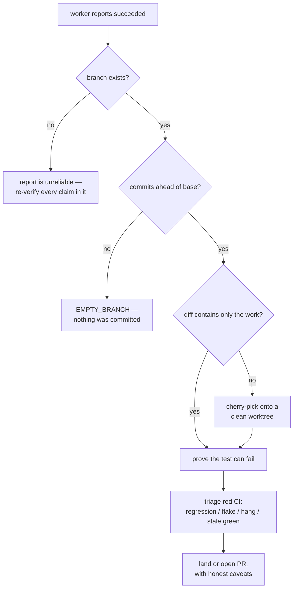

# Verifying Worker Output

What a coordinator does after a worker reports `succeeded`. Dispatching workers and the report contract they follow live in the `rove` skill ([`.claude/skills/kobe/SKILL.md`](../../.claude/skills/kobe/SKILL.md)); this page starts where that ends — **`succeeded` is a claim, not a verification.** Every rule here was paid for in one night of verifying 26 worker PRs; the examples are real.



## First: does the branch exist, and does it hold commits?

A worker report can be wrong at the most basic level. One task sent two contradictory reports; one of them named a branch that **did not exist**, and its conclusion was the opposite of what the real branch contained. So before reading anything else in the report:

```bash
git rev-parse --verify <branch>            # the branch is real
git log origin/main..<branch> --oneline    # it is ahead of the base
```

Empty `git log` output means nothing was committed — the worker may have done the work and reported success with it still sitting uncommitted in the worktree. `rove api land` refuses this case with `EMPTY_BRANCH` (or `EMPTY_BRANCH_DIRTY_WORKTREE` when the uncommitted work is recoverable), so `land` failing this way is the signal, not an obstacle.

`rove api collect --task-ids <a,b,c>` batches this for a fleet: per task it returns the branch, uncommitted `.changes`, and `.base` (commits ahead + diffstat vs the base branch) in one read.

If the branch doesn't exist or is empty, stop trusting the report wholesale — everything else in it needs independent verification too.

## The diff may not be the work

Worker branches frequently carry an in-progress commit from the checkout they branched off. Opening a PR from such a branch produces a fake diff — thousands of lines of deletions that are really the base checkout's unfinished state, not the worker's change.

The fix is mechanical: cherry-pick the work commits onto a fresh worktree cut from current `origin/main`, and PR that branch instead. This was done for all 22 PRs in the 2026-08-27 batch — every diff then contained only its own change.

## Prove the test would fail

A green test attached to a fix proves nothing by itself — it may pass with or without the fix. Revert the fix (leave the test), run it, and watch it go red. Only then does green mean anything.

This caught real gaps in one night, three shapes of it:

- An architecture guard and a harness test were both validated by reverting the guarded change and confirming the red.
- PR #588 merged two colliding fixes (#500 needed a `|| 1` floor that #384 deleted) and its invariant test was verified to fail under **either half alone** — reverting only one file → 1 failure, reverting only the other → 3 failures. A test that stayed green under either half would have proven nothing about the merge.

## Red CI is not automatically the change's fault

Before bouncing a PR back to a worker, distinguish which of four things the red actually is:

1. **A real regression** — the only one that's the worker's problem. If the same test fails twice on the branch, treat it as this.
2. **A known flake** — issue #61 tracks an intermittent `test:fast` residual (roughly 1 in 8 full runs after PR #590's fix; `terminal-pty-scrollback-cache` is one named residual that only fails under full-suite concurrency). A failure that doesn't reproduce on a re-run and touches files the PR never went near is this.
3. **A hung job** — `behavior` normally finishes in ~65 s; it has been seen stuck for 40 minutes with sibling jobs long done. That's infrastructure: cancel and rerun.
4. **A stale green check** — the inverse trap: a *green* check earned against an older CI definition looks identical to a fresh one (issue #56; required-check names match across CI versions). And `gh run rerun` does **not** refresh it — rerun reuses the frozen workflow definition and event payload, manufacturing a fresh timestamp on a stale conclusion. Only a new commit (rebase / update branch) re-runs current CI.

```bash
gh run list --workflow=ci.yml --branch <branch>   # what actually ran, when
gh run view <run-id> --log-failed                 # what actually failed
```

## The brief can be wrong too

Facts in the dispatch brief are claims of the same rank as facts in the report. A triage brief stated two relative-time formatting copies disagreed (floor vs round); on `main` both were `round`. The worker read the source, found the premise false, and declined to "fix" it — **that was the correct outcome**, not insubordination. Verify the premise before scoring a worker against it.

## Skipping is a legitimate conclusion

Not every dispatched item should land. Accept — and record the reasoning for — these outcomes:

- **Superseded**: a sibling PR already covers it as a strict superset (#369 by #376, #365 by #386). Land the superset, close the subset. When a sweep keeps producing duplicate PRs for one bug class, that's a process finding worth an issue of its own (issue #60).
- **Premise no longer applies**: the bug was fixed on `main` since the brief was written, or the brief was wrong (above).
- **Disproportionate cost**: PR #592 fixed a watcher bug class in two sites and deliberately declined the third — stat-polling a whole worktree wasn't worth a stale-pane miss in an opt-in, best-effort feature. A worker weighing cost against consequence beats one mechanically applying a correct fix everywhere.

## Don't endorse numbers you can't reproduce

If the report cites a measurement, reproduce it before repeating it. PR #592's source commit cited a ~3% permanent drop rate; a 60-iteration probe got 0 drops on both old and new implementations. The PR shipped anyway — the fix was correct by construction — but it states plainly that the rate is unconfirmed. Put what you verified and what you couldn't in separate sentences; a coordinator's signature on a PR body is an endorsement of every claim in it.
