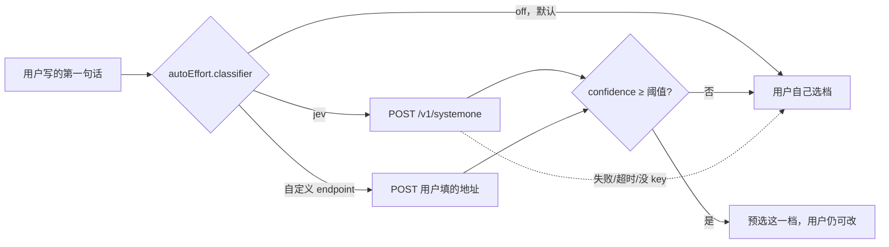

# 谁来选档：接一个分类器入口，还是自带一个模型

`autoEffort` 今天只做一半。[`engine/auto-effort.ts`](../../packages/kobe/src/engine/auto-effort.ts)
的注释把边界写得很清楚：

> No classifier, no auto-pick: the tier is a one-keystroke fill of three fields
> the user can still see and change.

TABLE（档位 → engine/model/effort）和 GATE（这个目标起不起得来）都在了，
缺的是 PICKER：**从用户写的第一句话里判出档位**。这页决定 PICKER 怎么落。

## 判据只有一条，和我们已有的一样

分类目标沿用已有的那条规范
（[auto-effort 分类器仓库](../../packages/auto-effort/prompts/rubric-annotator-v5.md)，
不在本仓库，gitignore 掉了）：**用户的指令里，有多少流程需要模型自己推理出来。**
流程给了 = swift；目标给了、流程没给 = standard；目标也要模型找 = deep。

## 已经量过的数字

94 条真人标注（`core-94`），地板（一律答 standard）48.9%：

| 方案 | 准确率 | deep 召回 | 延迟 | 谁付钱 |
| --- | ---: | ---: | ---: | --- |
| **Jev（TypeSafe System One），零训练** | **72.7%** | 17/20 = 85% | p50 283ms | 用户，约 $0.00003/次 |
| 自训 e5-large 560M，三种子集成 | 61.7% | 15/20 = 75% | 20ms 本机 / 694ms Modal CPU | 我们 |
| Haiku 4.5 + 同一份规范 + 24 条样例 | 60.4% | — | 秒级 | 用户的引擎额度 |

Jev 那一栏是零训练的：请求时现读规范文件，state 里带 24 条标注样例。
自训那一栏是 6469 条合成数据微调出来的。**差 11 个点，方向和直觉相反。**

级联也量了，不成立：两者分歧 31 条，Jev 对 20 条、encoder 对 9 条，
把任何一条交给 encoder 都是净亏。混合、概率平均、置信度分流，全都低于 Jev 单跑。

## 「自带模型」的真实含义不是本地推理

发布包的 `files` 是 `dist/cli` `dist/completions` `dist/web-ui` `dist/skills`，
依赖是 opentui / react / xterm / node-pty / ws / smol-toml，**没有任何 ML 运行时**，
而且发布版 CLI 跑在 node 下。要在用户机器上跑 560M 的 encoder，只有两条路：

- 打包 `onnxruntime-node`（每平台一个原生 addon）+ 一份量化权重，
  npm 安装体积从几 MB 变成几百 MB；
- 或者我们自己托管一个 endpoint。

第二条才是现实选项，那么它和 Jev 的对比就变成：

| | Jev（用户自己的 key） | 我们托管自己的模型 |
| --- | --- | --- |
| 准确率 | 72.7% | 61.7% |
| 谁付钱 | 用户，每次约 0.003 分 | 我们 |
| 谁值班 | 没人 | 我们（冷启动、可用性、版本） |
| 离线可用 | 否 | 否 |
| 第一句话发给谁 | TypeSafe | 我们 |

**自己托管在每一条上都不占优，包括准确率。** 所以「自带模型」这条不该做。

## 落法：PICKER 是一个适配器，默认关

不要在 TABLE 和 GATE 之外硬塞第三段逻辑，而是照引擎那套做成可插拔的一格。

契约只有一条：**POST 一段文本，返回一个档位加一个置信度。** 这样三件事同时成立——

- 填 `jev` 用内置的请求形状（规范 + 24 条样例，就是量出 72.7% 的那套）；
- 填自定义 endpoint 的人可以指向任何东西，包括自己托管的那个 e5 模型，
  所以「想完全本地」的用户有路可走，我们不用替他打包权重；
- 默认 `off`，一行网络请求都不发。

### 四条硬要求

1. **默认关。** Rove 是 local-first，新建 task 这条路径上不能凭空多出一个外部请求。
2. **置信度不够就不猜。** 实测 Jev 在 conf ≥ 0.7 时覆盖 44%、那部分准确率 85%；
   低于阈值就别预选，留在默认档上——错误的预选比不预选更烦人，因为用户要先发现再改。
3. **永远不挡建 task。** 没 key、断网、超时、endpoint 返回垃圾，一律退回人工选档，
   不弹错误框。分类器是加速器，不是依赖。
4. **数据流要写在 Settings 的说明里。** 任务第一句话会发给一个
   **不是用户已经选定的那个引擎厂商**的第三方。这是一条新的数据流向，
   必须明说，不能藏在「启用 auto effort」后面。

### 延迟不在关键路径上

283ms 听起来在建 task 的路上，但提示词在对话框提交之前就已经知道了——
用户还在看/改的时候就可以把请求发出去，返回慢了就当没预选。不要同步等它。

## 建议

**接入口，不自带模型。** 先做 `autoEffort.classifier = off | jev | <url>`，
内置 Jev 的请求形状，默认关，带置信度门和静默回退。

自训的那个 encoder 不下线也不托管——它留在 `packages/auto-effort`
当对照基线，用来回答「外部依赖值不值」这个问题。今天的答案是值：差 11 个点。

### 还需要确认的

- **阈值定多少**要在真实建 task 流量上重量一次；94 条测试集上一条等于 1.06 个百分点，
  定不出小数点后的东西。
- **规范文件怎么随版本走。** 现在线上那套是请求时现读 `rubric-annotator-v5.md`，
  规范一改模型就跟着变。内置进 Rove 之后，这份规范变成产品的一部分，
  改它要走发版，得想清楚它属于代码还是属于配置。
