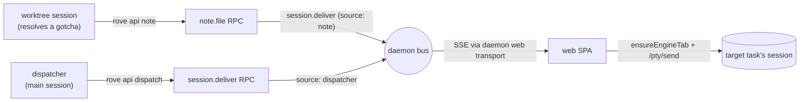
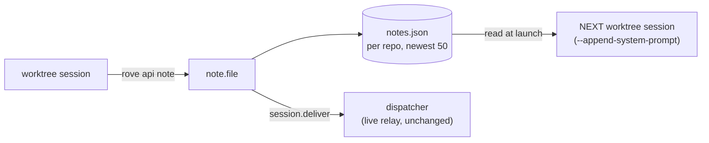

# Field-notes dispatcher (v1)

Status: shipped behind `experimental.dispatcher` (Settings → Dev). Off by default.

## What it is

Rove runs many agent sessions on one repo in parallel, and each one rediscovers the same gotchas (the build flag, the flaky test, the API trap) from scratch. The dispatcher closes that loop: **a worktree session that resolves a non-obvious, repo-level gotcha files a one-line field note; the repo's main session — the dispatcher — receives it and relays it to the in-flight tasks that would benefit.** Knowledge gets paid for once.

Design decisions (2026-06-13):

- **The dispatcher does NOTHING about merge conflicts.** A true conflict only matters at integration time, the colliding branch might be a throwaway, and early forced merges pollute branches with content that may never land — resolution timing belongs to humans and the tasks themselves, not to the dispatcher.
- **Dispatcher = the repo's `kind: "main"` task.** No new task kind, no designation state. On the web board it surfaces only when the board is scoped to a single project (chip opens the peek drawer).
- **Full autonomy, no approval gate** — bounded by effectors instead: the dispatcher can *read* (`rove api collect`) and *message sessions* (`rove api dispatch`); it has no verb that mutates tasks, statuses, or worktrees. Worst case is a stray FYI.
- **Rules where unambiguous, agent where ambiguous.** Addressing (author → that repo's main task) is daemon code; *who benefits from a note* is the dispatcher agent's judgment.

## The pieces

| Piece | Where | Job |
|---|---|---|
| `rove api note --task-id <id> --text <line>` | `kobe/src/cli/api-cmd.ts` | A session files a discovery. |
| `note.file` RPC | `kobe-daemon/src/daemon/handlers.ts` | Addressing only: find the author's repo's main task, forward over `session.deliver` with provenance (`[ROVE FIELD NOTE] from "<author>" (task <id>): …`). Accepted-but-unrouted when the repo has no main task or the author *is* the dispatcher. |
| `session.deliver` channel | `kobe-daemon/src/daemon/protocol.ts` | "Paste this text into task X" — an address, not a delivery. EVENT semantics; consumers dedupe on `at`. |
| `rove api dispatch --task-id <id> --prompt <text>` | api-cmd + `session.deliver` RPC | The dispatcher's relay. Daemon-routed on purpose: `rove api send` targets the task's canonical standalone Hosted PTY session, while browser-sidecar PTYs are a separate delivery surface; starting the canonical session beside a browser-owned one can create a duplicate engine. |
| `noteFilingProtocol` + `worktreeProtocol` | `kobe/src/engine/interactive-command.ts` | Worktree (card) sessions get ONE composed `--append-system-prompt`: status self-report (gated by `experimental.autoStatus`) + note filing (gated by `experimental.dispatcher`). |
| `dispatcherProtocol` | same | The main session's role prompt: relay verbatim with provenance, only to tasks whose work plausibly touches the same area, never back to the author, never twice, no conflict actions, no git outside its own cwd. |
| Protocol CLI invocation | `kobeApiInvocation()` | Commands in protocols bake the environment-correct invocation (packaged → `rove api`, or the `kobe` alias when invoked that way; source checkout → the dev bun line), so a dev sandbox agent never drives a stale global install (BAD_VERB field bug). |
| SPA forwarder | `kobe-web/src/lib/dispatch-delivery.ts` | The front-end half of delivery (browser owns tab ids). `at` high-water mark in localStorage; failed sends roll back so the snapshot replay retries. |
| Board chip | `kobe-web/src/components/Board.tsx` | `dispatcher` chip on repo-scoped boards; opens the main session in the peek drawer. |

## v2 — notes persist and seed the next session (2026-08-08)

v1's loop was open at the far end: a note reached whichever sessions happened to be in flight, then evaporated with the dispatcher's transcript. A gotcha resolved on Monday was invisible to Tuesday's worktree, so the fleet re-paid for the same discovery indefinitely.

v2 closes it with a store and a recall block — no retrieval layer, no embeddings:

| Piece | Where | Job |
|---|---|---|
| `NotesStore` | `kobe-daemon/src/daemon/notes-store.ts` | Append-only, keyed by git common-dir (the issue-store convention), newest `NOTES_RETENTION_CAP` (50) kept per repo. |
| `note.file` (extended) | `handlers-ui.ts` | **Persists first, then routes.** A note filed with no dispatcher seat is no longer a loss; a store failure degrades to routing-only and never errors the author. |
| `note.list` RPC + `rove api note-list --repo` | `handlers-ui.ts` / `verbs.ts` | Read the accumulated notes back. |
| `readFieldNotes` | `kobe/src/state/field-notes.ts` | Sync launch-path reader (matches on `repoRoot`). A missing or corrupt store is "no notes" — recall must never block a session from starting. |
| `noteRecallProtocol` | `engine/interactive-command.ts` | Renders the newest `NOTE_INJECTION_CAP` (15) into the worktree session's existing `--append-system-prompt`, as **claims with provenance, not instructions** — a stale note must lose to what the session observes. |

Recall rides the same `experimental.dispatcher` switch and the same single injection point as note filing; the main session is excluded because it gets notes pushed live.

**Why full injection rather than retrieval:** a repo's note count is bounded at 50 by the store and 15 by the prompt. At that size, filtering costs more than it saves. The upgrade path if a repo genuinely outgrows it is filtering by touched path — not a vector store.

## Known limits

- **Live delivery requires an open dashboard** (the SPA is the forwarder). Persistence is unaffected — an undelivered note still reaches the next session.
- **Claude-only injection**, same as the status protocol.
- **No board rail for notes** — `rove api note-list` is the only reader UI.
- **No dedup on filing**: the recall block asks the agent not to re-file a note that restates an existing one; nothing enforces it.
- **Trust is deliberately deferred**: agent-authored text flows into other agents' inputs with no human gate, and persistence now means a wrong note outlives the session that wrote it. Revisit before any default-on.
