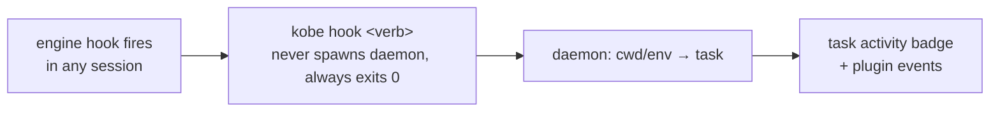

# Engine internals

Contributor-facing mechanics behind [`docs/ENGINES.md`](../ENGINES.md): the
engine-owned contract, hook wiring, and activity-state detection. Ground
truth is [`packages/kobe/src/engine/registry.ts`](../../packages/kobe/src/engine/registry.ts);
if this file and the registry disagree, the registry wins.

## The engine-owned contract

Per-vendor wiring lives in exactly one place: the engine registry. Every
built-in engine registers an entry exposing:

- `identity` — product/assistant names and copy (e.g. the composer
  placeholder `Ask Claude…`). Neutral layers (TUI, web, orchestrator) read
  these and must never hard-code vendor strings.
- `capabilities` — model catalog, permission modes, context-window math.
- `history` — a reader over the engine's on-disk transcript store (auto-title,
  recap, and activity polling).
- `detectAccount` — a read-only binary + login probe (Settings → Accounts,
  `rove doctor`).
- `createHookAdapter` — installs activity hooks into the engine's own config
  file so sessions report normalized events.
- `createTurnDetector` — turn-completion detection for the chat tab.
- `defaultCommand` / `displayName` / `effortLevels` / `terminalTitle` /
  `quotaUsage` — launch argv, labels, reasoning-effort flags, OSC title
  policy, and the subscription-quota probe.

Adding an engine means one new registry entry plus its vendor-local modules;
no neutral code names a vendor.

## Account detection

Detection is **read-only**: Rove never writes to engine config for this, and
never shells out to a status subcommand. The on-disk files are the source of
truth those subcommands print anyway. Anything that isn't cleanly "logged in"
/ "not logged in" (unreadable file, corrupt JSON, malformed JWT) surfaces as
a warning instead of pretending to be "not logged in".

| Engine | Account file read | What counts as logged in |
|---|---|---|
| `claude` | `$CLAUDE_CONFIG_DIR/.claude.json` (default `~/.claude.json`) | `oauthAccount.emailAddress` present |
| `codex` | `$CODEX_HOME/auth.json` (default `~/.codex/auth.json`) | `tokens.id_token` JWT (ChatGPT login, with plan claim) or a non-empty `OPENAI_API_KEY` |
| `copilot` | `$COPILOT_HOME/config.json` (default `~/.copilot/config.json`) | `COPILOT_GITHUB_TOKEN` / `GH_TOKEN` / `GITHUB_TOKEN` env, else a token-ish key in the config |
| `kimi` | `$KIMI_CODE_HOME/credentials/kimi-code.json` | non-empty `access_token` (the JWT carries no email claim, so no email is shown) |

The new-task dialog hides engines whose CLI binary isn't installed (a
`which`-style probe, memoized per process). Custom engines are always shown:
"the user added it" counts as available, and a missing binary just fails to
launch with a shell error.

## Hook integration

Rove learns what a session is doing (turn started/finished, rate-limited,
waiting on a permission prompt) from the engine's **own hook mechanism**, not
polling. Each engine's hook adapter translates vendor events into neutral
verbs and points them at `kobe hook <verb>`, an internal CLI subcommand that
reports the event to the daemon. The daemon maps the hook's `cwd` (or the
inherited `ROVE_TASK_ID` / `ROVE_TAB_ID` env vars, with `KOBE_*` aliases) to a
task and folds the event into the task's activity badge.

Install is **default-on and global**: on every Rove launch,
`ensureGlobalKobeHooks` (in `src/cli/hook-cmd.ts`) writes Rove's hooks into
each hook-supporting engine's user-level config file. The merge is idempotent
and merge-safe — your own hooks for the same events are preserved; Rove
replaces only its own entries, identified by the `kobe hook` command
substring — and never blocks launch.

### Claude: `~/.claude/settings.json`

| Claude hook event | Neutral verb |
|---|---|
| `SessionStart` | `session-start` |
| `UserPromptSubmit` | `turn-start` |
| `Stop` | `turn-complete` |
| `StopFailure` | `turn-failed` (classified: rate limit / billing / other) |
| `Notification` (`permission_prompt`, `elicitation_dialog`) | `awaiting-input` |
| `SessionEnd` | `session-end` |
| `PreCompact` / `PostCompact` | `pre-compact` / `post-compact` |
| `SubagentStart` / `SubagentStop` | `subagent-start` / `subagent-stop` |
| `PreToolUse` / `PostToolUse` / `PostToolUseFailure` | `tool-pre` / `tool-post` / `tool-failed` (gated, see below) |

### Codex: `~/.codex/hooks.json`

Codex uses the same settings-file shape. Wired: `SessionStart`,
`UserPromptSubmit`, `Stop`, `PreCompact`, `PostCompact`, and the gated
`PreToolUse` / `PostToolUse`. **Not wired:** `turn-failed`, `session-end`,
and `awaiting-input`. Codex's only waiting signal is `PermissionRequest`, an
allow/deny *decision* hook, and installing an observer there could interfere
with Codex's approval flow. The polling fallback covers those states.

Codex also won't run a non-managed hook until you trust it once via `/hooks`
(or launch with `--dangerously-bypass-hook-trust`). Rove writes the
definition but never auto-bypasses trust, so Codex activity badges light up
only after you approve, by design.

### Copilot, Kimi, custom engines

No hook mechanism is wired (`NoopHookAdapter`); install is a no-op and
nothing is written to their config.

### The `tool.*` volume gate

The tool-family hooks fire on **every tool call of every session
machine-wide**. They're written into the engine config **only while an
enabled plugin declares a `tool.*` event hook** (`pluginsWantToolEvents` in
`src/cli/hook-cmd.ts`, re-synced on every launch, so installing or removing
such a plugin takes effect on the next Rove start). The other activity hooks
are always installed.

### Worktree watch

A global `PostToolUse` (Bash) observer hook reports
`kobe hook worktree-created` after every Bash call; it no-ops fast unless the
command was `git worktree remove` (archive the pinned task). It once also
adopted on `git worktree add`; removed 2026-08-24 — creation is mechanical
(agents mint worktrees for PR isolation and no engine session ever enters),
so adoption now requires intent: an engine `session-start` inside a managed
worktree root, or an explicit adopt (`rove add .` / New task → Adopt
Worktree). This is a pure *observer*
fired after the tool runs, unlike the old `WorktreeCreate` *provider* hook
(0.7.4–0.7.9) whose mere presence broke `claude --worktree` everywhere. Rove
removes any such legacy hook it ever wrote; `kobe hook setup` survives only
as a deprecated cleanup no-op.

### Invocation contract

`kobe hook <verb>` is internal: engines fire it, you don't. It keeps the
legacy binary name on purpose — a hook file outlives the launcher that wrote
it, so `kobeHookInvocation()` persists the guaranteed `kobe` alias rather than
a name a future PATH may not carry. Two guarantees
are load-bearing — it **never spawns the daemon** (an idle-stopped daemon
means the event is simply dropped), and it **always exits 0** (a hook must
never fail the engine's action).

## Activity state detection

The sidebar badge (working / done / needs-input) is fed by **three layers**,
merged hook-wins (`src/tui/workspace/turn-state-merge.ts`):

1. **Hooks** (claude, codex). Authoritative while reporting: a hook-driven
   `engine-state` push supersedes anything the pollers conclude.
   `needs_input` is **hook-only** — no amount of polling can distinguish
   "waiting for a permission prompt" from "thinking".
2. **Turn detectors** — transcript-based completion detection per engine
   (`src/engine/turn-detector.ts`). `ClaudeTurnDetector` watches the JSONL
   transcript for assistant-message markers; `CodexTurnDetector` watches the
   rollout log for `task_complete` / `turn_complete` / `turn_aborted`. This
   covers hook-less or untrusted sessions of hook-capable engines.
3. **Quiescence/mtime fallback** — for engines with no markers (copilot) the
   daemon watches the latest transcript mtime; a session that goes quiet
   reads as done. Custom engines resolve to an empty history reader, so their
   badge stays dark. Rove labels the gap honestly rather than guessing state
   from screen scraping.

Because hook delivery can lapse (daemon restart, dropped event), a ~10-minute
watchdog caps how long a stale "working" badge survives without confirmation.
The poll loop runs every ~2 s against the daemon's shared transcript-activity
slice, and it also spots a hand-launched `claude` in a plain shell tab (via
the OSC window title) so even unmanaged sessions get a badge.

**Daemon-side arbitration** (2026-08, adopted from herdr's
`TerminalState::recompute_effective_state`): each tab's activity record keeps
**one slot per source** — a `hook` slot written by `report()` and an
`observed` slot written by the PTY/foreground observer's `observeTab()` — and
ONE pure function arbitrates them
(`packages/kobe-daemon/src/daemon/activity-arbitrate.ts`):

1. a hook entry in a sticky state (`turn_complete` / `permission_needed` /
   `error` / `rate_limited`) always wins — observation never dims an
   attention state;
2. a hook `running` wins unless an observed `rest` fact is **fresher than the
   claim** (herdr's `fallback_not_older_than_hook`) and the claim is older
   than `correctHookRunningAfterMs` — the one correction, covering ESC
   interrupts and dead engines;
3. any other hook entry wins;
4. no hook entry → the observed slot wins (`running` re-seeds a busy dot
   after a daemon restart; `idle` is the known-idle marker that stays
   distinguishable from "no signal" = unknown).

Writers never edit each other's slot, so adding a source means adding a slot
plus one rule — not special-casing another writer. A hook event supersedes
its tab's observed slot (hooks are authoritative while the engine lives); a
hook idle clears the tab's record outright. Only hook slots get the lapse
watchdog; observed entries are retired by the observer's own poll.

The user-visible consequence: **only claude/codex sessions can ever show
needs-input**; every other engine tops out at working/done.

## Terminal titles

Claude and Codex own their OSC title while visible
(`terminalTitle.ownsStatus`), so neutral tab chrome doesn't prefix a
duplicate turn glyph. The title stream IS the tab label — Rove strips only
the engine's own status decoration (`terminalTitle.statusPrefixes`, drawn in
Rove's glyph column instead) and never rewrites the name. Vendor identity
comes from the process tree, never from matching the title string.

An engine's title is only as good as what the engine has to put there, so the
policy (`src/engine/terminal-title.ts`) carries two engine-declared knobs — one
to ask for a better title, one to reject a title that still isn't a name — so
no neutral layer ever names a vendor:

| Knob | Meaning | Declared by |
|---|---|---|
| `launchArgs` | ask the engine for a better title at launch | codex: `-c tui.terminal_title=["activity","thread-title"]` |
| `sessionIdFromTitle` | the title IS a session id — don't render it, and name the tab from that session | codex: its thread UUID |

An engine whose bad title carries no session id at all would need a sibling
knob beside `sessionIdFromTitle`; none does today, so none exists.

Codex's `thread-title` segment is documented as "the thread title, **or the
thread identifier when unnamed**", and an unnamed thread stays unnamed, so
codex tabs reported a bare UUID. Rove reads that id back (it names the rollout
under `~/.codex/sessions/**`) and labels the tab with the conversation's
first prompt instead — the same rung claude tabs use, one they could not reach
before because codex accepts no caller-set `--session-id`. The judgement is
display-side: snapshots that already recorded a UUID heal without a migration,
and the moment codex names a thread its real title wins again.

## Transcript readers

Each engine with a verified on-disk format ships a reader behind the neutral
`EngineHistoryReader` contract: session ids for a worktree (oldest-first),
messages for a session id, and the newest transcript mtime used by activity
polling.

| Engine | Transcript store |
|---|---|
| `claude` | `~/.claude/projects/<encoded-cwd>/<sessionId>.jsonl` |
| `codex` | `~/.codex/sessions/<YYYY>/<MM>/<DD>/rollout-<ts>-<uuid>.jsonl` |
| `copilot` | `~/.copilot/session-state/<id>/` (`workspace.yaml` records the cwd) |

Readers are best-effort: size-bounded, tolerant of corrupt entries, and they
never throw. A missing or unreadable transcript degrades to "no session"
rather than an error in the UI. Engines without a verified format (Kimi,
custom engines) share an explicit `EMPTY_HISTORY` sentinel so neutral code
can label the gap explicitly (`supportsStructuredHistory`, used by
`rove api read-output`) instead of confusing "no reader" with "reader found
nothing".

## Session handoff

Rove never converts one vendor's transcript into another's format — every
engine can read a JSONL file, and a converter would rot on both sides' format
changes. Instead the target engine starts a FRESH session whose first prompt
names the previous engine, the worktree, and the absolute path of that
session's transcript, and tells it to read what it needs from there
(`src/engine/session-handoff.ts`).

The brief also marks the transcript as untrusted historical data (it contains
arbitrary tool output), makes the working tree authoritative, and asks the new
session to state where the old one stopped — that sentence is how you verify
the handoff landed.

A handoff needs the source engine to expose a transcript path
(`EngineHistoryReader.transcriptPath`).
