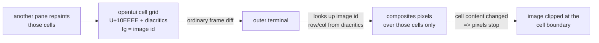
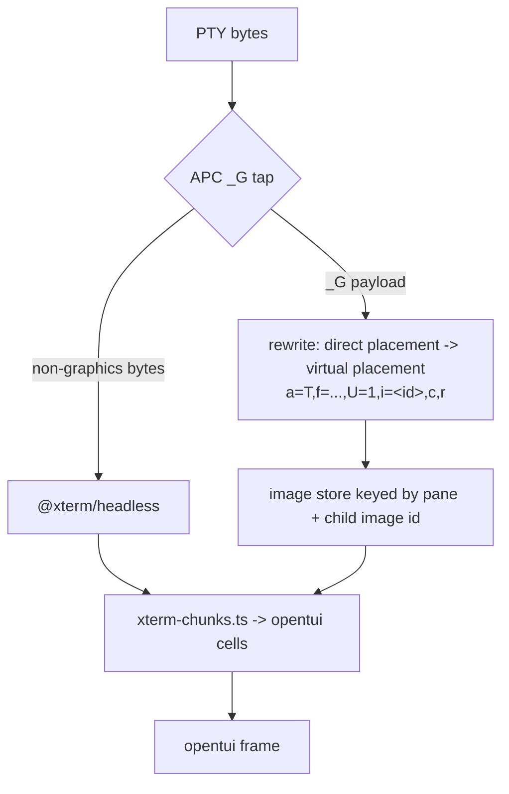

# Kitty graphics in Rove — feasibility gate

**Verdict: the output path carries Kitty graphics today. The embedded terminal tab does not.**

Rove's own TUI surface can host a Kitty image with the opentui version we already
ship — no upgrade, no new dependency, no "reserved rectangle" machinery. What does
not work is graphics *from a child process inside a terminal tab*: `@xterm/headless`
has no APC handler, so the payload dies one layer below us.

Scope: this was a gate, not a feature. No file under `packages/*/src/**` was changed.
Probes live in `.scratch/kitty-spike/` (gitignored); each section names the one that
produced its evidence and what that probe does when the thing under test is broken.

| | question | answer |
|---|---|---|
| Q0 | did opentui add image rendering after 0.4.3? | yes — 0.5.0+ ships `ImageRenderable`, verified rendering in Ghostty |
| Q1 | can opentui 0.4.3 emit placeholder cells intact? | yes — byte-exact, 1 cell wide, exact truecolor fg |
| Q2 | can Rove yield a rectangle it won't repaint? | yes — and there is no rectangle to yield; see below |
| Q3 | can a terminal tab pass a child's APC through? | no on the current stack; needs a tap above `@xterm/headless` |

Everything below was measured on **Ghostty 1.3.1**, `TERM=xterm-ghostty`, in a real
window. The browser `/harness` path cannot see any of it — `xterm.js` in the browser
drops the payload exactly like the embedded tab does, so both BEFORE and AFTER would
have come back as the same blank screenshot.

---

## The control that makes every result below attributable

**Ghostty renders both Kitty placement modes; a corrupt payload renders nothing.**

`.scratch/kitty-spike/probes/run-q0-control.sh` → `out/p0-controls.png` puts four
panels in one window:

- `P0a` direct placement (`a=T,f=100`) — **tile appears**
- `P0b` Unicode placeholder (`a=T,f=100,U=1` + `U+10EEEE` cells, image id in the fg
  channels) — **tile appears**
- `P0c` same call path, payload truncated to 40 bytes + 40 NUL — **nothing**
- `P0d` placeholder cells with no image transmitted behind them — **nothing**

P0c and P0d are the reason a later "nothing rendered" means something. Without them
a blank panel is indistinguishable from a probe that never ran.

One trap this caught: the first version of `P0b` omitted `f=100`, so Ghostty read the
PNG bytes as raw RGBA and rendered nothing. That failure looks *identical* to "Ghostty
has no placeholder support". The control panel is what separated them.

---

## Q0 — opentui gained a real image path after 0.4.3

**Conclusion: yes. `@opentui/core` 0.5.x renders images to the terminal natively, and
its native VT even parses inbound Kitty APC. Upgrading is the largest lever available,
and also the largest change — it swaps the terminal emulator under our tabs.**

We pin `0.4.3` ([`packages/kobe/package.json:72-73`](../../packages/kobe/package.json)).
npm `latest` is **0.5.11** (published 2026-09-07); 0.5.0 landed 2026-08-03.

What 0.5.11 adds that 0.4.3 does not have at all:

- `image.d.ts` — a native image codec (decode / resize / extract / composite, PNG, JPEG,
  WebP, GIF, raw RGBA).
- `renderables/Image.d.ts` — `ImageRenderable` with
  `protocol: "auto" | "kitty" | "sixel" | "blocks"` and `resolveImageRenderProtocol()`
  that picks from `TerminalCapabilities`.
- `zig.d.ts:304` — `bufferDrawImage(buffer, image, x, y, w, h, pxW, pxH, srcX, srcY,
  srcW, srcH, protocol)`. The image is drawn **into opentui's own `OptimizedBuffer`**,
  which is why scroll/clip/z-order come for free rather than needing a reserved region.
- `renderables/EmbeddedTerminal.d.ts` + `zig.d.ts:740-765` — a native terminal emulator
  (`createEmbeddedTerminal`, `embeddedTerminalWrite`, `embeddedTerminalCompose`, …),
  i.e. a replacement for the `@xterm/headless` we drive today.
- Startup capability probe: opentui 0.5.11 writes
  `\x1b_Gi=31337,s=1,v=1,a=q,t=d,f=24;AAAA\x1b\\` during init — captured in
  `out/q0-0511-stderr.bin`.

`strings libopentui.dylib` shows Kitty graphics on **both** sides of that native lib:
an outbound command template `_Ga=,t=f,f=,s=,v=,q=0;`, and an inbound image store with
eviction, placements, delete ranges and shared-memory transport, reached through
`(terminal_apc) kitty graphics protocol error`.

Measured, not read (`.scratch/kitty-spike/q0-sandbox/q0.ts` → `out/q0-0511.png`,
installed in a throwaway sandbox so the repo lockfile was untouched):

- **Panel A** — `ImageRenderable({ protocol: "kitty" })`: **tile renders.**
- **Panel B** — `EmbeddedTerminalRenderable` fed the same APC bytes a child would emit:
  **no tile**, while plain text written to the same renderable in the same frame
  displays normally. So the emulator consumes the APC into its own image store and
  `embeddedTerminalCompose()` does not surface it to the parent buffer.

*If this were broken:* panel A blank while `P0a` renders would mean opentui's emitter
is wrong rather than the terminal; panel B's text control is what makes its blank
attributable instead of just "the panel never got data".

Not done here, and deliberately: the upgrade itself. 0.4.3 → 0.5.11 crosses a native
emulator swap and a renderable-API change; that is its own scoped piece of work.

---

## Q1 — opentui 0.4.3 already puts placeholder cells on the wire byte-for-byte

**Conclusion: yes, on all three failure modes. No normalisation, width 1, exact RGB.**

`.scratch/kitty-spike/probes/q1-opentui-placeholder.ts`, driven two ways:

**On the wire** (`probes/wire.sh` → `out/q1-wire.bin`, a real PTY via `script(1)`):

```
U+10EEEE on the wire: 118        (truncated capture; 160 were written)
first placeholder run: U+10EEEE U+0305 U+0305 U+10EEEE U+0305 U+030D
fg SGR 38;2;0;0;31   : True
```

opentui reproduces `U+10EEEE` + row diacritic + column diacritic exactly, and emits
the image id as an exact truecolor SGR — no 256-colour or theme downgrade.

**On screen** (`out/q1-opentui-043-fixed.png`, measured by
`probes/measure.py`, not eyeballed):

- cell pitch from the 30-digit ruler: **16.000 px**
- tile magenta span: **316 px**, plus the tile's own 2 px white frame on each side
  = 320 px = **exactly 20 cells** for a 20-column block. `U+10EEEE` is **width 1**.

Two mechanisms worth carrying forward:

1. **Kitty image storage is scoped to the screen it was transmitted on.**
   `probes/run-q1b-altscreen.sh` → `out/q1b-altscreen.png` isolates it with no opentui
   involved: transmit on the primary screen and print the cells in the alternate screen
   → **nothing**; transmit inside the alternate screen → **tile**; direct placement
   inside the alternate screen → **tile**. Rove lives in the alternate screen, so the
   transmit has to happen after opentui has switched. The first Q1 run failed on
   exactly this and looked like "opentui ate the combining marks".
2. **Ghostty scales the image to the declared column count and keeps its aspect ratio**,
   leaving the rest of the declared rows blank: a 320×160 image in a 20×8 block filled
   20 cols × ~4.7 rows (156 px at a 34 px row pitch). The host has to compute the row
   count from the pixel height itself — which is why terminal-browser's host queries
   `CSI 16 t` for the cell pixel size before it sends `init`.

*If this were broken:* the `XXXXXXXXXX` row in the same frame carries the identical fg,
so a colour downgrade shows as a visibly wrong swatch even when the placeholder renders
nothing; the ruler row makes a width-2 codepoint show up as a 40-cell-wide tile.

---

## Q2 — there is no rectangle to reserve

**Conclusion: yes, and the framing in the brief is the wrong shape. The image is bound
to cell *content*, not to screen coordinates, so opentui's ordinary diffing and
clipping already are the containment. Nothing needs to declare a region off-limits.**



`.scratch/kitty-spike/probes/q2-rect-ownership.ts`, three phases plus a resize, each
with a neighbouring renderable repainting at 30 fps throughout:

| phase | shot | result |
|---|---|---|
| `steady` | `out/q2-steady.png` | tile intact at frame 525 of continuous neighbour repaints |
| `moved` | `out/q2-moved.png` | block re-laid-out 6 rows down — tile follows the cells, no residue at the old position |
| `overlay` | `out/q2-overlay.png` | a modal box drawn over the block's centre — **tile clipped exactly at the cell boundary**, visible everywhere the modal is not, no pixel outside the declared rect |
| resize | `out/q2-resize-before.png` → `out/q2-resize-after.png` | window 900×800 → 1180×560; magenta span stays 316 px, tile stays inside the green declared border |

The overlay phase is the load-bearing one: it is simultaneously the containment proof
(nothing leaks outside) and the occlusion proof (an overlapping pane wins, per cell,
with no coordination code).

*If this were broken:* a leak would show as magenta pixels outside the green border,
which `probes/measure.py` reports numerically; a repaint that killed the image would
show as a blank rect under a frame counter that is still ticking.

---

## Q3 — the embedded terminal tab cannot pass a child's APC through today

**Conclusion: no, and not because of coordinates — the bytes are destroyed one layer
below us. `@xterm/headless` exposes no APC handler at all. A tap above it is the only
route, and it is a real piece of work, not a shim.**

The tab's path is PTY → `@xterm/headless` →
[`xterm-chunks.ts`](../../packages/kobe/src/tui/panes/terminal/xterm-chunks.ts) →
opentui cells. `.scratch/kitty-spike/probes/q3-xterm-apc.ts` writes a real Kitty APC
into the exact dependency and version we ship:

```
parser registration hooks:
   registerCsiHandler: function     registerDcsHandler: function
   registerEscHandler: function     registerOscHandler: function
   registerApcHandler: undefined    registerPmHandler:  undefined
APC bytes in the cell buffer          : false
positive control in the cell buffer   : true
APC survives SerializeAddon           : false
positive control survives SerializeAddon: true
serialized length: 30   |  APC input length: 1692
```

1692 bytes in, 0 bytes out, no hook to intercept them. The positive control — a plain
SGR-coloured string down the same two paths — survives both, so this is the APC
specifically, not a dead probe.

*If this were broken:* the control string failing would mean the probe never reached
the terminal; it passes, so the APC's disappearance is attributable.

### If we were to build it



The seam is [`pty-xterm-base.ts`](../../packages/kobe/src/tui/panes/terminal/pty-xterm-base.ts),
`feedInternal()` — every PTY byte reaches `this.term.write(data, …)` there, so that is
the one place a tap sees the whole stream before xterm consumes it.

Four things that tap would own, none of them optional:

- **Coordinate rebase.** A child's `a=T` places at *the child's* cursor. The outer
  terminal's cursor is somewhere else entirely. The tap has to convert every direct
  placement into a virtual placement plus placeholder cells written into the pane's own
  cell grid — which is the mechanism Q1 and Q2 already proved works, so scroll, clip
  and occlusion then come for free instead of needing per-frame coordinate fixups.
- **Image id namespacing.** Two panes running two children will both pick id 1.
- **`a=d` (delete) forwarding**, and eviction when a pane closes — the Ghostty-side
  store is finite and evicts on its own terms (`kitty_gfx evicting image id=`).
- **Scrollback.** Placeholder cells scroll out of the pane's buffer like any other
  cell; the image behind them does not, so the store needs a lifetime tied to the
  pane's scrollback, not to the frame.

The 0.5.x native emulator removes the *first* blocker only — it parses the APC into an
image store (Q0, panel B) but does not surface it through `embeddedTerminalCompose()`,
so the coordinate and lifetime work above is unchanged.

---

## What this means for the two things the owner asked for

**Kitty graphics in Rove's own panes: go.** 0.4.3 already carries everything needed.
The constraints to design against are the three named above — transmit inside the
alternate screen, derive rows from the cell pixel size, namespace image ids.

**Swapping the carbonyl Browser plugin for terminal-browser: the host side is
unblocked.** Its embedded-mode contract needs the host to (a) report cell pixel size,
(b) print `U+10EEEE` placeholder cells with the image id in the fg channels, and
(c) leave those cells alone across repaints. Q1 proves (b) byte-for-byte, Q2 proves (c)
with no new machinery, and (a) is a `CSI 16 t` query. That plugin lives in
`Sma1lboy/kobe-plugins`, so its actual replacement is a report to that repo, not a
change here.

**Not blocked on the opentui upgrade.** The upgrade buys native image rendering and a
native VT; it does not unlock the terminal-browser path, which 0.4.3 already carries.
Worth evaluating on its own merits, separately.

---

## Reproducing

```bash
cd .scratch/kitty-spike
python3 probes/make-image.py out/tile.png
curl -s https://raw.githubusercontent.com/kovidgoyal/kitty/master/gen/rowcolumn-diacritics.txt \
  -o out/rowcolumn-diacritics.txt

./probes/shoot.sh "$PWD/probes/run-q0-control.sh"    "$PWD/out/p0-controls.png"     5  # controls
./probes/shoot.sh "$PWD/probes/run-q1.sh"            "$PWD/out/q1.png"              8  # Q1 on screen
./probes/wire.sh  out/q1-wire.bin bun probes/q1-opentui-placeholder.ts                 # Q1 on the wire
./probes/shoot.sh "$PWD/probes/run-q1b-altscreen.sh" "$PWD/out/q1b-altscreen.png"   6  # alt-screen scoping
Q2_PHASE=overlay ./probes/shoot.sh "$PWD/probes/run-q2.sh" "$PWD/out/q2-overlay.png" 7 # Q2
bun probes/q3-xterm-apc.ts                                                             # Q3 (no terminal needed)
./probes/shoot.sh "$PWD/probes/run-q0-0511.sh"       "$PWD/out/q0-0511.png"         9  # Q0 on 0.5.11
```

`shoot.sh` launches an **isolated** Ghostty instance (`out/ghostty-spike.conf`, with
`window-save-state = never`) and captures it by CGWindowID. Both matter: without the
isolated config, macOS window restoration reopened the owner's live session in the
probe's own tabs; without CGWindowID capture, an area capture picks up whatever app
happens to be in front of that screen rectangle.
