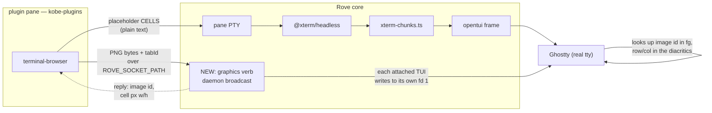
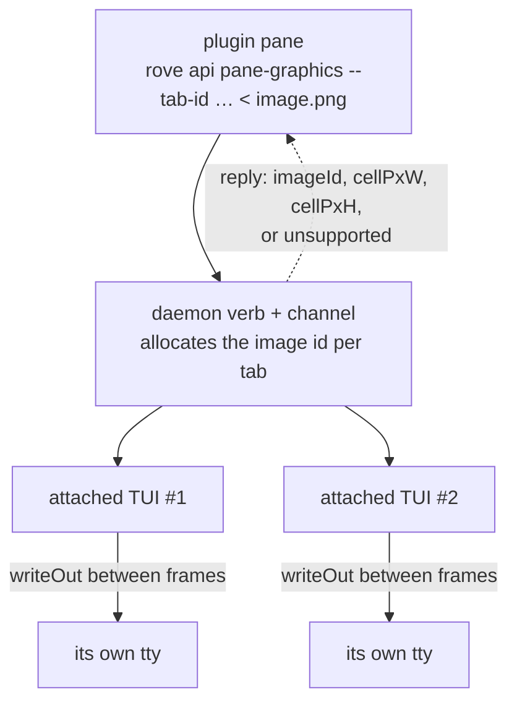

# terminal-browser: plugin or core tab kind?

**Verdict: build it as a PLUGIN in `Sma1lboy/kobe-plugins`, plus ONE
product-neutral verb in Rove core — a daemon broadcast that hands opaque
graphics bytes to every attached TUI to write to its own tty, and answers with
the cell pixel size and the image id to use.**

The render half needs no core change at all: a Kitty Unicode placeholder
printed by a PTY child survives `@xterm/headless` → `xterm-chunks.ts` →
opentui → Ghostty byte-for-byte, and Ghostty composites the image over those
cells (measured below, `out/q1e-full.png`). The only thing a plugin pane
cannot do is get the pixels into the terminal: its `tty(1)` is its own PTY
slave, the outer emulator's identity is scrubbed out of its environment, and
the default PTY backend runs it under `pty-host` (pid 954 at measurement time,
**ppid 1, tty `??`**), which has no controlling terminal at all.

A core tab kind would put a browser vendor's socket protocol, its `init`
handshake and its lifecycle inside the neutral TUI layer, and would still have
to build the same pixel transport. The transport is the whole gap. Build the
transport, keep the browser in the plugin.

Scope: a probe. No file under `packages/*/src/**` was changed. Probes live in
`.scratch/kitty-plugin/` (gitignored); every section names the one that
produced its numbers and what that probe does when the thing under test breaks.

| | question | answer |
|---|---|---|
| Q1 | does a placeholder survive the embedded terminal layer? | yes — 3 codepoints in 1 cell, width 1, fg exact `38;2;R;G;B` |
| Q2 | can a plugin pane child reach the outer tty? | no, by three independent mechanisms, and nothing in the plugin contract substitutes |

---

## The architecture this decides



The split is terminal-browser's own embedded-mode contract, with one
substitution: its reference host lets the child write pixels to the tty
directly (`ttyName()` in `examples/embedded/src/host.ts`); here the host writes
them, because in Rove the child provably cannot.

---

## Q1 — the placeholder survives the embedded terminal layer intact

**Conclusion: yes, on every failure mode that was checked. Three codepoints
stay in one cell, the cell is one column wide, and the foreground stays an
exact truecolor triple.**

The prior gate measured opentui emitting placeholders *directly*
([kitty-graphics-feasibility.md](#prior-work), Q1). This measures the layer
that gate skipped: a real PTY child → `@xterm/headless` → `xterm-chunks.ts`.

### In the cell grid — `probes/q1-pane-stack.ts`

Drives the shipped `BunTerminalTaskPty`, so the Unicode 11 addon, the
`allowProposedApi` flag, the env scrub and the cell→`Chunk` converter are the
ones that ship, not a re-creation of them:

```
placeholder row found          : true
first 6 codepoints             : U+10EEEE U+305 U+305 U+10EEEE U+305 U+30D
codepoint sequence byte-exact  : true
codepoints in row              : 60 (expected 60)
chunk fg                       : rgb(10,11,12)
fg is exact truecolor          : true
placeholder run is ONE chunk   : true (chunks: 1)

== all 297 kitty diacritics ==
placeholder cells emitted      : 297
placeholder cells recovered    : 297
cells with both diacritics kept: 297
```

The 297-diacritic sweep is not decoration. A placeholder at row 200 / column
200 uses combining marks far outside the common ranges; one of them measuring
width 1 instead of 0 would split that cell and corrupt only the bottom-right
of a large image, which reads as "the browser renders wrong below the fold".

*If this were broken:* three negative controls run in the same process and
each one fails the assertion its positive twin passes.

```
N1 non-combining filler        : U+10EEEE U+61 U+10EEEE U+61 -> cells did NOT merge: true
N2 width-2 CJK row text        : "漢漢|"
N3 SGR 38;5;13 chunk fg        : rgb(199,169,255)
```

N1 proves the "3 codepoints, 1 cell" test can see a split. N2 proves the grid
reports real widths rather than assuming 1. N3 proves a 256-colour downgrade
would land in `chunk.fg` as a different triple — a downgrade cannot hide.

### On the wire — `probes/q1-wire.sh` → `out/q1e-wire.bin`

The same stack under a real PTY via `script(1)`, capturing what opentui writes
outward. 4096 bytes before the capture truncates, containing 119 placeholder
cells:

```
ESC [ 3 8 ; 2 ; 0 ; 0 ; 7 7 m  ESC [ 4 9 m  U+10EEEE ̅ ̅  U+10EEEE ̅ ̍  U+10EEEE ̅ ̎ …
```

`38;2;0;0;77` is image id 77 in the blue channel, emitted as exact truecolor
immediately before the cells.

### On screen — `probes/q1e-pane-to-ghostty.ts` → `out/q1e-full.png`

The whole proposed architecture, minus the plugin: a real PTY child prints
only placeholder cells; the shipped `TerminalRowPainter` paints them into
opentui; the host writes the image APC straight to fd 1 after opentui has
entered the alternate screen. **The tile renders.**

Measured, not eyeballed (`probes/measure.py`, `probes/measure-ruler.py`):

- Ghostty's own answer to `CSI 16 t` at that font size: `ESC[6;34;16t` →
  **cell 16 px wide, 34 px high**.
- tile magenta span **316 px**, plus its own 2 px white frame each side =
  **320 px = exactly 20 cells** for the 20 placeholder cells printed.
  `U+10EEEE` is width 1 through the pane stack, confirmed against two
  independent rulers (the 30-glyph text ruler reads a 15.867 px ink span, i.e.
  a 16 px pitch; Ghostty reports 16 px).

*If this were broken:* `MODE=cells` re-runs the identical path with the APC
transmit omitted → `out/q1e-cells-negative.png`, `measure.py` reports **"no
tile pixels found"**. A tile in the full shot is therefore the image, not a
magenta box the probe happened to draw.

---

## Q2 — a plugin pane child cannot reach the outer tty, and nothing substitutes

**Conclusion: no. Three mechanisms block it independently, so no clever
plugin-side workaround gets around all three, and the plugin contract exposes
no replacement fact.**

`probes/q2-run.ts` builds the pane argv through the shipped
[`buildPaneArgv()`](../../packages/kobe-daemon/src/plugins/pane-command.ts) —
`[loginShell, "-ilc", "exec env ROVE_…=… <command>"]` — and runs
`probes/q2-pane-reach.py` inside it.

**1. The child's tty is its own PTY slave.**

```
tty: /dev/ttys029
```

**2. The outer emulator's identity is scrubbed.**
[`embeddedTerminalEnv()`](../../packages/kobe-daemon/src/daemon/pty-env.js)
drops `TERM_PROGRAM`, `LC_TERMINAL`, `__CFBundleIdentifier` and every
`GHOSTTY_` / `KITTY_` / `ITERM_` / `WEZTERM_` prefix:

```
TERM=xterm-256color   TERM_PROGRAM=<unset>   LC_TERMINAL=<unset>
GHOSTTY_* : 0 vars    KITTY_* : 0 vars       ITERM_* : 0 vars
```

**3. Ancestry leads nowhere.** The default backend is `hosted`
([`createTaskPty`](../../packages/kobe/src/tui/panes/terminal/pty.ts)), so the
child's ancestor is `pty-host`, measured live as **pid 954, ppid 1, tty `??`**.
A hosted PTY outlives the TUI by design, so there is no ancestor holding an
outer tty to walk up to — and a task can be attached by more than one GUI at
once, so "the outer tty" is not even a single thing.

**The capability queries terminal-browser's host makes are answered by the
wrong emulator.** Asked from inside the pane, versus asked by a host process
that owns the real Ghostty tty (`probes/q2-host-caps.py`):

| query | from the pane | from the host |
|---|---|---|
| `CSI 16 t` (cell px) | `b''` | `ESC[6;34;16t` |
| `CSI 14 t` (window px) | `b''` | `ESC[4;1428;1648t` |
| `CSI 18 t` (size in cells) | `b''` | `ESC[8;42;103t` |
| `CSI ?1016$p` (pixel mouse) | `ESC[?1016;2$y` | `ESC[?1016;2$y` |
| `OSC 10` / `OSC 11` | Rove's own theme colours | Ghostty's |

*If this were broken:* the `CSI ?1016$p` row is the positive control. The pane
answers it, so the query channel works and the three empty replies are the
embedded emulator declining to answer, not a probe that never wrote anything.

**Nothing in the plugin contract substitutes.** Of the 52 `rove api` verbs,
none reports terminal geometry or a tty. Of the `ROVE_*` / `KOBE_*` variables a
pane receives, none names a tty, a display, or a pixel dimension. Grepping
`packages/kobe/src` + `packages/kobe-daemon/src` for `cellWidth|pixelWidth|
CSI 16|termProgram` finds only `doctor-report.ts` (diagnostics) and the scrub
list itself: **Rove does not know its own cell pixel size today**, at any
layer.

Known ceiling, not a blocker: Rove forwards mouse as SGR 1006 with cell
coordinates (`\x1b[<${code};${col};${row}M`,
[`keys-pure.ts:462`](../../packages/kobe/src/tui/panes/terminal/keys-pure.ts)),
and answers `CSI ?1016$p` with `2` (permanently reset). A browser pane gets
pointing at 16 × 34 px granularity, not per-pixel.

---

## If we build it: the seam

One verb, shaped exactly like the one that already exists. `rove api
pane-open` validates in the daemon, publishes on a channel, and **the attached
TUI performs the real work** — the daemon never touches a terminal itself.
A graphics verb is one more of that kind, not a new mechanism.



Three pieces, in the layer each already belongs to:

1. **The TUI learns its own cell pixel size.** One `CSI 16 t` query on its tty
   around renderer creation
   ([`tui-react/lib/host-boot.tsx:255`](../../packages/kobe/src/tui-react/lib/host-boot.tsx)),
   reported to the daemon with the `role: "gui"` subscribe
   ([`daemon/subscribe.ts`](../../packages/kobe-daemon/src/daemon/subscribe.ts)).
   This is the prerequisite `docs/design/terminal-graphics.md` recorded as
   unsolved; the measurement above shows it is one query, and terminals that
   answer `0` or nothing simply report no capability.
2. **A verb + channel**, alongside
   [`handlers-ui.ts`](../../packages/kobe-daemon/src/daemon/handlers-ui.ts)'s
   `tab.open`: take opaque bytes plus a tab id, allocate the image id in the
   daemon (per-tab, which is the id-namespacing blocker the prior gate listed),
   broadcast to every attached GUI, reply with the id and the cell size — or
   `unsupported`, so the plugin falls back to half-blocks the way the carbonyl
   pane does today.
3. **The TUI writes the payload to fd 1 between frames**, next to where the
   event is consumed
   ([`client/remote-orchestrator-events.ts:353`](../../packages/kobe/src/client/remote-orchestrator-events.ts)).
   Bytes verbatim; Rove parses nothing.

**Why this does not reintroduce what the scrub prevents.**
`embeddedTerminalEnv()` exists so a child never emits the OUTER emulator's
dialect into Rove's xterm parser. Nothing here tells the child what the outer
emulator is: it hands over an opaque payload and gets back two integers and an
id. Its PTY still carries only plain text — Q1 is the proof that the parser
treats a placeholder cell as ordinary text. The one new fact the child learns,
the cell pixel size, is a measurement of the surface its own cells land on, not
a dialect it can emit.

**Why not a core tab kind.** Everything above is product-neutral: an image
viewer, a chart pane or a PDF preview would use the same verb. A tab kind
means the neutral TUI layer owns a unix socket protocol, an `init` handshake
and a browser process's lifecycle — vendor machinery in the layer that
[CLAUDE.md](../../CLAUDE.md) keeps vendor-free — and the transport above still
has to be built underneath it.

---

## What this changes in `docs/design/terminal-graphics.md`

That note's decision (2026-07-29, character cells, no kitty path) stands for
what it was about: capturing a *child's* APC. Two of its stated mechanisms are
now measured wrong for the *virtual placement* path, and should not be quoted
against this one:

- "the terminal composites from its own placement store, **not** from our
  cells, so a sidebar drawn 'over' a pane does not occlude an image". True of
  direct placements (`a=T` at the cursor). For `U=1` virtual placements the
  image is bound to cell *content*: the prior gate's Q2 measured a modal drawn
  over the block clipping the tile exactly at the cell boundary, with no
  coordination code.
- "Unsolved prerequisite: **cell pixel size** … opentui exposes no such
  field". opentui still doesn't, but the terminal answers: `CSI 16 t` →
  `ESC[6;34;16t`, measured above.

---

## Reproducing

```bash
cd .scratch/kitty-plugin                       # assets copied from .scratch/kitty-spike
(cd ../../packages/kobe && bun ../../.scratch/kitty-plugin/probes/q1-pane-stack.ts)   # Q1 in the grid
./probes/q1-wire.sh out/q1e-wire.bin                                                  # Q1 on the wire
./probes/shoot.sh "$PWD/probes/run-q1e.sh"       "$PWD/out/q1e-full.png"           10  # Q1 on screen
./probes/shoot.sh "$PWD/probes/run-q1e-cells.sh" "$PWD/out/q1e-cells-negative.png" 10  # its negative control
python3 probes/measure.py out/q1e-full.png && python3 probes/measure-ruler.py out/q1e-full.png
(cd ../../packages/kobe && bun ../../.scratch/kitty-plugin/probes/q2-run.ts)          # Q2 from the pane
./probes/shoot.sh "$PWD/probes/run-q2-host-caps.sh" "$PWD/out/q2-host-caps.png"     6  # Q2 from the host
```

`shoot.sh` launches an **isolated** Ghostty instance and captures it by
CGWindowID — without the isolated config macOS window restoration reopens the
owner's live session in the probe's tabs; without CGWindowID capture an area
capture picks up whatever app is in front of that rectangle.

<a id="prior-work"></a>

## Prior work

The gate this builds on — whether opentui emits placeholders at all, whether a
rectangle has to be reserved, and why `@xterm/headless` destroys a child's APC
— is `docs/design/kitty-graphics-feasibility.md` on the `aardvark` worktree
branch, with its probes in `.scratch/kitty-spike/`. Facts carried forward
unverified from it: the alternate-screen scoping of Kitty image storage,
Ghostty scaling to the declared column count, and
`registerApcHandler === undefined` on `@xterm/headless` 6.0.
