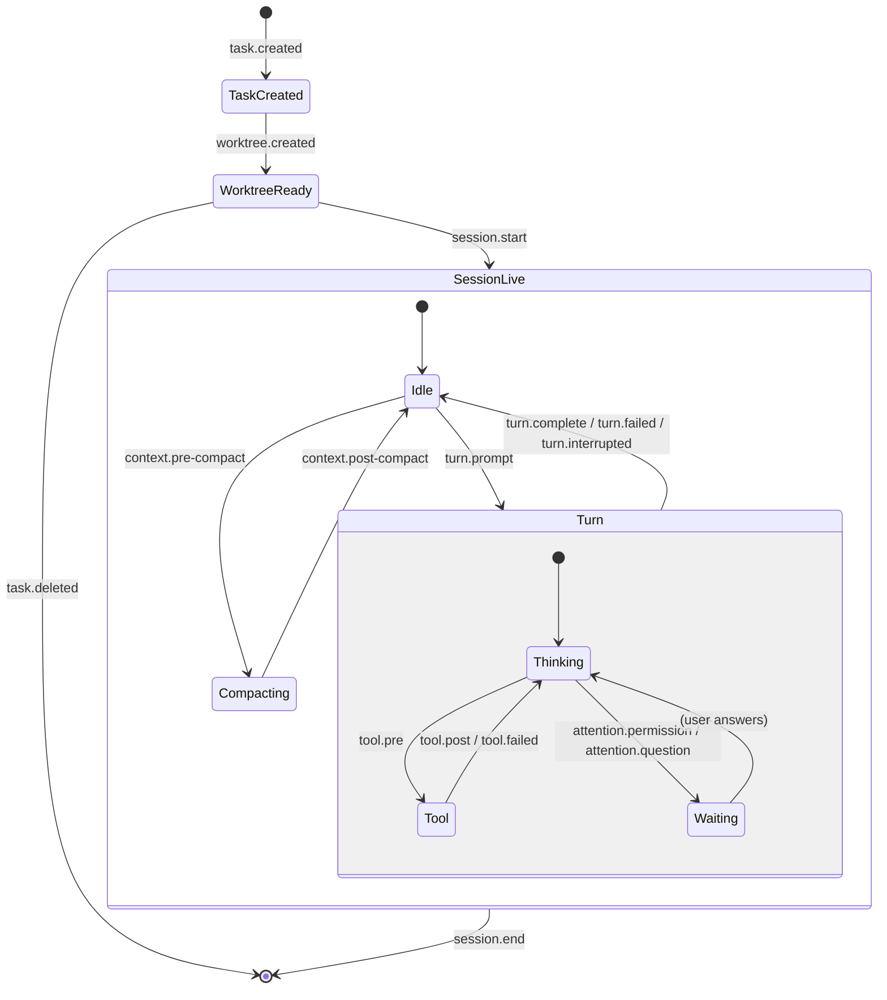

# Unified agent lifecycle events — the plugin event stream

Status: SHIPPED for Claude Code + Codex (2026-07-28) + Kimi (2026-08-23). Extends [plugins.md](./plugins.md) §Events.
Goal: one engine-agnostic event taxonomy covering the WHOLE product
lifecycle — Rove's task/worktree layer plus the engine's session/turn/tool
layer — so a plugin can hook any point of the flow without knowing which
vendor (Claude Code, Codex, Kimi Code) is underneath.

Grounding: all three engines now ship a Claude-Code-shaped `hooks` system
(stdin JSON, per-event commands). The differences are payload field names,
config format, and coverage gaps — exactly what an adapter layer is for.
Rove already normalizes engine hooks into activity verbs
(`src/engine/hook-events.ts` → `rove hook` → daemon `engine.reportEvent`);
this design widens that vocabulary and re-broadcasts it to plugins.

## Two layers, one stream

- **Product lifecycle (Rove-owned).** Task and worktree state the
  orchestrator itself controls. Already plugin-visible: `task.created`,
  `task.deleted`, `worktree.created` (plugins/events.ts).
- **Agent lifecycle (engine-owned, normalized).** What the engine reports
  through its hooks, translated by the per-vendor adapter into one verb set.
  Plugin-visible today only as the reduced `agent.*` states.

A plugin subscribes to both through the same `[[events]]` mechanism; the
daemon is the single fan-out point.



Subagents run the inner `Turn` machine nested one level
(`subagent.start` … `subagent.stop`), tagged with the parent session.

## Event catalog

Support: **C** Claude Code · **X** Codex · **K** Kimi Code. `N` native hook,
`F` emulatable by watching session files, `—` absent. Status: ✅ shipped,
💤 deferred.

### Product layer (Rove-owned, engine-independent)

| Event | Fires when | Status |
|---|---|---|
| `task.created` / `task.deleted` | task appears/disappears in the index | ✅ |
| `task.landed` | branch merged back into the base repo (`detail.strategy/landedOn/commit`) | ✅ |
| `task.archived` | task archived; restores don't fire | ✅ |
| `worktree.created` | worktree materialized for a task | ✅ |
| `issue.changed` | daemon-tracker issue mutated (`detail.repo/op`) | ✅ |
| `task.status-changed` | backlog → in-progress → done transitions | 💤 (derivable from snapshots; add on demand) |
| `file.will-open` / `file.opened` | Files-pane open, before/after (`detail.path`, `detail.via: plugin\|editor\|external`) | ✅ |
| `file.closed` | the editor tab left the tab strip (fires off the tab-delta seam) | ✅ |
| `task.opened` / `project.opened` | the user selects/enters a task or project row | ✅ |
| `tab.opened` / `tab.closed` | a workspace tab appeared/went away; mount-time restores don't fire | ✅ |

### A. Session

| Event | C | X | K | Status | Payload notes |
|---|---|---|---|---|---|
| `session.start` | N | N | N | ✅ | `source: startup\|resume\|clear\|compact` as detail, not separate events |
| `session.end` | N | N* | N | ✅ (Claude) | *Codex: documented upstream, absent from the pinned protocol — version-gate |

### B. Turn

| Event | C | X | K | Status |
|---|---|---|---|---|
| `turn.prompt` | N | N | N | ✅ |
| `turn.complete` | N | N | N | ✅ (`agent.turn-complete`) |
| `turn.failed` | N | F | N | ✅ (`agent.error` / `agent.rate-limited`) |
| `turn.interrupted` | — | F | N | ✅ verb wired — on Kimi, `Stop` does NOT fire after an interrupt, so without this verb an interrupted Kimi turn strands in `running` |

### C. Tool — the biggest gap, full native tri-engine coverage

| Event | C | X | K | Status |
|---|---|---|---|---|
| `tool.pre` | N | N | N | ✅ (gated install) |
| `tool.post` | N | N | N | ✅ (gated install) |
| `tool.failed` | N | — (folded into tool_response) | N | ✅ (Claude, gated) |

Normalized payload: `{ toolName, toolUseId, input?, output?, ok }` — the
vendor field spellings (`tool_result` / `tool_response` / `tool_output`)
are the adapter's problem, never the plugin's. Note Rove's existing
`worktree-created` detection is ALREADY a hard-coded `PostToolUse` observer
(`cli/hook-cmd.ts`); the general mechanism now ships alongside it.

### D. Attention

| Event | C | X | K | Status |
|---|---|---|---|---|
| `attention.permission` | N | N† | N | ✅ (Claude; Codex opt-in deferred) |
| `attention.question` (elicitation) | N | F | F | ✅ (Claude) |
| `attention.notification` | N | — | N | 💤 |

† Codex `PermissionRequest` hooks are SYNCHRONOUS: exit 0 + empty stdout is
an explicitly supported no-op, but a slow hook wedges the approval dialog.
`rove hook` must stay sub-second on this path (it already is: bounded stdin
read, connect-if-running, always exit 0).

### E. Context / compaction — cheapest win, uniform tri-engine shape

| Event | C | X | K | Status |
|---|---|---|---|---|
| `context.pre-compact` / `context.post-compact` | N | N | N | ✅ — `trigger: manual\|auto` |

### F. Subagent

| Event | C | X | K | Status |
|---|---|---|---|---|
| `subagent.start` / `subagent.stop` | N | N* | N | ✅ (Claude) — `{ type, id }`; feeds the nested-subagent-rows rule (CLAUDE.md §Engine-owned UI data) |

## Payload envelope (plugin-facing)

Every event a plugin hook receives exposes the canonical contract
(`ROVE_PLUGIN_EVENT`, `ROVE_PLUGIN_EVENT_JSON`, plain `ROVE_PLUGIN_TASK_*`
vars) plus identical `KOBE_PLUGIN_*` aliases, with the JSON envelope:

```jsonc
{
  "event": "tool.post",
  "taskId": "…",              // when cwd matched a task
  "task": { "id", "title", "repo", "branch", "worktreePath", "vendor", "status" },
  "vendor": "claude",          // which engine produced it (agent-layer events)
  "sessionId": "…",           // engine's own session id, when known
  "tabId": "…",               // Rove terminal tab, when the session is Rove-spawned
  "detail": { /* family-specific normalized fields, see catalog */ },
  "at": 1690000000000
}
```

All three engines ship `session_id` + `cwd` on every hook; Claude/Codex add
`transcript_path`, Codex adds `turn_id`, Kimi's base envelope is minimal —
fields are optional, never fabricated.

## What a plugin can tweak — and what it can't

Rove plugin event hooks are **asynchronous observers**: the daemon
broadcasts after the fact; a hook's exit code and output never feed back
into the engine's control flow. Blocking/mutating tweaks (deny a tool call,
rewrite a prompt) remain the territory of engine-native hooks the user
installs directly — Rove must never re-export a blocking surface it would
then be responsible for keeping synchronous across three vendors. The
observer stream still covers the high-value tweaks the ecosystem actually
builds: notify, log, mirror state, auto-file, auto-bootstrap, dashboards.

## Implementation notes (shipped shape)

- **Vendor-tagged reports (done).** Installed hook commands carry
  `--engine <vendor>`; `rove hook` decodes with exactly that adapter (legacy
  untagged installs fall back to first-answer guessing until re-install).
- **Verb transport (done).** New normalized verbs ride the existing
  `rove hook` → `engine.reportEvent` path. Lifecycle-only kinds are gated by
  `affectsActivityState` — they never touch the activity badge, inbox, or
  `engine-state` broadcast; the handler feeds them straight to the PluginHost
  (a direct sink, deliberately NOT a bus channel, so tool volume reaches only
  plugins that declared the hook).
- **Tool-family volume gate (done).** The PreToolUse/PostToolUse(/Failure)
  hooks are written into engine config ONLY while an enabled plugin declares
  a `tool.*` event (checked on every launch in `ensureGlobalKobeHooks`;
  install/remove such a plugin → takes effect on the next Rove start). A
  future manifest matcher (`tool = "Bash"`) can narrow further.
- **UI events (done).** The TUI fire-and-forgets product moments over the
  `ui.reportEvent` RPC → PluginHost direct sink (same no-broadcast path as
  lifecycle kinds). Async observers only — a `will-` event precedes the
  action but cannot block it.
- **Attention split (done for Claude).** `awaiting-input` maps to
  `attention.permission` vs `attention.question` by `detail.waiting`. Codex
  PermissionRequest opt-in and `attention.notification` remain deferred.
- **Kimi adapter** (shipped 2026-08-23): `KimiHookAdapter` writes a
  marker-delimited `[[hooks]]` block into `~/.kimi-code/config.toml`
  (append-at-EOF, merge-safe; payload fields verified against the installed
  0.37.2 binary — `SessionStart`/`UserPromptSubmit`/`Stop` live-fired with
  `session_id` + `cwd` in every payload). `Interrupt` → turn-interrupted and
  `PermissionRequest` → awaiting-input are wired; `Notification` stays out
  (no documented type filter). wire.jsonl watching still covers the F-gaps.

Version gates to re-verify against installed binaries at implementation
time: Codex `SessionEnd`/`Subagent*` (docs ahead of pinned protocol); Kimi
payload field names (inferred from the legacy Python + TS sources, not a
published contract).

## Sources

Engine docs: code.claude.com/docs/en/hooks · learn.chatgpt.com/docs/hooks ·
MoonshotAI/kimi-code docs/en/customization/hooks.md. Local ground truth:
`src/engine/hook-events.ts`, `src/engine/claude-code-local/hook-adapter.ts`,
`src/engine/codex-local/hook-adapter.ts`, `src/cli/hook-cmd.ts`,
`kobe-daemon/src/daemon/handlers.ts` (`engine.reportEvent`), and the
`refs/` clones (read-only).
