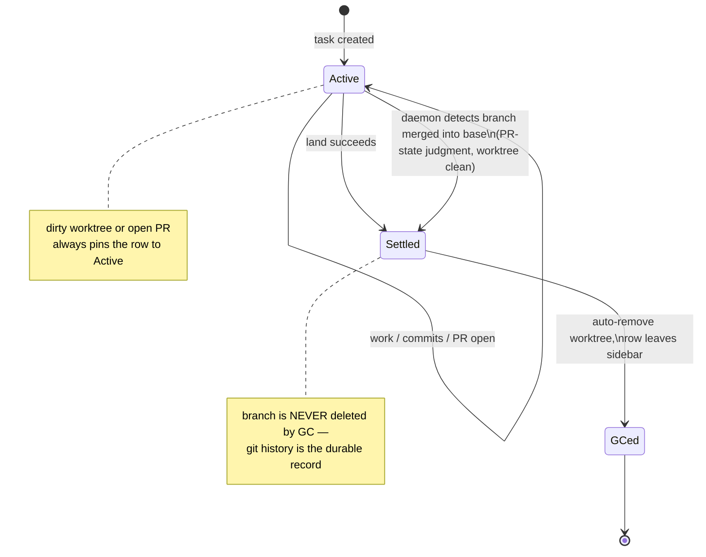
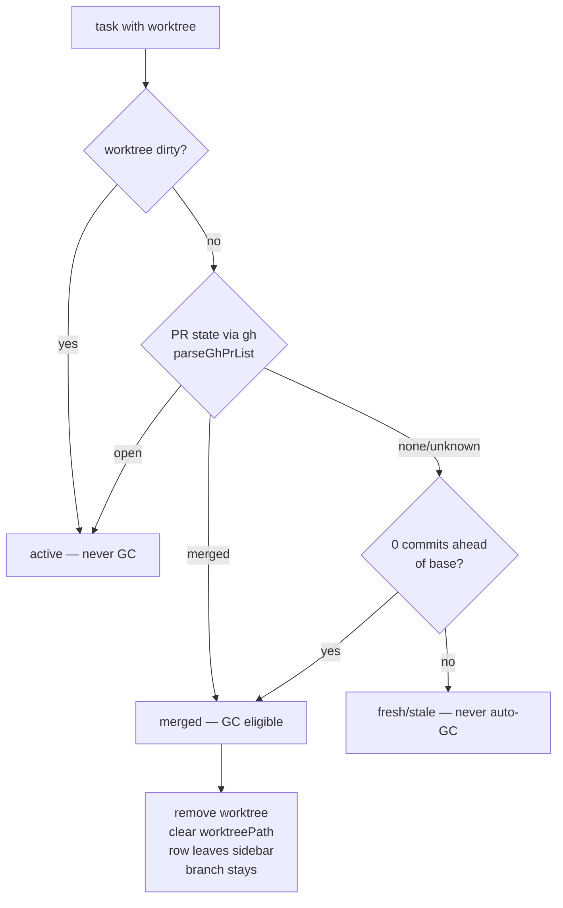

# Task Lifecycle: Delete Keeps the Branch, Archive Becomes GC

> Design record for issue #29 (2026-08-15). Direction: **the task list is a
> workbench, not an archive — git is the durable record.** A task row exists
> while there is live work; once the work is merged, the row should get out of
> the way and the branch stays behind as history.

## 1. The three changes

1. **`delete` keeps the branch by default.** Removing a task destroys the
   worktree and the index entry; the git branch survives unless the caller
   passes `--delete-branch` (the same opt-in flag `land` already has).
   Shipped with this document.
2. **`archive` is demoted from a user concept to an internal "closed,
   awaiting GC" state.** The recommended path is: land (or merge via PR) →
   the worktree is cleaned up automatically → the row disappears from the
   sidebar. The `archive` verb and the `a` chord remain as compatibility
   aliases, but docs stop recommending them. Auto-GC is a follow-up issue;
   this document is its contract.
3. **The sidebar filters by repo context** (a pure view-layer filter — no
   session or grouping entity is persisted). Shipped with this document.

## 2. Why delete must not delete the branch

Before this change `task-deletion.ts` hard-coded `deleteBranch: true`. In the
squash-merge workflow the branch usually *survived anyway* — but only because
`git branch -d` refuses a branch that looks unmerged (squash merges never make
branch commits ancestors of main), and the coordinator swallows that failure.
Branch survival was an accident of `-d`'s safety check, not a design
guarantee. Two consequences:

- A `merge`-strategy land followed by delete **did** silently drop the branch.
- `--force` delete escalated to `git branch -D`, which deletes unmerged
  branches — a force-delete of a dirty worktree also destroyed the only copy
  of the work's history.

The new contract:

- `delete` → worktree gone, index entry gone, **branch stays**. Always.
- `delete --delete-branch` → also `git branch -d` (or `-D` under `--force`).
- `--force` continues to mean "I accept losing uncommitted work in the
  worktree". It never implies `--delete-branch`; the two escalations are
  orthogonal and must be requested separately.
- Dirty-worktree refusal is unchanged: a dirty worktree still requires
  `--force`.

## 3. Archive → internal GC state

### 3.1 What archive is today

`task.archived: boolean` + a sidebar "Archived" view + the `a` chord + the
`archive` verb. Archiving stops hosted sessions but keeps worktree, branch,
and history. In practice it is a manual "I'm done with this row" gesture that
users must remember to perform — the workbench fills up with merged tasks
until someone sweeps.

### 3.2 Target state

The row leaves the workbench **automatically** when the work is provably
merged and the worktree holds nothing unmergeable:

Trigger sources:

- **Land success** (`task.land`): the merge just happened locally, so the
  answer is authoritative. Removing the worktree is already the default for
  a settled task (`--remove-worktree=false` opts out), so the cleanup half is
  done.
- **Daemon detection**: a task whose PR merged on the forge (the user merged
  in the browser, or an agent landed it from another checkout). The daemon
  already polls PR status (`pr-status-collector.ts`); a `merged` PR + a clean
  worktree marks the task settled.

### 3.3 Merge detection must not use merge-base

Rove's default workflow squash-merges (`gh pr merge --squash`), which never
makes branch commits ancestors of main — `git merge-base --is-ancestor` is a
**false negative for every squash-merged branch**. The judgment must reuse
the existing staleness rubric
([`orchestrator/worktree/staleness.ts`](../../packages/kobe/src/orchestrator/worktree/staleness.ts)),
whose signal cascade was built for exactly this:

`judgeWorktree` verdict `merged` (reason `prMerged` or `inMain`) is the GC
gate. Verdicts `stale` (closed PR, idle age) are deliberately **not** GC
triggers: abandoned work is a user decision, not a janitor's.

### 3.4 What GC does — and does not — touch

| Resource | GC action |
|---|---|
| Worktree directory | removed (`worktrees.remove`, never forced — a dirty tree aborts GC) |
| `task.worktreePath` | cleared (`clearWorktreePath`, already exists for out-of-band removal) |
| Sidebar row | disappears from the workbench view |
| Git branch | **kept, always** |
| Engine transcript/history | kept (engine store is keyed by worktree path; the archived-history preview already reads it after worktree removal) |
| Hosted sessions | stopped (same teardown archive performs today) |

Open question for the implementation issue: whether a GCed task keeps its
`tasks.json` entry (with `archived: true` + no worktree, reachable via the
existing Archived view) or is dropped entirely. Recommendation: **keep the
entry** initially — it preserves the archived-history preview and makes GC
reversible-ish (recreate the worktree from the branch), and dropping rows can
be a later tightening once trust is established.

### 3.5 Compatibility

- `rove api archive` stays, behavior unchanged (manual flag flip + session
  teardown). Docs describe it as a legacy/manual override, not the
  recommended path.
- The sidebar Archived view stays as the window onto settled tasks.
- The `a` chord stays bound.

### 3.6 Follow-up scope

Auto-GC (the daemon sweep + land-default cleanup) is intentionally **not**
shipped with this change — it lands as its own issue with:

1. A daemon collector tick that evaluates `judgeWorktree` per task (reusing
   the PR-status collector's cached `gh` data — no new polling).
2. Land success marking the task settled + scheduling worktree removal.
3. A settings escape hatch (`lifecycle.autoGc: false`) for users who want
   manual control.

## 4. Repo context filter (sidebar)

A pure view-layer filter over the tree sidebar: pick one project and the tree
shows only that project's rows. No persistence, no session entity, no
grouping model change — `buildTreeRows` input is filtered before shaping. The
filter chip renders in the sidebar; clearing it restores the full tree.
Keybinding: **TBD** — no chord is bound today. The former `ctrl+p` project-
filter chord was revoked in `docs/design/keybinding-decisions.md` because the
session model is heading toward repo-set grouping, not a single-repo cycle.
