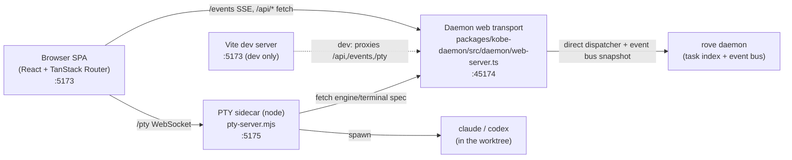

# Web dashboard (`rove web`) — architecture

> The browser dashboard for Rove: a terminal-native workspace at
> `http://localhost:5173`, not a faithful TUI mirror. Source lives in
> [`packages/kobe-web`](../../packages/kobe-web). This doc is the durable map
> of its process model, the daemon channels it consumes, and the daemon-hosted
> HTTP route table. For the running feature set read the CHANGELOG; for the
> daemon protocol read [`daemon.md`](./daemon.md).

## Current dev process split

`node-pty` does not work under Bun, so web development still has a small
process split. The browser-facing daemon data path is direct: Vite proxies
`/api` and `/events` to the daemon's local HTTP/SSE transport, while the PTY
sidecar stays as a Node adapter.

- **SPA** — single React app. State arrives over ONE SSE stream and a module
  store ([`src/lib/store.ts`](../../packages/kobe-web/src/lib/store.ts)); every
  mutation is a `POST /api/rpc`. No optimistic updates — the daemon's
  `task.snapshot` push is the round-trip.
- **Daemon web transport**
  ([`web-server.ts`](../../packages/kobe-daemon/src/daemon/web-server.ts)) —
  loopback HTTP/SSE routes hosted by the daemon. It dispatches browser RPCs
  through the same daemon handler registry as the socket protocol, builds the
  SSE bootstrap snapshot from daemon state, and treats an open browser SSE
  stream as a GUI lifetime hold.
- **PTY sidecar** ([`pty-server.mjs`](../../packages/kobe-web/pty-server.mjs)) —
  a node process (node-pty needs node). Each engine/terminal tab is a
  WebSocket-attached PTY keyed by a client tab id, kept alive across reconnects
  with a bounded scrollback ring.

The canonical `@sma1lboy/rove` package bundles these web assets under
`dist/web-ui`. `rove web`
([`packages/kobe/src/cli/web-cmd.ts`](../../packages/kobe/src/cli/web-cmd.ts))
ensures the daemon web transport is available, serves the built SPA from
`dist/web-ui`, and spawns the PTY sidecar on `port + 2`. In dev,
[`dev.ts`](../../packages/kobe-web/dev.ts) ensures the daemon, starts Vite and
the PTY sidecar, and lets Vite proxy `/api`, `/events`, `/pty`.

## Daemon channels the SPA consumes

The daemon web transport exposes only what the SPA is allowed to reach; no
standalone bridge socket is involved. Browser reachability is now declared
per handler (`web: true` in `packages/kobe-daemon/src/daemon/handlers*.ts`)
and surfaced as a set by `webExposedRpcNames` in
[`web-server.ts`](../../packages/kobe-daemon/src/daemon/web-server.ts),
so the list can't drift from the registry it describes — this replaced the
hand-maintained `spa-channels.ts`. A contract test
([`packages/kobe/test/daemon/web-exposure.test.ts`](../../packages/kobe/test/daemon/web-exposure.test.ts))
pins the exposed set exactly so a new verb can't slip through unaccounted.

| Channel | What the SPA does with it |
|---|---|
| `task.snapshot` | The authoritative task list. On each push the store sweeps per-task side tables (engine badges, jobs, workspace tabs + their PTYs) for tasks that no longer exist — a delete in any surface cleans up here too. |
| `active-task` | Cross-surface focus (the TUI/another browser switching tasks). |
| `engine-state` | Per-task activity dot + label (running / needs input / rate limited / error / idle). |
| `update` | npm-version chip in the status bar. |
| `task.jobs` | "materializing…" spinner on a row while a worktree is created. |
| `worktree.changes` | `+N −M` dirty chips on rows; also the live-refresh trigger for the diff surfaces (no browser-side git polling). |
| `ui-prefs` | Theme + sort-mode sync with the TUI — a TUI theme switch restyles open dashboards live. |
| `keybindings` | **Dropped** — the web has no keymap to re-read. |

## Daemon Web HTTP Route Table

All routes live in `createDaemonWebRequestHandler`
([`web-server.ts`](../../packages/kobe-daemon/src/daemon/web-server.ts)),
extracted from `Bun.serve` so the whole surface is unit-testable against a fake link
(`test/bridge-routes.test.ts`).

| Route | Method | Purpose |
|---|---|---|
| `/__kobe_web` | GET | Health marker for the port-takeover handshake. |
| `/events` | GET | SSE: `snapshot` on connect, then `channel` pushes. |
| `/api/rpc` | POST | Forward an **allowlisted** daemon RPC. See below. |
| `/api/session` | POST | Ensure a task's canonical standalone Hosted PTY engine session exists. |
| `/api/engine-spec` / `/api/terminal-spec` | GET | PTY launch spec for an engine / shell tab. |
| `/api/engines` | GET | Engine-owned vendor list (detected built-ins + custom, with display labels) — the SPA never hard-codes vendor strings. |
| `/api/themes` | GET | The TUI's 7 theme JSONs resolved into the web CSS token vocabulary. |
| `/api/history/sessions` / `/api/history/messages` | GET | Structured engine transcript via the registry's neutral `EngineHistoryReader` (path-traversal-guarded). |
| `/api/notes` | GET/PUT | Web-only per-task markdown scratchpad. |
| `/api/diff` | GET | Worktree diff (names-only or per-file patch; bounded-concurrency for untracked files). |
| `*` | — | Static SPA fallthrough (production), else 404. |

### `/api/rpc` is an allowlist, not a denylist

The forwarder admits only the verbs marked `web: true` in the handler
registry (surfaced by `webExposedRpcNames` in
[`web-server.ts`](../../packages/kobe-daemon/src/daemon/web-server.ts)) — a new
daemon verb is NOT browser-reachable until added deliberately, and
connection-scoped (`hello`/`subscribe`), kill-switch (`daemon.stop`), and
hook-ingest (`engine.reportEvent`/`worktree.reconcile`) verbs are pinned out by
a contract test (`packages/kobe/test/daemon/web-exposure.test.ts`).

### Teardown Hook

The daemon is the single writer for the task index. For browser task deletion
and archive, the daemon web route also performs the matching session cleanup:
a committed `task.delete` / `task.archive` (when actually archiving) triggers
`tearDownTaskSession`, stopping the task's sessions owned by the standalone PTY
Host. Browser-sidecar PTYs are a separate owner and are not covered by this
hook. Un-archive (`archived: false`) deliberately does NOT tear down.

## SPA routes

TanStack Router, file-based ([`src/routes/`](../../packages/kobe-web/src/routes)):

| Route | Surface |
|---|---|
| `/` | The workspace shell (rail + tabs + tools). |
| `/task/$taskId` | Deep link — selects the task; back/forward walks task-switch history. |
| `/board` | The unified kanban — the daemon-owned issues AND the persisted `Task.status` lifecycle in one board (see below). |

The top nav is two buttons — **Workspace** and **Board**. The standalone
`/issues` route folded into the Board (issues are now the Backlog column), and
the former `/overview` mission-control route is gone; its triage lives in the
rail status chips and the Board's attention-filter chips (see "Search, filter &
keyboard", below).

## Board (`/board`)

The unified kanban over BOTH stores — the daemon-owned issues and the task
list — grouped by **Project (= git repo)** (full plan + decisions:
`web-kanban.md`, in git history). The two stores stay separate (Path 1);
the board is a join, not a merge. One column per `TaskStatus`
(`error`/`canceled` fold away when empty; unknown statuses become trailing
read-only columns rather than dropping cards). Columns bind ONLY to the
persisted status — transient engine activity stays a per-card signal lamp,
never a column.

**What lands in each column.** Backlog shows the repo's **issues** plus any
tasks still in `backlog` status; `in_progress` / `in_review` show **tasks**;
Done shows both. **Dedup is by link:** an issue linked to a LIVE task (status
not `done`/`canceled`/`error`, not archived) is hidden — it's represented by
its task card, which carries a `#<issueId>` back-link chip. Deleting or
archiving that task resurfaces its issue in Backlog. Issues are non-optimistic
(the daemon `issue.snapshot` push is truth), but an issue is optimistically
hidden the moment `quickStartIssue` resolves with a `taskId`, so there's no
flash of a duplicate card before the snapshot catches up.

**Interaction split.** Task cards are draggable across status columns
(`task.status`) and within a column (`task.reorder`, a web-only sparse
fractional `position` that never bumps `updatedAt` and is invisible to the TUI);
drops paint through an optimistic override layer in
[`src/lib/board-state.ts`](../../packages/kobe-web/src/lib/board-state.ts)
(ULID-keyed, tasks only) whose clear rule is snapshot-confirmation per field,
and dragging disables while the daemon/stream is down. **Issue cards are NOT
draggable.** Clicking an issue card opens a **right-side drawer** (the extended
`IssuePeek`) where you can edit title + description, pick an **engine**, and
click **Start** — Start spawns a task with the chosen engine via
`quickStartIssue` and links the two. A task card's eye button opens a **peek
drawer** — the task's live engine PTY + transcript without leaving the board.
The drawer attaches by the task's WORKSPACE vendor-tab id (`ensureEngineTab`),
because PTYs are keyed by tab id: a drawer-private id would spawn a second
engine instance. Closing the drawer never calls `/pty/close`; the sidecar fans
output to every attached socket, so peek and workspace coexist.

## Workspace tabs

Tab + split state is purely client-owned and persisted in localStorage
([`src/lib/tabs.ts`](../../packages/kobe-web/src/lib/tabs.ts)). Tab kinds:

- **vendor** — engine PTY (with a prompt composer + reattach affordance). xterm
  is lazy-loaded so it only weighs on first terminal open.
- **terminal** — shell PTY in the worktree.
- **transcript** — structured read-only chat render over `/api/history`, with a
  search box (filter to matching messages + count), a "↓ latest" jump button
  when scrolled up, and a "tools" toggle to hide tool-call rows and read just
  the conversation prose.
- **file** — read-only diff preview (line-number gutter + `+/−` stats, plus a
  "wrap" toggle to soft-wrap long lines instead of horizontal scroll).

## SPA surfaces & client modules

Beyond the rail/tabs/tools grammar, the dashboard carries:

- **Command palette** (Cmd/Ctrl+K) — fuzzy task jump + actions, plus theme
  switching ("Theme: <name>" commands + "Follow TUI" to clear a web-local
  override); `?` opens a keyboard-help overlay. ([`CommandPalette.tsx`](../../packages/kobe-web/src/components/CommandPalette.tsx), [`KeyboardHelp.tsx`](../../packages/kobe-web/src/components/KeyboardHelp.tsx))
- **Search, filter & keyboard** — the task rail has a text filter + status
  chips (All/Needs/Run/Dirty, from `lib/triage.ts`), and is keyboard-first: `/`
  focuses the filter, Enter jumps to the top match, Escape clears, `j`/`k` move.
  The Board surfaces the same `triage` buckets as **attention-filter chips**
  (the rail chips and the Board chips share one engine), and the Changes pane has
  its own filter box that filters files by path.
- **New Task / Adopt** dialogs (`task.create` / `worktree.discoverAdoptable`+`adopt`); New Task can seed a first prompt into the engine composer. The Task panel can **Copy path** (via a shared `lib/clipboard.ts`).
- **Settings** — live theme picker (precedence: web-local override > TUI `ui-prefs` > claude, [`lib/theme.ts`](../../packages/kobe-web/src/lib/theme.ts)), engines, notifications, connection/version.
- **Desktop notifications** ([`lib/notify.ts`](../../packages/kobe-web/src/lib/notify.ts)) — fire on the rising edge into `waiting_permission`/`error` while the tab is hidden.
- **Notes** ([`NotesPanel.tsx`](../../packages/kobe-web/src/components/NotesPanel.tsx)) — a web-only per-task markdown scratchpad (the TUI has no equivalent), autosaved server-side under `<ROVE_HOME>/.rove/notes/<taskId>.md` via `/api/notes`, with an Edit/Preview toggle. The preview renders through an escape-first markdown renderer ([`lib/markdown.ts`](../../packages/kobe-web/src/lib/markdown.ts)) — the one `dangerouslySetInnerHTML` sink in the app, so it escapes all input before composing its own tags and drops unsafe link schemes; the taskId→file path is traversal-guarded server-side (`isSafeTaskId`).
- **Resilience & empty states** — a root error boundary (no white-screen) and a
  daemon-offline banner; failed mutations surface in a toast stack
  ([`lib/toast.ts`](../../packages/kobe-web/src/lib/toast.ts)). The Board,
  transcript, diff, Settings, and Adopt surfaces each carry their own
  offline/empty-state hint instead of rendering blank — e.g. "no tasks yet",
  "nothing to review", or a "daemon offline, reconnecting" line — so a fresh or
  disconnected dashboard explains itself rather than looking broken.

Pure helpers with unit tests: [`lib/diff-rows.ts`](../../packages/kobe-web/src/lib/diff-rows.ts) (gutter + stats), `lib/time.ts` (`relativeTime` + `relativeTimeAgo`), the extracted `shouldNotify` / `resolveEffectiveTheme`, the markdown renderer's escape-first safety, and the reducer layer on both sides — the store's `applyJobEvent` / `isOrphanIdleEngineState` / `pruneByTask`, the daemon web snapshot/reducer seam, `formatError`, and the New Task pending-prompt consume-once handoff. **Component logic lives in React-free lib modules so it's unit-tested away from the `.tsx`:** `lib/activity.ts` (dot color/label, rail↔Board drift guard), `lib/triage.ts` (attention buckets + priority + `matchesStatusFilter` for the rail + Board attention-filter chips), `lib/fuzzy.ts` (command-palette ranking), `lib/task-list.ts` (rail group-order + search), `lib/tool-display.ts` (transcript tool-call labels), `lib/diff-display.ts` (status/row mappers), `lib/diff-filter.ts` (Changes-pane path filter), `lib/path-format.ts` (`tailPath`), `lib/palette-commands.ts` (theme command entries), `lib/transcript-search.ts` (`messageMatchesQuery` + `blockVisible` hide-tools), `lib/scroll.ts` (`isNearBottom` for stick-to-bottom + jump-to-latest). Plus the daemon web route + channel + allowlist contracts and the server-side route guards (notes/diff/history traversal).

## Dev: production vs sandbox

`bun --filter kobe-web dev` connects to the **production** `~/.kobe` daemon and
prints a banner saying so. `bun --filter kobe-web dev:sandbox` points
`KOBE_HOME_DIR` at the TUI's shared `.dev-sandbox/home`, isolating the task
index, daemon socket, standalone PTY Host socket, and Web PTY sidecar from
production state. `bun run test` touches no daemon at all — its isolation is
unconditional.

## Security posture (current + gaps)

Both the daemon web transport and the PTY sidecar
([`pty-server.mjs`](../../packages/kobe-web/pty-server.mjs)) bind
**`127.0.0.1` by default**. `KOBE_WEB_HOST` overrides only when a LAN bind is
intended. A PTY WS is arbitrary command exec in the worktree, so the upgrade enforces a
**localhost-Origin allowlist** (`localhost`/`127.0.0.1`/`[::1]`) — a browser
cross-origin upgrade is rejected; a non-browser client (no `Origin`) is allowed
since there's no ambient browser session to ride.

The browser-facing HTTP routes live at the daemon-owned seam, so the Origin
policy, RPC allowlist, and event-channel filtering are enforced before a browser
request reaches daemon state mutation.
